# 분류(Classification)

## 1. 결정트리(DecisionTreeClassification)

### 0) 모듈 삽입

```python
from sklearn.tree import DecisionTreeClassifier
from sklearn.datasets import load_iris
from sklearn.model_selection import train_test_split

# 워닝 무시
import warnings
warnings.filterwarnings('ignore')
```

### 1) iris 데이터 로드 및 분리

```python
# 붓꽃 데이터를 로딩
iris_data = load_iris()

# 학습과 테스트 데이터 셋으로 분리
X_train , X_test , y_train , y_test = train_test_split(iris_data.data, iris_data.target,
                                                       test_size=0.2,  random_state=11)
```

### 2) 모델 학습(디시전 트리)

```python
# DecisionTree Classifier 생성
dt_clf = DecisionTreeClassifier(random_state=156)

# DecisionTreeClassifer 학습.
dt_clf.fit(X_train, y_train)
```

Out[]:

```
DecisionTreeClassifier(random_state=156)
```

### 3) 디시전트리 그래프비즈로 시각화

```python
from sklearn.tree import export_graphviz

# export_graphviz()의 호출 결과로 out_file로 지정된 tree.dot 파일을 생성함. 
export_graphviz(dt_clf, out_file="tree.dot", class_names=iris_data.target_names, \
                feature_names = iris_data.feature_names, impurity=True, filled=True)
```

```python
import graphviz

# 위에서 생성된 tree.dot 파일을 Graphviz 읽어서 Jupyter Notebook상에서 시각화 
# with open : "파일을 읽겠다"
with open("tree.dot") as f:
    dot_graph = f.read()

# graphviz.Source 메소드로 dot_graph 읽기
graphviz.Source(dot_graph)
```

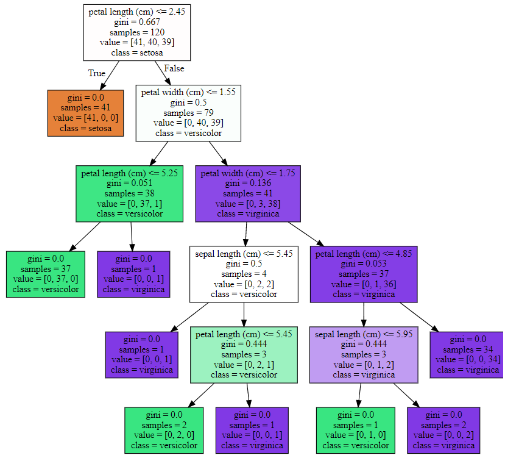

**결정트리**

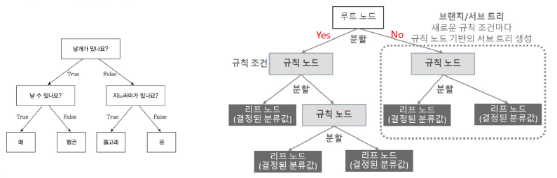

1. 결정 트리의 특징

   - 장점 
     - 쉽다, 직관적이다.
     - 피처의 스케일링이나 정규화 등의 사전 가공 영향도가 크지 않음.
   - 단점
     - 과적합으로 알고리즘 성능이 떨어진다. 이를 극복하기 위해 트리의 크기를 사전에 제한하는 튜닝 필요.

2. 결정 트리 주요 하이퍼 파라미터

   - max_depth : 트리의 최대 깊이를 규정

     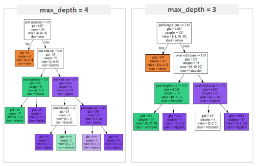

   - max_feature : 최적의 분할을 위해 고려할 최대 피처 개수. 디폴트는 None으로 데이터 세트의 모든 피처를 사용해 분할 수행

   - min_samples_split 

     - 노드를 분할하기 위한 최소한의 샘플 데이터 수. 
     - 디폴트는 2이고 작게 설정할수록 분할되는 노드가 많아져서 과적합 가능성 증가

     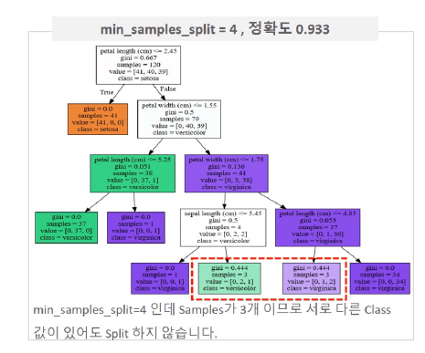

   - min_samples_leaf : 리프노드가 되기 위한 최소한의 샘플 데이터 수

     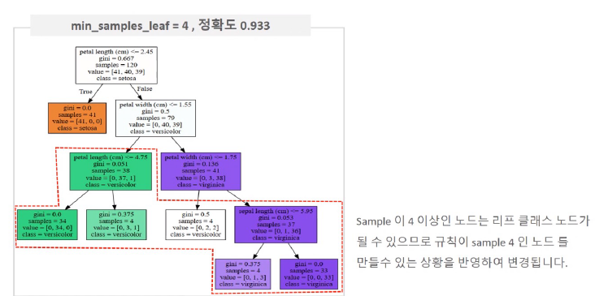

   - max_leaf_nodes : 말단 노드의 최대 개수

   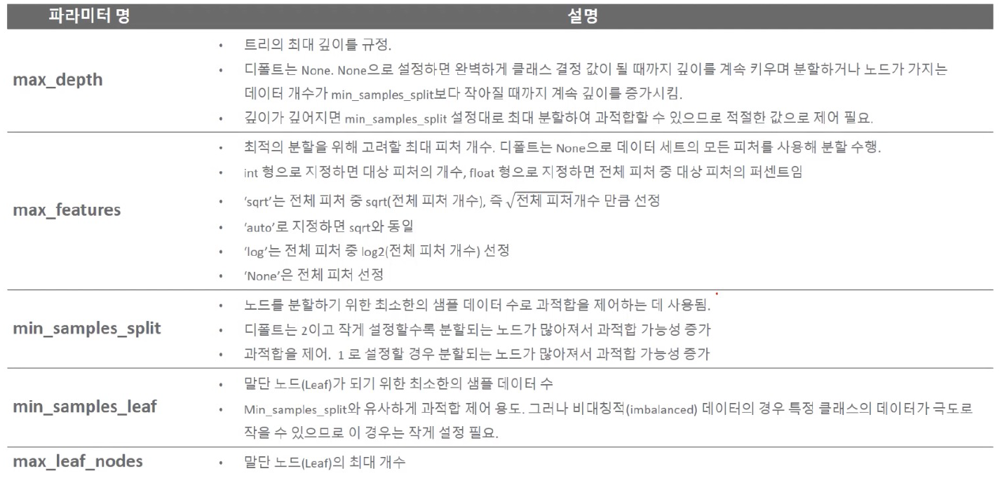

   - `min_samples_split`, `min_samles_leaf` 차이점
     - `min_samples_split` : 분할되기 위해 노드가 가져야하는 최소 샘플 수
     - `min_samples_leaf` : 리프 노드가 가져야할 최소 샘플 수
     - samples이 4개인 노드일 때, `min_samples_split=4`이면 분할이 되고, `min_samples_leaf=4`이면 최소 샘플 수를 만족했기 때문에 분할되지 않고 종료된다.

### 4) 디시전트리의 피처 중요도 확인

```python
import seaborn as sns
import numpy as np
%matplotlib inline

# iris 데이터의 피처 4개 확인
iris_data.feature_names
```

```
['sepal length (cm)',
 'sepal width (cm)',
 'petal length (cm)',
 'petal width (cm)']
```

```python
# 피처 4개에 대한 각각의 feature importance 확인
dt_clf.feature_importances_

# feature importance 소수 3째 자리까지
print("Feature importances:\n{0}".format(np.round(dt_clf.feature_importances_, 3)))
```

```
Feature importances:
[0.025 0.    0.555 0.42 ]
```

```python
# feature별 importance 매핑
for name, value in zip(iris_data.feature_names , dt_clf.feature_importances_):
    print('{0} : {1:.3f}'.format(name, value))

# feature importance를 column 별로 시각화 하기 
sns.barplot(x=dt_clf.feature_importances_ , y=iris_data.feature_names)
```

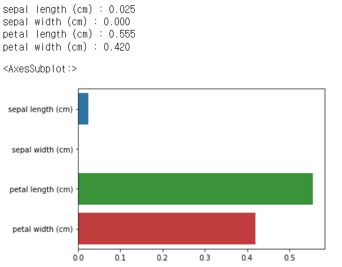

### 5) 디시전트리 과적합(Overfitting)

```python
from sklearn.datasets import make_classification
import matplotlib.pyplot as plt
%matplotlib inline

plt.title("3 Class values with 2 Features Sample data creation")

# 샘플 데이터 생성 : 2차원 시각화를 위해서 feature는 2개, 결정값 클래스는 3가지 유형. 
X_features, y_labels = make_classification(n_features=2, n_redundant=0, n_informative=2,
                             n_classes=3, n_clusters_per_class=1, random_state=0)

# plot 형태로 2개의 feature로 2차원 좌표 시각화, 각 클래스값은 다른 색깔로 표시됨. 
plt.scatter(X_features[:, 0], X_features[:, 1], marker='o', c=y_labels, s=25, cmap='rainbow', edgecolor='k')
```

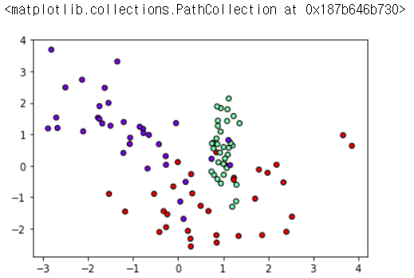

```python
import numpy as np

# Classifier의 Decision Boundary를 시각화 하는 함수
def visualize_boundary(model, X, y):
    fig,ax = plt.subplots()
    
    # 학습 데이타 scatter plot으로 나타내기
    ax.scatter(X[:, 0], X[:, 1], c=y, s=25, cmap='rainbow', edgecolor='k',
               clim=(y.min(), y.max()), zorder=3)
    ax.axis('tight')
    ax.axis('off')
    xlim_start , xlim_end = ax.get_xlim()
    ylim_start , ylim_end = ax.get_ylim()
    
    # 호출 파라미터로 들어온 training 데이타로 model 학습 . 
    model.fit(X, y)
    # meshgrid 형태인 모든 좌표값으로 예측 수행. 
    xx, yy = np.meshgrid(np.linspace(xlim_start, xlim_end, num=200), np.linspace(ylim_start,ylim_end, num=200))
    Z = model.predict(np.c_[xx.ravel(), yy.ravel()]).reshape(xx.shape)
    
    # contourf() 를 이용하여 class boundary 를 visualization 수행. 
    n_classes = len(np.unique(y))
    contours = ax.contourf(xx, yy, Z, alpha=0.3,
                           levels=np.arange(n_classes + 1) - 0.5,
                           cmap='rainbow', clim=(y.min(), y.max()),
                           zorder=1)
```

```python
from sklearn.tree import DecisionTreeClassifier

# 특정한 트리 생성 제약없는 결정 트리의 Decsion Boundary 시각화. -> 과적합된 모델
dt_clf = DecisionTreeClassifier().fit(X_features, y_labels)
visualize_boundary(dt_clf, X_features, y_labels)
```

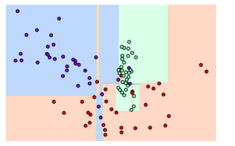

```python
# min_samples_leaf=6 으로 트리 생성 조건을 제약한 Decision Boundary 시각화 -> 일반화가 잘 된 모델
dt_clf = DecisionTreeClassifier( min_samples_leaf=6).fit(X_features, y_labels)
visualize_boundary(dt_clf, X_features, y_labels)
```

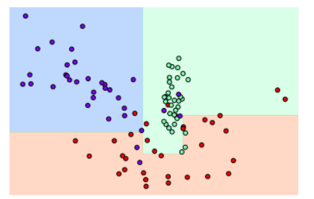

### 6) 결정 트리 실습 - Human Activity Recognition

1. 데이터 로드

```python
import pandas as pd
import matplotlib.pyplot as plt
%matplotlib inline

# features.txt 파일에는 피처 이름 index와 피처명이 공백으로 분리되어 있음. 이를 DataFrame으로 로드.
feature_name_df = pd.read_csv('./features.txt', sep='\s+',
                              header=None, names=['column_index','column_name'])

print(feature_name_df.shape)
feature_name_df.head()
```

```
(561, 2)
```

Out[31]:

|      | column_index |       column_name |
| ---: | -----------: | ----------------: |
|    0 |            1 | tBodyAcc-mean()-X |
|    1 |            2 | tBodyAcc-mean()-Y |
|    2 |            3 | tBodyAcc-mean()-Z |
|    3 |            4 |  tBodyAcc-std()-X |
|    4 |            5 |  tBodyAcc-std()-Y |

2. 데이터 전처리, 데이터 분리

**중복 feature명에 대해서 원본 feature 명에 '_1(또는2)'를 추가로 부여하는 함수인 get_new_feature_name_df() 생성**

```python
def get_new_feature_name_df(old_feature_name_df):
    feature_dup_df = pd.DataFrame(data=old_feature_name_df.groupby('column_name').cumcount(), columns=['dup_cnt'])
    feature_dup_df = feature_dup_df.reset_index()
    new_feature_name_df = pd.merge(old_feature_name_df.reset_index(), feature_dup_df, how='outer')
    new_feature_name_df['column_name'] = new_feature_name_df[['column_name', 'dup_cnt']].apply(lambda x : x[0]+'_'+str(x[1]) 
                                                                                           if x[1] >0 else x[0] ,  axis=1)
    new_feature_name_df = new_feature_name_df.drop(['index'], axis=1)
    return new_feature_name_df
```

```python
pd.options.display.max_rows = 999
new_feature_name_df = get_new_feature_name_df(feature_name_df)
new_feature_name_df[new_feature_name_df['dup_cnt'] > 0]
```

```python
import pandas as pd

# train, test 데이터 분리해주는 함수
def get_human_dataset( ):
    
    # 각 데이터 파일들은 공백으로 분리되어 있으므로 read_csv에서 공백 문자를 sep으로 할당.
    feature_name_df = pd.read_csv('./features.txt',sep='\s+',
                      header=None,names=['column_index','column_name'])
    
    # 중복된 feature명을 새롭게 수정하는 get_new_feature_name_df()를 이용하여 새로운 feature명 DataFrame생성. 
    new_feature_name_df = get_new_feature_name_df(feature_name_df)
    
    # DataFrame에 피처명을 컬럼으로 부여하기 위해 리스트 객체로 다시 변환
    feature_name = new_feature_name_df.iloc[:, 1].values.tolist()
    
    # 학습 피처 데이터 셋과 테스트 피처 데이터을 DataFrame으로 로딩. 컬럼명은 feature_name 적용
    X_train = pd.read_csv('./human_activity/train/X_train.txt',sep='\s+', names=feature_name )
    X_test = pd.read_csv('./human_activity/test/X_test.txt',sep='\s+', names=feature_name)
    
    # 학습 레이블과 테스트 레이블 데이터을 DataFrame으로 로딩하고 컬럼명은 action으로 부여
    y_train = pd.read_csv('./human_activity/train/y_train.txt',sep='\s+',header=None,names=['action'])
    y_test = pd.read_csv('./human_activity/test/y_test.txt',sep='\s+',header=None,names=['action'])
    
    # 로드된 학습/테스트용 DataFrame을 모두 반환 
    return X_train, X_test, y_train, y_test


X_train, X_test, y_train, y_test = get_human_dataset()
```

3. 학습 / 예측 / 평가

```python
from sklearn.tree import DecisionTreeClassifier
from sklearn.metrics import accuracy_score

# DecisionTreeClassifier 클래스 객체 생성
dt_clf = DecisionTreeClassifier(random_state=156)

# 학습
dt_clf.fit(X_train , y_train)

# 예측
pred = dt_clf.predict(X_test)

# 평가 - 정확도 확인
accuracy = accuracy_score(y_test, pred)
print('결정 트리 예측 정확도: {0:.4f}'.format(accuracy), '\n')

# DecisionTreeClassifier의 하이퍼 파라미터 추출
print('DecisionTreeClassifier 기본 하이퍼 파라미터:\n', dt_clf.get_params())
```

```
결정 트리 예측 정확도: 0.8548 

DecisionTreeClassifier 기본 하이퍼 파라미터:
 {'ccp_alpha': 0.0, 'class_weight': None, 'criterion': 'gini', 'max_depth': None, 'max_features': None, 'max_leaf_nodes': None, 'min_impurity_decrease': 0.0, 'min_impurity_split': None, 'min_samples_leaf': 1, 'min_samples_split': 2, 'min_weight_fraction_leaf': 0.0, 'random_state': 156, 'splitter': 'best'}
```

-> GridSearchCV를 적용하기 전 모델의 정확도는 0.85
GridSearchCV를 적용해서 하이퍼 파라미터 튜닝을 하면 정확도가 올라갈까?

### 7) GridSearchCV 하이퍼 파라미터 튜닝

```python
%%time
# 수행시간 1~2분
from sklearn.model_selection import GridSearchCV

params = {
    'max_depth' : [6, 8 ,10, 12, 16 ,20, 24]
}

grid_cv = GridSearchCV(dt_clf, param_grid=params, scoring='accuracy', cv=5, verbose=1)
grid_cv.fit(X_train , y_train)
print('GridSearchCV 최고 평균 정확도 수치:{0:.4f}'.format(grid_cv.best_score_))
print('GridSearchCV 최적 하이퍼 파라미터:', grid_cv.best_params_)
```

```
Fitting 5 folds for each of 7 candidates, totalling 35 fits
GridSearchCV 최고 평균 정확도 수치:0.8513
GridSearchCV 최적 하이퍼 파라미터: {'max_depth': 16}
Wall time: 2min 13s
```

```python
# GridSearchCV객체의 cv_results_ 속성을 DataFrame으로 생성.
cv_results_df = pd.DataFrame(grid_cv.cv_results_)
```

```python
# max_depth 파라미터 값과 그때의 테스트(Evaluation)셋, 학습 데이터 셋의 정확도 수치 추출
# 사이킷런 버전이 업그레이드 되면서 아래의 GridSearchCV 객체의 cv_results_에서 mean_train_score는 더이상 제공되지 않습니다
# cv_results_df[['param_max_depth', 'mean_test_score', 'mean_train_score']]

# max_depth 파라미터 값과 그때의 테스트(Evaluation)셋, 학습 데이터 셋의 정확도 수치 추출
result_rank = cv_results_df[['param_max_depth', 'mean_test_score', 'rank_test_score']]   # 리스트에서 'mean_train_score' 제거한 상태

# test socre 순위 기준으로 정렬해보면 아래와 같다.
result_rank.sort_values(by='rank_test_score')
```

|      | param_max_depth | mean_test_score | rank_test_score |
| ---: | --------------: | --------------: | --------------: |
|    4 |              16 |        0.851344 |               1 |
|    2 |              10 |        0.851209 |               2 |
|    1 |               8 |        0.851069 |               3 |
|    5 |              20 |        0.850800 |               4 |
|    0 |               6 |        0.850791 |               5 |
|    6 |              24 |        0.849440 |               6 |
|    3 |              12 |        0.844135 |               7 |

```python
# max_depth 값을 변화 시키면서 그때마다 학습과 테스트 셋에서의 예측 성능 측정
max_depths = [ 6, 8 ,10, 12, 16 ,20, 24]

for depth in max_depths:
    dt_clf = DecisionTreeClassifier(max_depth=depth, random_state=156)
    dt_clf.fit(X_train , y_train)
    pred = dt_clf.predict(X_test)
    accuracy = accuracy_score(y_test , pred)
    print('max_depth = {0} 정확도: {1:.4f}'.format(depth , accuracy))
```

```
max_depth = 6 정확도: 0.8558
max_depth = 8 정확도: 0.8707
max_depth = 10 정확도: 0.8673
max_depth = 12 정확도: 0.8646
max_depth = 16 정확도: 0.8575
max_depth = 20 정확도: 0.8548
max_depth = 24 정확도: 0.8548
```

-> 모델을 테스트셋에 적용해 본 결과 max_depth가 8인 경우 가장 성능이 좋다.

```python
%%time
# min_samples_split 하이퍼 파라미터도 추가해서 GridSearchCV 수행 (수행시간 1~2분 정도)
params = {
    'max_depth' : [ 8 , 12, 16 , 20 ], 
    'min_samples_split' : [ 16, 24 ],
}

grid_cv = GridSearchCV(dt_clf, param_grid=params, scoring='accuracy', cv=5, verbose=1 )

grid_cv.fit(X_train , y_train)
print('GridSearchCV 최고 평균 정확도 수치: {0:.4f}'.format(grid_cv.best_score_), '\n')
print('GridSearchCV 최적 하이퍼 파라미터:', grid_cv.best_params_)
```

```
Fitting 5 folds for each of 8 candidates, totalling 40 fits
GridSearchCV 최고 평균 정확도 수치: 0.8549 

GridSearchCV 최적 하이퍼 파라미터: {'max_depth': 8, 'min_samples_split': 16}
Wall time: 2min 34s
```

-> 그리드서치로 찾아진 최적의 하이퍼 파라미터를 가진 모델을 가지고 테스트 데이터에 적용

```python
best_df_clf = grid_cv.best_estimator_

pred1 = best_df_clf.predict(X_test)
accuracy = accuracy_score(y_test , pred1)
print('결정 트리 예측 정확도:{0:.4f}'.format(accuracy))
```

```
결정 트리 예측 정확도:0.8717
```

-> 결론 : 그리드서치로 하이퍼 파라미터 튜닝을 했더니 기존의 정확도가 0.85에서 0.87로 상승

#### (1) 피처 중요도 확인하기

```python
# 피처 중요도 확인해보기
import seaborn as sns

ftr_importances_values = best_df_clf.feature_importances_

# Top 중요도로 정렬을 쉽게 하고, 시본(Seaborn)의 막대그래프로 쉽게 표현하기 위해 Series변환
ftr_importances = pd.Series(ftr_importances_values, index=X_train.columns)

# 중요도값 순으로 Series를 정렬. 피처는 중요도 상위 20개만 추출해서 정렬.
ftr_top20 = ftr_importances.sort_values(ascending=False)[:20]

plt.figure(figsize=(8, 6))
plt.title('Feature importances Top 20')
sns.barplot(x=ftr_top20 , y = ftr_top20.index)
plt.show()
```

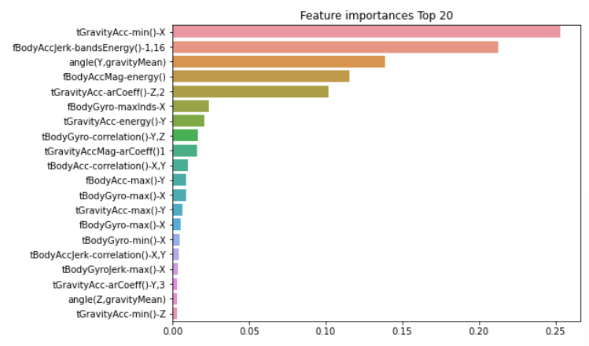


## 2. 앙상블

> 앙상블 학습을 통한 분류는 여러 개의 분류기를 생성하고 그 예측을 결합함으로써 보다 정확한 최종 예측을 도출하는 기법을 말한다.

### 1) 앙상블 유형

- 보팅(Voting)
- 배깅(Bagging) - 랜덤 포레스트(Randome Forest)
- 부스팅(Boosting) - 에이다 부스팅, 그래디언트 부스팅, XGBoost, LightGBM

### 2) 앙상블의 특징

- 단일 모델의 약점을 다수의 모델들을 결합하여 보완
- 뛰어난 성능을 가진 모델들로만 구성하는 것보다 성능이 떨어지더라도 서로 다른 유형의 모델을 섞는 것이 전체 성능에 도움이 될 수 있음
- 결정 트리의 단점인 과적합을 수십~수천개의 많은 분류기를 결합해 보완하고 장점인 직관적인 분류 기준은 강화됨.

### 3) 보팅과 배깅의 차이

- 보팅과 배깅은 여러 개의 분류기가 투표를 통해 최종 예측 결과를 결정하는 방식
- 차이점은 보팅은 일반적으로 서로 다른 알고리즘을 가진 분류기를 결합하고, 배깅은 각각의 분류기가 모두 같은 유형의 알고리즘 기반이지만, 데이터 샘플링을 서로 다르게 가져가면서 학습을 수행해 보팅을 수행한다.

### 4) Voting Classifier

1. 위스콘신 유방암 데이터 로드

```python
import pandas as pd

from sklearn.ensemble import VotingClassifier         # 앙상블 - 보팅
from sklearn.linear_model import LogisticRegression   # 분류 알고리즘(이진 분류)
from sklearn.neighbors import KNeighborsClassifier    # 분류 알고리즘
from sklearn.datasets import load_breast_cancer       # 유방암 데이터
from sklearn.model_selection import train_test_split
from sklearn.metrics import accuracy_score

# 워닝 무시
import warnings
warnings.filterwarnings('ignore')
```

```python
# 유방암 데이터 로드(array 형태)
cancer = load_breast_cancer()

# 데이터 확인 / array형태를 데이터프레임으로
data_df = pd.DataFrame(cancer.data, columns=cancer.feature_names)

print(data_df.shape)
data_df.head()
```

```
(569, 30)
```

Out[20]:

|      | mean radius | mean texture | mean perimeter | mean area | mean smoothness | mean compactness | mean concavity | mean concave points | mean symmetry | mean fractal dimension |  ... | worst radius | worst texture | worst perimeter | worst area | worst smoothness | worst compactness | worst concavity | worst concave points | worst symmetry | worst fractal dimension |
| ---: | ----------: | -----------: | -------------: | --------: | --------------: | ---------------: | -------------: | ------------------: | ------------: | ---------------------: | ---: | -----------: | ------------: | --------------: | ---------: | ---------------: | ----------------: | --------------: | -------------------: | -------------: | ----------------------: |
|    0 |       17.99 |        10.38 |         122.80 |    1001.0 |         0.11840 |          0.27760 |         0.3001 |             0.14710 |        0.2419 |                0.07871 |  ... |        25.38 |         17.33 |          184.60 |     2019.0 |           0.1622 |            0.6656 |          0.7119 |               0.2654 |         0.4601 |                 0.11890 |
|    1 |       20.57 |        17.77 |         132.90 |    1326.0 |         0.08474 |          0.07864 |         0.0869 |             0.07017 |        0.1812 |                0.05667 |  ... |        24.99 |         23.41 |          158.80 |     1956.0 |           0.1238 |            0.1866 |          0.2416 |               0.1860 |         0.2750 |                 0.08902 |
|    2 |       19.69 |        21.25 |         130.00 |    1203.0 |         0.10960 |          0.15990 |         0.1974 |             0.12790 |        0.2069 |                0.05999 |  ... |        23.57 |         25.53 |          152.50 |     1709.0 |           0.1444 |            0.4245 |          0.4504 |               0.2430 |         0.3613 |                 0.08758 |
|    3 |       11.42 |        20.38 |          77.58 |     386.1 |         0.14250 |          0.28390 |         0.2414 |             0.10520 |        0.2597 |                0.09744 |  ... |        14.91 |         26.50 |           98.87 |      567.7 |           0.2098 |            0.8663 |          0.6869 |               0.2575 |         0.6638 |                 0.17300 |
|    4 |       20.29 |        14.34 |         135.10 |    1297.0 |         0.10030 |          0.13280 |         0.1980 |             0.10430 |        0.1809 |                0.05883 |  ... |        22.54 |         16.67 |          152.20 |     1575.0 |           0.1374 |            0.2050 |          0.4000 |               0.1625 |         0.2364 |                 0.07678 |

5 rows × 30 columns

2. 단일모델과 VotingClassifier 성능 비교

```python
# 개별 모델은 로지스틱 회귀와 KNN 임.
lr_clf = LogisticRegression()
knn_clf = KNeighborsClassifier(n_neighbors=8)

# 개별 모델을 소프트 보팅 기반의 앙상블 모델로 구현한 분류기 
vo_clf = VotingClassifier( estimators=[('LR', lr_clf),('KNN', knn_clf)] , voting='soft')
vo_clf
```

```
VotingClassifier(estimators=[('LR', LogisticRegression()),
                             ('KNN', KNeighborsClassifier(n_neighbors=8))],
                 voting='soft')
```

- Voting 분류기 정확도

```python
# train, test 데이터 분리
X_train, X_test, y_train, y_test = train_test_split(cancer.data, cancer.target, 
                                                    test_size=0.2, random_state= 156)

# VotingClassifier 학습/예측/평가. 
vo_clf.fit(X_train , y_train)
pred = vo_clf.predict(X_test)
print('Voting 분류기 정확도: {0:.4f}'.format(accuracy_score(y_test , pred)))
```

```
Voting 분류기 정확도: 0.9474
```

- 개별 모델 정확도

```python
# 개별 모델의 학습/예측/평가.
classifiers = [lr_clf, knn_clf]

for classifier in classifiers:
    classifier.fit(X_train , y_train)
    pred = classifier.predict(X_test)
    class_name= classifier.__class__.__name__
    print('{0} 정확도: {1:.4f}'.format(class_name, accuracy_score(y_test , pred)))
```

```
LogisticRegression 정확도: 0.9386
KNeighborsClassifier 정확도: 0.9386
```

-> VotingClassifier로 모델들을 합친 앙상블 모델의 정확도가 개별 모델보다 더 높게 나왔다.

### 5) Random Forest

1. 결정트리의 실습 데이터인 Human Activity Recognition 데이터셋 로드 후 데이터 전처리 

```python
import pandas as pd

# 중복 feature명에 대해서 원본 feature 명에 '_1(또는2)'를 추가로 부여하는 함수
def get_new_feature_name_df(old_feature_name_df):
    feature_dup_df = pd.DataFrame(data=old_feature_name_df.groupby('column_name').cumcount(), columns=['dup_cnt'])
    feature_dup_df = feature_dup_df.reset_index()
    new_feature_name_df = pd.merge(old_feature_name_df.reset_index(), feature_dup_df, how='outer')
    new_feature_name_df['column_name'] = new_feature_name_df[['column_name', 'dup_cnt']].apply(lambda x : x[0]+'_'+str(x[1]) 
                                                                                           if x[1] >0 else x[0] ,  axis=1)
    new_feature_name_df = new_feature_name_df.drop(['index'], axis=1)
    return new_feature_name_df
```

```python
import pandas as pd

# 사용자 행동인식 데이터를 train, test로 나눠주는 함수
def get_human_dataset( ):
    
    # 각 데이터 파일들은 공백으로 분리되어 있으므로 read_csv에서 공백 문자를 sep으로 할당.
    feature_name_df = pd.read_csv('./features.txt',sep='\s+',
                        header=None,names=['column_index','column_name'])
    
    # 중복된 feature명을 새롭게 수정하는 get_new_feature_name_df()를 이용하여 새로운 feature명 DataFrame생성. 
    new_feature_name_df = get_new_feature_name_df(feature_name_df)
    
    # DataFrame에 피처명을 컬럼으로 부여하기 위해 리스트 객체로 다시 변환
    feature_name = new_feature_name_df.iloc[:, 1].values.tolist()
    
    # 학습 피처 데이터 셋과 테스트 피처 데이터을 DataFrame으로 로딩. 컬럼명은 feature_name 적용
    X_train = pd.read_csv('./human_activity/train/X_train.txt',sep='\s+', names=feature_name )
    X_test = pd.read_csv('./human_activity/test/X_test.txt',sep='\s+', names=feature_name)
    
    # 학습 레이블과 테스트 레이블 데이터을 DataFrame으로 로딩하고 컬럼명은 action으로 부여
    y_train = pd.read_csv('./human_activity/train/y_train.txt',sep='\s+',header=None,names=['action'])
    y_test = pd.read_csv('./human_activity/test/y_test.txt',sep='\s+',header=None,names=['action'])
    
    # 로드된 학습/테스트용 DataFrame을 모두 반환 
    return X_train, X_test, y_train, y_test

X_train, X_test, y_train, y_test = get_human_dataset()
```

2. 학습/테스트 데이터로 분리하고, 랜덤 포레스트로 학습/예측/평가

```python
from sklearn.ensemble import RandomForestClassifier
from sklearn.metrics import accuracy_score
import pandas as pd

# 워닝 무시
import warnings
warnings.filterwarnings('ignore')

# get_human_dataset( )을 이용해 train, test 데이터 분리
X_train, X_test, y_train, y_test = get_human_dataset()

# 랜덤 포레스트 학습 및 별도의 테스트 셋으로 예측 성능 평가
rf_clf = RandomForestClassifier(random_state=0, max_depth=10) 
# (default) min_samples_leaf=1, min_samples_split=2

rf_clf.fit(X_train , y_train)
pred = rf_clf.predict(X_test)
accuracy = accuracy_score(y_test , pred)
print('랜덤 포레스트 정확도: {0:.4f}'.format(accuracy))
```

```
랜덤 포레스트 정확도: 0.9230
```

3. GridSearchCV로 교차검증 및 하이퍼 파라미터 튜닝

```python
%%time
from sklearn.model_selection import GridSearchCV

params = {
    'n_estimators':[100],
    'max_depth' : [6, 8, 10, 12],
    'min_samples_leaf' :  [1, 8, 12, 18],
    'min_samples_split' : [2, 8, 16, 20]
}

# RandomForestClassifier 객체 생성 후 GridSearchCV 수행
rf_clf = RandomForestClassifier(random_state=0, n_jobs=-1)  # n_jobs=-1 : 컴퓨터의 모든 코어를 다 사용해라
                                                           # https://aimb.tistory.com/150
# 그리드서치 수행
# # n_jobs=-1  : 전체 cpu core를 사용해라.
grid_cv = GridSearchCV(rf_clf , param_grid=params , cv=2, n_jobs=-1)
grid_cv.fit(X_train , y_train)

print('최적 하이퍼 파라미터:\n', grid_cv.best_params_)
print('최고 예측 정확도: {0:.4f}'.format(grid_cv.best_score_))
```

```
최적 하이퍼 파라미터:
 {'max_depth': 10, 'min_samples_leaf': 8, 'min_samples_split': 2, 'n_estimators': 100}
최고 예측 정확도: 0.9180
Wall time: 2min 23s
```

4. 튜닝 된 하이퍼 파라미터로 랜덤포레스트 재학습/예측/평가

```python
# n_estimators(결정 트리 개수)는 300으로 늘린다.
rf_clf1 = RandomForestClassifier(n_estimators=100, max_depth=10, min_samples_leaf=8, \
                                 min_samples_split=2, random_state=0)
rf_clf1.fit(X_train , y_train)
pred = rf_clf1.predict(X_test)
print('예측 정확도: {0:.4f}'.format(accuracy_score(y_test , pred)))
```

-> 랜덤포레스트의 정확도는 0.9196

5. 개별 feature들의 중요도 시각화

```python
import matplotlib.pyplot as plt
import seaborn as sns
%matplotlib inline

ftr_importances_values = rf_clf1.feature_importances_
ftr_importances = pd.Series(ftr_importances_values, index=X_train.columns  )

# 중요도가 높은 20개의 피처들만 확인
ftr_top20 = ftr_importances.sort_values(ascending=False)[:20]

plt.figure(figsize=(8,6))
plt.title('Feature importances Top 20')
sns.barplot(x=ftr_top20 , y = ftr_top20.index)
plt.show()
```

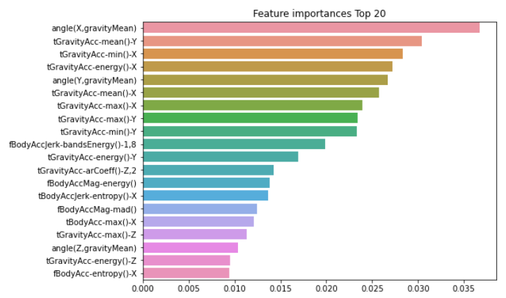

### 6) GBM (Gradient Boosting Machine)

```python
# 수행시간 약 8분
from sklearn.ensemble import GradientBoostingClassifier
import time

# 워닝 무시
import warnings
warnings.filterwarnings('ignore')

# train, test 데이터 분리
X_train, X_test, y_train, y_test = get_human_dataset()

# GBM 수행 시간 측정을 위함. 시작 시간 설정.
start_time = time.time()

# GBM 클래스 객체 생성
gb_clf = GradientBoostingClassifier(random_state=0)   # n_estimators = 100(default)

# 학습
gb_clf.fit(X_train , y_train)

# 예측
gb_pred = gb_clf.predict(X_test)

# 평가
gb_accuracy = accuracy_score(y_test, gb_pred)

print('GBM 정확도: {0:.4f}'.format(gb_accuracy))
print("GBM 수행 시간: {0:.1f} 초 ".format(time.time() - start_time))  # 약 8분
```

```
GBM 정확도: 0.9389
GBM 수행 시간: 708.9 초 
```

* 높은 정확도를 보이지만, 수행 시간이 오래 걸려서 하이퍼 파라미터 튜닝이 어렵다.

```python
# 그리드서치 수행

from sklearn.model_selection import GridSearchCV

start_time = time.time()
params = {
    'n_estimators':[100, 500],
    'learning_rate' : [0.05, 0.1]
}

grid_cv = GridSearchCV(gb_clf , param_grid=params , cv=2 ,verbose=1, n_jobs=-1)
grid_cv.fit(X_train , y_train)
print('최적 하이퍼 파라미터:\n', grid_cv.best_params_)
print('최고 예측 정확도: {0:.4f}'.format(grid_cv.best_score_))
print("학습에 걸린 시간: ".format(time.time() - start_time))
```

```
Fitting 2 folds for each of 4 candidates, totalling 8 fits
최적 하이퍼 파라미터:
 {'learning_rate': 0.1, 'n_estimators': 500}
최고 예측 정확도: 0.9011
학습에 걸린 시간: 
```

```python
# 그리드서치 결과 보기
scores_df = pd.DataFrame(grid_cv.cv_results_)
scores_df[['params', 'mean_test_score', 'rank_test_score',
'split0_test_score', 'split1_test_score']]
```

|      |                                       params | mean_test_score | rank_test_score | split0_test_score | split1_test_score |
| ---: | -------------------------------------------: | --------------: | --------------: | ----------------: | ----------------: |
|    0 | {'learning_rate': 0.05, 'n_estimators': 100} |        0.899619 |               3 |          0.886834 |          0.912405 |
|    1 | {'learning_rate': 0.05, 'n_estimators': 500} |        0.900299 |               2 |          0.890098 |          0.910501 |
|    2 |  {'learning_rate': 0.1, 'n_estimators': 100} |        0.898939 |               4 |          0.886561 |          0.911317 |
|    3 |  {'learning_rate': 0.1, 'n_estimators': 500} |        0.901115 |               1 |          0.889826 |          0.912405 |

```python
# GridSearchCV를 이용하여 최적으로 학습된 estimator로 predict 수행. 
gb_pred = grid_cv.best_estimator_.predict(X_test)
gb_accuracy = accuracy_score(y_test, gb_pred)
print('GBM 정확도: {0:.4f}'.format(gb_accuracy))
```

```
GBM 정확도: 0.9420
```

-> GBM의 정확도는 0.9406으로 랜덤포레스트의 0.9165보다 높게 나왔다.

### 7) XGBoost

**공통 : 필요한 라이브러리**

```python
import pandas as pd
import numpy as np
from sklearn.datasets import load_breast_cancer
from sklearn.model_selection import train_test_split

# 워닝 무시
import warnings
warnings.filterwarnings('ignore')
```

#### (1) Case1. Python Wrapper xgb 적용

```python
import xgboost as xgb   # Python wrapper xgb
from xgboost import plot_importance
```

1. 데이터 로드

```python
# 위스콘신 유방암 데이터 로드
dataset = load_breast_cancer()
dataset
```

```python
# feature, target data setting
X_features = dataset.data
y_label = dataset.target

# data load
cancer_df = pd.DataFrame(data=X_features, columns=dataset.feature_names)
cancer_df['target']= y_label

print(cancer_df.shape)
cancer_df.head(5)
```

```
(569, 31)
```

Out[6]:

|      | mean radius | mean texture | mean perimeter | mean area | mean smoothness | mean compactness | mean concavity | mean concave points | mean symmetry | mean fractal dimension |  ... | worst texture | worst perimeter | worst area | worst smoothness | worst compactness | worst concavity | worst concave points | worst symmetry | worst fractal dimension | target |
| ---: | ----------: | -----------: | -------------: | --------: | --------------: | ---------------: | -------------: | ------------------: | ------------: | ---------------------: | ---: | ------------: | --------------: | ---------: | ---------------: | ----------------: | --------------: | -------------------: | -------------: | ----------------------: | -----: |
|    0 |       17.99 |        10.38 |         122.80 |    1001.0 |         0.11840 |          0.27760 |         0.3001 |             0.14710 |        0.2419 |                0.07871 |  ... |         17.33 |          184.60 |     2019.0 |           0.1622 |            0.6656 |          0.7119 |               0.2654 |         0.4601 |                 0.11890 |      0 |
|    1 |       20.57 |        17.77 |         132.90 |    1326.0 |         0.08474 |          0.07864 |         0.0869 |             0.07017 |        0.1812 |                0.05667 |  ... |         23.41 |          158.80 |     1956.0 |           0.1238 |            0.1866 |          0.2416 |               0.1860 |         0.2750 |                 0.08902 |      0 |
|    2 |       19.69 |        21.25 |         130.00 |    1203.0 |         0.10960 |          0.15990 |         0.1974 |             0.12790 |        0.2069 |                0.05999 |  ... |         25.53 |          152.50 |     1709.0 |           0.1444 |            0.4245 |          0.4504 |               0.2430 |         0.3613 |                 0.08758 |      0 |
|    3 |       11.42 |        20.38 |          77.58 |     386.1 |         0.14250 |          0.28390 |         0.2414 |             0.10520 |        0.2597 |                0.09744 |  ... |         26.50 |           98.87 |      567.7 |           0.2098 |            0.8663 |          0.6869 |               0.2575 |         0.6638 |                 0.17300 |      0 |
|    4 |       20.29 |        14.34 |         135.10 |    1297.0 |         0.10030 |          0.13280 |         0.1980 |             0.10430 |        0.1809 |                0.05883 |  ... |         16.67 |          152.20 |     1575.0 |           0.1374 |            0.2050 |          0.4000 |               0.1625 |         0.2364 |                 0.07678 |      0 |

5 rows × 31 columns

```python
# 타겟명과 타겟값의 레이블 분포 확인
print(dataset.target_names)
print(cancer_df['target'].value_counts())
```

```
['malignant' 'benign']
1    357
0    212
Name: target, dtype: int64
```

-> 우리가 예측해야할 타겟값들이 - 'malignant'(악성:유해한), 'benign'(양성:무해한) -
0, 1로 표시되어 어느정도 고르게 분포되어 있다.

```python
# 전체 데이터 중 80%는 학습용 데이터, 20%는 테스트용 데이터 추출
X_train, X_test, y_train, y_test = train_test_split(X_features, y_label,
                                         test_size=0.2, random_state=156 )
print(X_train.shape , X_test.shape)
```

```
(455, 30) (114, 30)
```

2. 전처리

```python
# Python Wrapper XGBoost - 학습과 예측 데이터 세트를 DMatrix로 변환 필요
dtrain = xgb.DMatrix(data=X_train , label=y_train)
dtest = xgb.DMatrix(data=X_test , label=y_test)
```

**하이퍼 파라미터 설정**

```python
params = { 'max_depth':3,
           'eta': 0.1,          # 학습률 
           'objective':'binary:logistic',  # 예측 결정 함수 : 이진 분류
           'eval_metric':'logloss',
           'early_stoppings':100   # 100번동안 성능향상 없으면 학습 조기종료
        }

# 학습 횟수
num_rounds = 400
```

3. 학습 : train() 함수 

```python
# 데이터를 학습용은 ‘train’ , 검증용은 ‘eval’로 표시
wlist = [(dtrain,'train'),(dtest,'eval') ]

# 하이퍼 파라미터와 early stopping 파라미터를 train( ) 함수의 파라미터로 전달
xgb_model = xgb.train(params = params, dtrain=dtrain, num_boost_round=num_rounds, evals=wlist)
xgb_model
```

4. 예측

**predict()를 통해 예측 확률값을 반환하고 예측 값으로 변환**

```python
pred_probs = xgb_model.predict(dtest)
print('predict( ) 수행 결과값을 10개만 표시, 예측 확률 값으로 표시됨')
print(np.round(pred_probs[:10], 3))
```

```
predict( ) 수행 결과값을 10개만 표시, 예측 확률 값으로 표시됨
[0.95  0.003 0.9   0.086 0.993 1.    1.    0.999 0.998 0.   ]
```

```python
# 예측 확률이 0.5 보다 크면 1, 그렇지 않으면 0으로 예측값 결정하여 리스트에 저장
preds = [ 1 if x > 0.5 else 0 for x in pred_probs ]
print('예측값 10개만 표시:', preds[:10])
```

```
예측값 10개만 표시: [1, 0, 1, 0, 1, 1, 1, 1, 1, 0]
```

5. 평가

**get_clf_eval()을 통해 예측 평가**

```python
from sklearn.metrics import confusion_matrix, accuracy_score
from sklearn.metrics import precision_score, recall_score
from sklearn.metrics import f1_score, roc_auc_score

# 수정된 get_clf_eval() 함수 
def get_clf_eval(y_test, pred=None, pred_proba=None):
    confusion = confusion_matrix( y_test, pred)
    accuracy = accuracy_score(y_test , pred)
    precision = precision_score(y_test , pred)
    recall = recall_score(y_test , pred)
    f1 = f1_score(y_test,pred)
    # ROC-AUC 추가 
    roc_auc = roc_auc_score(y_test, pred_proba)
    print('오차 행렬')
    print(confusion)
    # ROC-AUC print 추가
    print('정확도: {0:.4f}, 정밀도: {1:.4f}, 재현율: {2:.4f},\
    F1: {3:.4f}, AUC:{4:.4f}'.format(accuracy, precision, recall, f1, roc_auc), '\n')
```

```python
get_clf_eval(y_test , preds, pred_probs)
```

```
오차 행렬
[[35  2]
 [ 1 76]]
정확도: 0.9737, 정밀도: 0.9744, 재현율: 0.9870,    F1: 0.9806, AUC:0.9951 
```

#### (2) Case2. 사이킷런 Wrapper XGBoost 적용

```python
# Scikit-learn Wrapper XGBoost 클래스인 XGBClassifier 임포트
from xgboost import XGBClassifier

# 원래 검증에 test 데이터를 사용하면 안되지만 여기서는 검증 데이터가 따로 없으므로 쓴다.
evals = [(X_test, y_test)]

# XGBClassifier 클래스의 객체 생성
xgb_wrapper = XGBClassifier(n_estimators=400, learning_rate=0.1, max_depth=3)
```

1. 학습 (검증 포함)

   - early_stopping_rounds = 400

   ```python
   xgb_wrapper.fit(X_train, y_train, early_stopping_rounds=400, eval_set=evals, eval_metric="logloss",  verbose=True)
   
   # 예측
   w_preds = xgb_wrapper.predict(X_test)
   w_pred_proba = xgb_wrapper.predict_proba(X_test)[:, 1]
   ```

   ```python
   # 평가
   get_clf_eval(y_test , w_preds, w_pred_proba)
   ```

   ```
   오차 행렬
   [[35  2]
    [ 1 76]]
   정확도: 0.9737, 정밀도: 0.9744, 재현율: 0.9870,    F1: 0.9806, AUC:0.9951 
   ```

   - early_stopping_rounds = 100

   ```python
   from xgboost import XGBClassifier
   
   xgb_wrapper = XGBClassifier(n_estimators=400, learning_rate=0.1, max_depth=3)
   
   evals = [(X_test, y_test)]
   
   # early_stopping_rounds=100
   xgb_wrapper.fit(X_train, y_train, early_stopping_rounds=100, eval_metric="logloss", 
                   eval_set=evals, verbose=True)
   
   ws100_preds = xgb_wrapper.predict(X_test)
   ws100_pred_proba = xgb_wrapper.predict_proba(X_test)[:, 1]
   ```

   -> 211번째 나온 0.0859보다 성능이 좋은 모델이 311번까지 나오지 않아 학습 조기종료

   ```python
   get_clf_eval(y_test , ws100_preds, ws100_pred_proba)
   ```

   ```
   오차 행렬
   [[34  3]
    [ 1 76]]
   정확도: 0.9649, 정밀도: 0.9620, 재현율: 0.9870,    F1: 0.9744, AUC:0.9954 
   ```

   - early_stopping_rounds = 10

   ```python
   # early_stopping_rounds를 10으로 설정하고 재 학습. 
   
   # 학습(early_stopping_rounds=10)
   xgb_wrapper.fit(X_train, y_train, early_stopping_rounds=10, 
                   eval_metric="logloss", eval_set=evals,verbose=True)
   # 예측
   ws10_preds = xgb_wrapper.predict(X_test)
   
   # 평가
   ws10_pred_proba = xgb_wrapper.predict_proba(X_test)[:, 1]
   get_clf_eval(y_test , ws10_preds, ws10_pred_proba)
   ```

   ```
   오차 행렬
   [[34  3]
    [ 2 75]]
   정확도: 0.9561, 정밀도: 0.9615, 재현율: 0.9740,    F1: 0.9677, AUC:0.9947 
   ```

-> early stopping을 10으로 짧게 주면 성능이 떨어지기는 하지만, 어느 정도 성능은 나온다. 이 정도 학습 속도에서 하이퍼 파라미터 튜닝을 해서 베이스라인을 잡은 다음에 점차 early_stopping_rounds나 n_estimator 수를 늘려나가는 것도 방법.

### 8) LightGBM

1. 데이터 로드 및 확인

```python
# LightGBM의 파이썬 패키지인 lightgbm에서 LGBMClassifier 임포트
from lightgbm import LGBMClassifier

import pandas as pd
import numpy as np

from sklearn.datasets import load_breast_cancer
from sklearn.model_selection import train_test_split

dataset = load_breast_cancer()
ftr = dataset.data
target = dataset.target

# feature, target data의 앞 3개만 확인
print(ftr.shape)
print(ftr[:3], '\n')
print(target[:3])
```

```
(569, 30)
[[1.799e+01 1.038e+01 1.228e+02 1.001e+03 1.184e-01 2.776e-01 3.001e-01
  1.471e-01 2.419e-01 7.871e-02 1.095e+00 9.053e-01 8.589e+00 1.534e+02
  6.399e-03 4.904e-02 5.373e-02 1.587e-02 3.003e-02 6.193e-03 2.538e+01
  1.733e+01 1.846e+02 2.019e+03 1.622e-01 6.656e-01 7.119e-01 2.654e-01
  4.601e-01 1.189e-01]
 [2.057e+01 1.777e+01 1.329e+02 1.326e+03 8.474e-02 7.864e-02 8.690e-02
  7.017e-02 1.812e-01 5.667e-02 5.435e-01 7.339e-01 3.398e+00 7.408e+01
  5.225e-03 1.308e-02 1.860e-02 1.340e-02 1.389e-02 3.532e-03 2.499e+01
  2.341e+01 1.588e+02 1.956e+03 1.238e-01 1.866e-01 2.416e-01 1.860e-01
  2.750e-01 8.902e-02]
 [1.969e+01 2.125e+01 1.300e+02 1.203e+03 1.096e-01 1.599e-01 1.974e-01
  1.279e-01 2.069e-01 5.999e-02 7.456e-01 7.869e-01 4.585e+00 9.403e+01
  6.150e-03 4.006e-02 3.832e-02 2.058e-02 2.250e-02 4.571e-03 2.357e+01
  2.553e+01 1.525e+02 1.709e+03 1.444e-01 4.245e-01 4.504e-01 2.430e-01
  3.613e-01 8.758e-02]] 

[0 0 0]
```

```python
dataset.feature_names
```

```
array(['mean radius', 'mean texture', 'mean perimeter', 'mean area',
       'mean smoothness', 'mean compactness', 'mean concavity',
       'mean concave points', 'mean symmetry', 'mean fractal dimension',
       'radius error', 'texture error', 'perimeter error', 'area error',
       'smoothness error', 'compactness error', 'concavity error',
       'concave points error', 'symmetry error',
       'fractal dimension error', 'worst radius', 'worst texture',
       'worst perimeter', 'worst area', 'worst smoothness',
       'worst compactness', 'worst concavity', 'worst concave points',
       'worst symmetry', 'worst fractal dimension'], dtype='<U23')
```

2. 학습

```python
# train, test 데이터 분리
X_train, X_test, y_train, y_test = train_test_split(ftr, target, test_size=0.2, random_state=156 )

# 앞서 XGBoost와 동일하게 n_estimators는 400 설정. 
lgbm_wrapper = LGBMClassifier(n_estimators=400)

# LightGBM도 XGBoost와 동일하게 조기 중단 수행 가능. 
evals = [(X_test, y_test)]  # 원래 evals 데이터는 검증 데이터 셋을 별도로 둬야되는데 여기서는 테스트 데이터 사용
lgbm_wrapper.fit(X_train, y_train, early_stopping_rounds=100, eval_metric="logloss", 
                 eval_set=evals, verbose=True)
```

3. 예측

```python
preds = lgbm_wrapper.predict(X_test)
preds
```

```
array([1, 0, 1, 0, 1, 1, 1, 1, 1, 0, 0, 0, 1, 1, 1, 1, 1, 1, 1, 1, 0, 1,
       0, 1, 0, 1, 0, 0, 1, 0, 1, 0, 1, 1, 0, 0, 1, 1, 0, 1, 0, 1, 1, 1,
       1, 1, 0, 1, 1, 1, 1, 0, 1, 1, 1, 1, 1, 1, 1, 1, 1, 1, 0, 0, 1, 1,
       0, 1, 1, 1, 0, 1, 0, 1, 1, 0, 1, 1, 1, 0, 0, 1, 1, 1, 1, 1, 1, 1,
       1, 0, 1, 1, 0, 0, 1, 0, 0, 1, 0, 1, 0, 0, 1, 1, 1, 1, 1, 1, 1, 1,
       1, 1, 1, 1])
```

```python
# 1 예측 확률값 3개만 확인
pred_proba = lgbm_wrapper.predict_proba(X_test)[:, 1]
pred_proba[:3]
```

```
array([0.60514473, 0.00747978, 0.94351324])
```

4. 평가

```python
from sklearn.metrics import confusion_matrix, accuracy_score
from sklearn.metrics import precision_score, recall_score
from sklearn.metrics import f1_score, roc_auc_score

# 성능 평가 함수
def get_clf_eval(y_test, pred=None, pred_proba=None):
    confusion = confusion_matrix( y_test, pred)
    accuracy = accuracy_score(y_test , pred)
    precision = precision_score(y_test , pred)
    recall = recall_score(y_test , pred)
    f1 = f1_score(y_test,pred)
    roc_auc = roc_auc_score(y_test, pred_proba)
    print('오차 행렬')
    print(confusion)
    print('정확도: {0:.4f}, 정밀도: {1:.4f}, 재현율: {2:.4f},\
    F1: {3:.4f}, AUC:{4:.4f}'.format(accuracy, precision, recall, f1, roc_auc), '\n')
```

```python
get_clf_eval(y_test, preds, pred_proba)
```

```
오차 행렬
[[33  4]
 [ 1 76]]
정확도: 0.9561, 정밀도: 0.9500, 재현율: 0.9870,    F1: 0.9682, AUC:0.9905 
```

-> 하이퍼 파라미터 튜닝이 안되어 있어서 XGBoost보다 성능은 다소 안좋게 나온 상태.
   (4.6 XGBoost - 정확도: 0.9737, 정밀도: 0.9744, 재현율: 0.9870,    F1: 0.9806, AUC:0.9951)

## 3. 실습

### 1) 산탄데르  고객 만족 예측

> 교차검증으로 하이퍼 파라미터 튜닝을 통해서 성능을 올리는 것보다는, 차라리 피처 엔지니어링 하는 것이 성능 향상에 더 중요할 때가 많다. (이상치 제거, 표준 정규화 등)

1. 데이터 로드 및 확인

```python
import numpy as np 
import pandas as pd 
import matplotlib.pyplot as plt
import matplotlib

cust_df = pd.read_csv("./train_santander.csv", encoding='latin-1')

print('dataset shape:', cust_df.shape)
cust_df.head(5)
```

```
dataset shape: (76020, 371)
```

Out[2]:

|      |   ID | var3 | var15 | imp_ent_var16_ult1 | imp_op_var39_comer_ult1 | imp_op_var39_comer_ult3 | imp_op_var40_comer_ult1 | imp_op_var40_comer_ult3 | imp_op_var40_efect_ult1 | imp_op_var40_efect_ult3 |  ... | saldo_medio_var33_hace2 | saldo_medio_var33_hace3 | saldo_medio_var33_ult1 | saldo_medio_var33_ult3 | saldo_medio_var44_hace2 | saldo_medio_var44_hace3 | saldo_medio_var44_ult1 | saldo_medio_var44_ult3 |         var38 | TARGET |
| ---: | ---: | ---: | ----: | -----------------: | ----------------------: | ----------------------: | ----------------------: | ----------------------: | ----------------------: | ----------------------: | ---: | ----------------------: | ----------------------: | ---------------------: | ---------------------: | ----------------------: | ----------------------: | ---------------------: | ---------------------: | ------------: | -----: |
|    0 |    1 |    2 |    23 |                0.0 |                     0.0 |                     0.0 |                     0.0 |                     0.0 |                     0.0 |                     0.0 |  ... |                     0.0 |                     0.0 |                    0.0 |                    0.0 |                     0.0 |                     0.0 |                    0.0 |                    0.0 |  39205.170000 |      0 |
|    1 |    3 |    2 |    34 |                0.0 |                     0.0 |                     0.0 |                     0.0 |                     0.0 |                     0.0 |                     0.0 |  ... |                     0.0 |                     0.0 |                    0.0 |                    0.0 |                     0.0 |                     0.0 |                    0.0 |                    0.0 |  49278.030000 |      0 |
|    2 |    4 |    2 |    23 |                0.0 |                     0.0 |                     0.0 |                     0.0 |                     0.0 |                     0.0 |                     0.0 |  ... |                     0.0 |                     0.0 |                    0.0 |                    0.0 |                     0.0 |                     0.0 |                    0.0 |                    0.0 |  67333.770000 |      0 |
|    3 |    8 |    2 |    37 |                0.0 |                   195.0 |                   195.0 |                     0.0 |                     0.0 |                     0.0 |                     0.0 |  ... |                     0.0 |                     0.0 |                    0.0 |                    0.0 |                     0.0 |                     0.0 |                    0.0 |                    0.0 |  64007.970000 |      0 |
|    4 |   10 |    2 |    39 |                0.0 |                     0.0 |                     0.0 |                     0.0 |                     0.0 |                     0.0 |                     0.0 |  ... |                     0.0 |                     0.0 |                    0.0 |                    0.0 |                     0.0 |                     0.0 |                    0.0 |                    0.0 | 117310.979016 |      0 |

5 rows × 371 columns

2. 데이터 전처리

```python
# 만족:0, 불만족:1
print(cust_df['TARGET'].value_counts())
```

```
0    73012
1     3008
Name: TARGET, dtype: int64
```

```python
# 전체 응답 중 불만족 비율
total_cnt = cust_df['TARGET'].count()

unsatisfied_cnt = cust_df[cust_df['TARGET'] == 1]['TARGET'].count()

print('unsatisfied 비율은 {0:.2f}'.format((unsatisfied_cnt / total_cnt)))
```

```
unsatisfied 비율은 0.04
```

```python
cust_df.describe( )
```

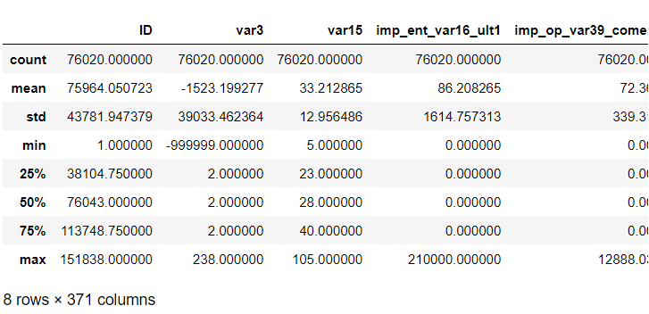

-> 'var3' 값들의 분포는 이상하다. 

```python
print(cust_df['var3'].value_counts( )[:10])
```

```
 2         74165
 8           138
-999999      116
 9           110
 3           108
 1           105
 13           98
 7            97
 4            86
 12           85
Name: var3, dtype: int64
```

-> -999999의 값들은 가장 많은 2로 대체한다.

```python
# var3 피처 값 대체
cust_df['var3'].replace(-999999, 2, inplace=True) # inplace = 객체 자체를 바꿔라

# ID는 필요 없으므로 drop (컬럼 삭제 시, axis=1, inplace=True)
cust_df.drop('ID', axis=1, inplace=True)
```

```python
# features, target 분리
X_features = cust_df.iloc[:, :-1]
y_labels = cust_df.iloc[:, -1]
print('피처 데이터 shape:{0}'.format(X_features.shape))
```

```
피처 데이터 shape:(76020, 369)
```

```python
from sklearn.model_selection import train_test_split

# train, test 데이터 분리
X_train, X_test, y_train, y_test = train_test_split(X_features, y_labels,
                                                    test_size=0.2, random_state=0, stratify=y_labels)
```

```python
# 잘 분리되었는지 분포 확인
train_cnt = y_train.count()
test_cnt = y_test.count()
print('학습 세트 Shape:{0}, 테스트 세트 Shape:{1}'.format(X_train.shape, X_test.shape), '\n')

print(' 학습 세트 레이블 값 분포 비율')
print(y_train.value_counts()/train_cnt)

print('\n 테스트 세트 레이블 값 분포 비율')
print(y_test.value_counts()/test_cnt)
```

```
학습 세트 Shape:(60816, 369), 테스트 세트 Shape:(15204, 369) 

 학습 세트 레이블 값 분포 비율
0    0.960438
1    0.039562
Name: TARGET, dtype: float64

 테스트 세트 레이블 값 분포 비율
0    0.960405
1    0.039595
Name: TARGET, dtype: float64
```

-> train, test 데이터 각각 레이블 분포 비율이 비슷하게 쪼개진 것을 확인

3. 학습

```python
from xgboost import XGBClassifier
from sklearn.metrics import roc_auc_score

# XGBClassifier 객체 생성
xgb_clf = XGBClassifier(n_estimators=100, random_state=156)

# 학습 : 성능 평가 지표를 auc로 설정하고 학습 수행. 
xgb_clf.fit(X_train, y_train, early_stopping_rounds=30,
            # 원래 검증 셋은 test 말고 다른 데이터 셋으로 해야하지만 여기서는 그냥 test 셋으로 진행함
            eval_metric="auc", eval_set=[(X_train, y_train), (X_test, y_test)])
```

```
XGBClassifier(base_score=0.5, booster='gbtree', colsample_bylevel=1,
              colsample_bynode=1, colsample_bytree=1, enable_categorical=False,
              gamma=0, gpu_id=-1, importance_type=None,
              interaction_constraints='', learning_rate=0.300000012,
              max_delta_step=0, max_depth=6, min_child_weight=1, missing=nan,
              monotone_constraints='()', n_estimators=100, n_jobs=8,
              num_parallel_tree=1, predictor='auto', random_state=156,
              reg_alpha=0, reg_lambda=1, scale_pos_weight=1, subsample=1,
              tree_method='exact', validate_parameters=1, verbosity=None)
```

```python
xgb_roc_score = roc_auc_score(y_test, xgb_clf.predict_proba(X_test)[:,1], average='macro')
print('ROC AUC: {0:.4f}'.format(xgb_roc_score))
```

```
ROC AUC: 0.8251
```

4. GridSearchCV 적용

```python
%%time
# 수행시간 4분
from sklearn.model_selection import GridSearchCV

# 하이퍼 파라미터 테스트의 수행 속도를 향상시키기 위해 n_estimators를 100으로 감소
xgb_clf = XGBClassifier(n_estimators=100)

# colsample_bytree : 컬럼이 너무 많으니 일부 비율로 해서 과적합을 조정하겠다.
# min_child_weight : 트리에서 가지를 추가로 치기 위해 필요한 최소 샘플 수.(> 0)
params = {'max_depth':[5, 7] , 'min_child_weight':[1, 3] , 'colsample_bytree':[0.5, 0.75] }

# 하이퍼 파라미터 테스트의 수행속도를 향상 시키기 위해 cv는 2로 부여함
gridcv = GridSearchCV(xgb_clf, param_grid=params, cv=2)
gridcv.fit(X_train, y_train, early_stopping_rounds=30, eval_metric="auc",
           eval_set=[(X_train, y_train), (X_test, y_test)])

print('GridSearchCV 최적 파라미터:', gridcv.best_params_) 

xgb_roc_score = roc_auc_score(y_test, gridcv.predict_proba(X_test)[:,1], average='macro')
print('ROC AUC: {0:.4f}'.format(xgb_roc_score))
```

```
GridSearchCV 최적 파라미터: {'colsample_bytree': 0.5, 'max_depth': 5, 'min_child_weight': 3}
ROC AUC: 0.8237
Wall time: 2min 50s
```

-> 교차검증을 해도 안 했을 때와 크게 차이는 없다

5. n_estimators는 1000으로 증가, learning_rate=0.02로 감소, reg_alpha=0.03으로 추가

```python
%%time
# 수행시간 1분
# 새로운 하이퍼 파라미터 적용된 XGBClassifier 객체 생성
xgb_clf = XGBClassifier(n_estimators=1000, random_state=156, learning_rate=0.02, max_depth=5,\
                        min_child_weight=1, colsample_bytree=0.75, reg_alpha=0.03)

# 학습
xgb_clf.fit(X_train, y_train, early_stopping_rounds=200, 
            eval_metric="auc", eval_set=[(X_train, y_train), (X_test, y_test)])

# 평가(roc auc)
xgb_roc_score = roc_auc_score(y_test, xgb_clf.predict_proba(X_test)[:,1],average='macro')
print('ROC AUC: {0:.4f}'.format(xgb_roc_score))
```

```
ROC AUC: 0.8271
Wall time: 2min 21s
```

```python
# 직전 모델에 max_depth만 7로 변경
xgb_clf = XGBClassifier(n_estimators=1000, random_state=156, learning_rate=0.02, max_depth=7,\
                        min_child_weight=1, colsample_bytree=0.75, reg_alpha=0.03)

# evaluation metric을 auc로, early stopping은 200 으로 설정하고 학습 수행. 
xgb_clf.fit(X_train, y_train, early_stopping_rounds=200, 
            eval_metric="auc", eval_set=[(X_train, y_train), (X_test, y_test)])

xgb_roc_score = roc_auc_score(y_test, xgb_clf.predict_proba(X_test)[:,1],average='macro')
print('ROC AUC: {0:.4f}'.format(xgb_roc_score))
```

```
ROC AUC: 0.8269
```

6. LightGBM 모델 학습과 하이퍼 파라미터 튜닝

```python
from lightgbm import LGBMClassifier

# LGBMClassifier 객체 생성
lgbm_clf = LGBMClassifier(n_estimators=500)

# 검증 데이터 지정
evals = [(X_test, y_test)]

# 학습
lgbm_clf.fit(X_train, y_train, early_stopping_rounds=100, eval_metric="auc", eval_set=evals,
                verbose=True)
# 평가(roc auc)
lgbm_roc_score = roc_auc_score(y_test, lgbm_clf.predict_proba(X_test)[:,1],average='macro')
print('ROC AUC: {0:.4f}'.format(lgbm_roc_score))
```

```
ROC AUC: 0.8239
```

-> XGBoost에 비하면 수행시간이 엄청 빠르다!

```python
%%time
# 그리드서치CV 수행
from sklearn.model_selection import GridSearchCV

# 하이퍼 파라미터 테스트의 수행 속도를 향상시키기 위해 n_estimators를 100으로 감소
LGBM_clf = LGBMClassifier(n_estimators=100)

params = {'num_leaves': [32, 64],
          'max_depth':[128, 160],
          'min_child_samples':[60, 100],
          'subsample':[0.8, 1]}

# 하이퍼 파라미터 테스트의 수행속도를 향상 시키기 위해 cv 를 지정하지 않습니다. 
gridcv = GridSearchCV(lgbm_clf, param_grid=params)
gridcv.fit(X_train, y_train, early_stopping_rounds=30, eval_metric="auc",
           eval_set=[(X_train, y_train), (X_test, y_test)])

print('GridSearchCV 최적 파라미터:', gridcv.best_params_)
lgbm_roc_score = roc_auc_score(y_test, gridcv.predict_proba(X_test)[:,1], average='macro')
print('ROC AUC: {0:.4f}'.format(lgbm_roc_score))
```

``````
그리드서치 결과 
GridSearchCV 최적 파라미터: {'max_depth': 128, 'min_child_samples': 100, 'num_leaves': 32, 'subsample': 0.8}
``````

```python
# 위 하이퍼 파라미터를 적용하고 n_estimators는 1000으로 증가, early_stopping_rounds는 100으로 증가
lgbm_clf = LGBMClassifier(n_estimators=1000, num_leaves=32, sumbsample=0.8, min_child_samples=100,
                          max_depth=128)

evals = [(X_test, y_test)]
lgbm_clf.fit(X_train, y_train, early_stopping_rounds=100, eval_metric="auc", eval_set=evals,
                verbose=True)

lgbm_roc_score = roc_auc_score(y_test, lgbm_clf.predict_proba(X_test)[:,1],average='macro')
print('ROC AUC: {0:.4f}'.format(lgbm_roc_score))
```

```
ROC AUC: 0.8263
```

-> 그리드서치를 이용해서 하이퍼 파라미터를 튜닝해서 성능을 극대화하기는 힘들다. XGBoost같은 좋은 알고리즘일 때 더욱 그렇다.
특히 트리 계열은 하이퍼 파라미터 종류가 너무 많아서 시간 대비 결과가 만족스럽지 않은 경우가 많다.

피처 엔지니어링의 중요성 : 이상치, 표준정규화 등을 통해 데이터를 잘 가공하는 것이 중요하다!

### 2) 신용카드_사기검출

1. 데이터 로드 및 확인

```python
import pandas as pd
import numpy as np 
import matplotlib.pyplot as plt
import warnings
warnings.filterwarnings("ignore")
%matplotlib inline

card_df = pd.read_csv('./creditcard.csv')

print(card_df.shape)
card_df.head(3)
```

```
(284807, 31)
```

Out[2]:

|      | Time |        V1 |        V2 |       V3 |       V4 |        V5 |        V6 |        V7 |       V8 |        V9 |  ... |       V21 |       V22 |       V23 |       V24 |       V25 |       V26 |       V27 |       V28 | Amount | Class |
| ---: | ---: | --------: | --------: | -------: | -------: | --------: | --------: | --------: | -------: | --------: | ---: | --------: | --------: | --------: | --------: | --------: | --------: | --------: | --------: | -----: | ----: |
|    0 |  0.0 | -1.359807 | -0.072781 | 2.536347 | 1.378155 | -0.338321 |  0.462388 |  0.239599 | 0.098698 |  0.363787 |  ... | -0.018307 |  0.277838 | -0.110474 |  0.066928 |  0.128539 | -0.189115 |  0.133558 | -0.021053 | 149.62 |     0 |
|    1 |  0.0 |  1.191857 |  0.266151 | 0.166480 | 0.448154 |  0.060018 | -0.082361 | -0.078803 | 0.085102 | -0.255425 |  ... | -0.225775 | -0.638672 |  0.101288 | -0.339846 |  0.167170 |  0.125895 | -0.008983 |  0.014724 |   2.69 |     0 |
|    2 |  1.0 | -1.358354 | -1.340163 | 1.773209 | 0.379780 | -0.503198 |  1.800499 |  0.791461 | 0.247676 | -1.514654 |  ... |  0.247998 |  0.771679 |  0.909412 | -0.689281 | -0.327642 | -0.139097 | -0.055353 | -0.059752 | 378.66 |     0 |

3 rows × 31 columns

**원본 DataFrame은 유지하고 데이터 가공을 위한 DataFrame을 복사하여 반환**

```python
from sklearn.model_selection import train_test_split

# 전처리 함수 : df의 Time 컬럼 삭제 
def get_preprocessed_df(df=None):
    df_copy = df.copy()
    df_copy.drop('Time', axis=1, inplace=True)
    return df_copy
```

**학습과 테스트 데이터 세트를 반환하는 함수 생성. 사전 데이터 처리가 끝난 뒤 해당 함수 호출**

```python
# 사전 데이터 가공 후 학습과 테스트 데이터 세트를 반환하는 함수.
def get_train_test_dataset(df=None):
    # 인자로 입력된 DataFrame의 사전 데이터 가공이 완료된 복사 DataFrame 반환
    df_copy = get_preprocessed_df(df)
    
    # 피처, 클래스 분리
    X_features = df_copy.iloc[:, :-1]
    y_target = df_copy.iloc[:, -1]
    
    # train_test_split( )으로 학습과 테스트 데이터 분할. 
    X_train, X_test, y_train, y_test = \
    train_test_split(X_features, y_target, test_size=0.3, random_state=0, stratify=y_target)
    
    # 학습과 테스트 데이터 세트 반환
    return X_train, X_test, y_train, y_test

X_train, X_test, y_train, y_test = get_train_test_dataset(card_df)
```

```python
print('학습 데이터 레이블 값 비율')
print(y_train.value_counts()/y_train.shape[0] * 100, '\n')
print('테스트 데이터 레이블 값 비율')
print(y_test.value_counts()/y_test.shape[0] * 100)
```

```
학습 데이터 레이블 값 비율
0    99.827451
1     0.172549
Name: Class, dtype: float64 

테스트 데이터 레이블 값 비율
0    99.826785
1     0.173215
Name: Class, dtype: float64
```

-> 상당히 레이블 0에 치우쳐진 불균형 데이터

**학습 검증 함수 불러오기**

```python
from sklearn.metrics import confusion_matrix, accuracy_score, precision_score, recall_score, f1_score
from sklearn.metrics import roc_auc_score

# 수정된 get_clf_eval() 함수
def get_clf_eval(y_test, pred=None, pred_proba=None):
    confusion = confusion_matrix( y_test, pred)
    accuracy = accuracy_score(y_test , pred)
    precision = precision_score(y_test , pred)
    recall = recall_score(y_test , pred)
    f1 = f1_score(y_test,pred)
    # ROC-AUC 추가 
    roc_auc = roc_auc_score(y_test, pred_proba)
    print('오차 행렬')
    print(confusion)
    # ROC-AUC print 추가
    print('정확도: {0:.4f}, 정밀도: {1:.4f}, 재현율: {2:.4f},\
    F1: {3:.4f}, AUC:{4:.4f}'.format(accuracy, precision, recall, f1, roc_auc), '\n')
```

2. 학습

   - LogisticRegression

   ```python
   from sklearn.linear_model import LogisticRegression
   
   lr_clf = LogisticRegression()    # 모델 선언
   lr_clf.fit(X_train, y_train)     # 학습
   
   lr_pred = lr_clf.predict(X_test)  # 예측
   lr_pred_proba = lr_clf.predict_proba(X_test)[:, 1]   # 예측 확률값
   
   # get_clf_eval() 함수를 이용하여 평가 수행 
   get_clf_eval(y_test, lr_pred, lr_pred_proba)  # 평가
   ```

   ```
   오차 행렬
   [[85282    13]
    [   59    89]]
   정확도: 0.9992, 정밀도: 0.8725, 재현율: 0.6014,    F1: 0.7120, AUC:0.9568 
   ```

   ​	** 앞으로 피처 엔지니어링을 수행할 때마다 모델을 학습/예측/평가하므로 이를 위한 함수 생성**

   ```python
   # 학습/예측/평가 수행하는 함수
   def get_model_train_eval(model, ftr_train=None, ftr_test=None, tgt_train=None, tgt_test=None):
       model.fit(ftr_train, tgt_train)  # 학습
       pred = model.predict(ftr_test)   # 예측
       pred_proba = model.predict_proba(ftr_test)[:, 1]   # 예측 확률값
       get_clf_eval(tgt_test, pred, pred_proba)   # 평가
   ```

   - LightGBM 학습/예측/평가

   ```python
   from lightgbm import LGBMClassifier
   # LGBMClassifier의 boost_from_average 옵션이 True일 경우 
   # 레이블 값이 극도로 불균형 분포를 이루는 경우 재현률 및 ROC-AUC 성능이 매우 저하됨.
   lgbm_clf = LGBMClassifier(n_estimators=1000, num_leaves=64, n_jobs=-1, boost_from_average=False)
   
   get_model_train_eval(lgbm_clf, ftr_train=X_train, ftr_test=X_test, tgt_train=y_train, tgt_test=y_test)
   ```

   ```
   오차 행렬
   [[85290     5]
    [   36   112]]
   정확도: 0.9995, 정밀도: 0.9573, 재현율: 0.7568,    F1: 0.8453, AUC:0.9790 
   ```

   -> 재현율이 LogisticRegression보다 좋아졌다.

3. Amount 피처 변환 후 다시 학습

   ```python
   # Amount feature의 분포도 확인
   import seaborn as sns
   
   plt.figure(figsize=(8, 4))
   plt.xticks(range(0, 30000, 1000), rotation=60)
   
   sns.distplot(card_df['Amount'])
   ```

   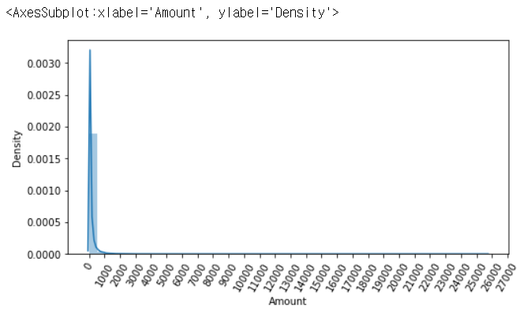

   -> Amount 피처는 롱테일 구조임을 알 수 있다.

   - Amount 피처에 StandardScaler 적용

   ```python
   card_df['Amount'].values.reshape(-1, 1)
   ```

   ```
   array([[149.62],
          [  2.69],
          [378.66],
          ...,
          [ 67.88],
          [ 10.  ],
          [217.  ]])
   ```

   ```python
   from sklearn.preprocessing import StandardScaler
   
   # Amount 피처값을 StandardScaler 적용하는 함수
   def get_preprocessed_df(df=None):
       df_copy = df.copy()
       scaler = StandardScaler()
       amount_n = scaler.fit_transform(df_copy['Amount'].values.reshape(-1, 1))
       
       # 변환된 Amount를 Amount_Scaled로 피처명 변경후 DataFrame맨 앞 컬럼으로 입력
       df_copy.insert(0, 'Amount_Scaled', amount_n)
       
       # 기존 Time, Amount 피처 삭제
       df_copy.drop(['Time', 'Amount'], axis=1, inplace=True)
       return df_copy
   ```

   **StandardScaler 변환 후 로지스틱 회귀 및 LightGBM 학습/예측/평가**

   ```python
   # Amount를 정규분포 형태로 변환 후 로지스틱 회귀 및 LightGBM 수행. 
   X_train, X_test, y_train, y_test = get_train_test_dataset(card_df)
   
   print('### 로지스틱 회귀 예측 성능 ###')
   lr_clf = LogisticRegression()
   get_model_train_eval(lr_clf, ftr_train=X_train, ftr_test=X_test, tgt_train=y_train, tgt_test=y_test)
   
   print('### LightGBM 예측 성능 ###')
   lgbm_clf = LGBMClassifier(n_estimators=1000, num_leaves=64, n_jobs=-1, boost_from_average=False)
   get_model_train_eval(lgbm_clf, ftr_train=X_train, ftr_test=X_test, tgt_train=y_train, tgt_test=y_test)
   ```

   ``````
   ### 로지스틱 회귀 예측 성능 ###
   오차 행렬
   [[85282    13]
    [   59    89]]
   정확도: 0.9992, 정밀도: 0.8725, 재현율: 0.6014,    F1: 0.7120, AUC:0.9568 
   
   ### LightGBM 예측 성능 ###
   오차 행렬
   [[85290     5]
    [   36   112]]
   정확도: 0.9995, 정밀도: 0.9573, 재현율: 0.7568,    F1: 0.8453, AUC:0.9790 
   ``````

   -> StandardScaler를 적용해도 평가지표는 변화 없는 것을 알 수 있다.

   - Amount 피처를 로그 변환

   ```python
   def get_preprocessed_df(df=None):
       df_copy = df.copy()
       
       # 넘파이의 log1p( )를 이용하여 Amount를 로그 변환
       amount_n = np.log1p(df_copy['Amount'])
       df_copy.insert(0, 'Amount_Scaled', amount_n)
       df_copy.drop(['Time','Amount'], axis=1, inplace=True)
       return df_copy
   ```

   ```python
   # train, test 데이터 분리
   X_train, X_test, y_train, y_test = get_train_test_dataset(card_df)
   
   print('### 로지스틱 회귀 예측 성능 ###')
   get_model_train_eval(lr_clf, ftr_train=X_train, ftr_test=X_test, tgt_train=y_train, tgt_test=y_test)
   
   print('### LightGBM 예측 성능 ###')
   get_model_train_eval(lgbm_clf, ftr_train=X_train, ftr_test=X_test, tgt_train=y_train, tgt_test=y_test)
   ```

   ``````
   ### 로지스틱 회귀 예측 성능 ###
   오차 행렬
   [[85283    12]
    [   59    89]]
   정확도: 0.9992, 정밀도: 0.8812, 재현율: 0.6014,    F1: 0.7149, AUC:0.9727 
   
   ### LightGBM 예측 성능 ###
   오차 행렬
   [[85290     5]
    [   35   113]]
   정확도: 0.9995, 정밀도: 0.9576, 재현율: 0.7635,    F1: 0.8496, AUC:0.9796 
   ``````

   -> Amount 피처를 log변환 해주었더니 전반적으로 모델 성능이 향상되었다.

4. 이상치 데이터 제거 후 모델 학습/예측/평가

   -  corr() : 각 피처들의 상관 관계. 결정 레이블인 class 값과 가장 상관도가 높은 피처 추출

   ```python
   import seaborn as sns
   
   plt.figure(figsize=(9, 9))
   corr = card_df.corr()
   sns.heatmap(corr, cmap='RdBu')
   ```

   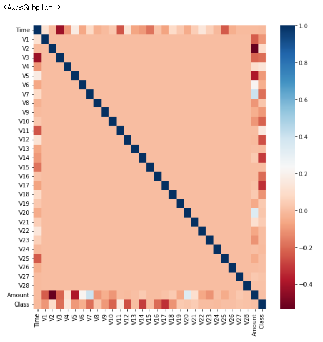

   -> class와 상관관계가 높은 피처는 V12, V14, V17

   이 중 V14 이상치를 제거

   **DataFrame에서 outlier에 해당하는 데이터를 필터링하기 위한 함수 생성. outlier 레코드의 index를 반환함**

   ```python
   import numpy as np
   
   # 이상치를 찾는 함수
   def get_outlier(df=None, column=None, weight=1.5):
       # fraud에 해당하는 column 데이터만 추출, 1/4 분위와 3/4 분위 지점을 np.percentile로 구함. 
       fraud = df[df['Class']==1][column]
       quantile_25 = np.percentile(fraud.values, 25)  # 1/4 분위
       quantile_75 = np.percentile(fraud.values, 75)  # 3/4 분위
       
       # IQR을 구하고, IQR에 1.5를 곱하여 최대값과 최소값 지점 구함. 
       iqr = quantile_75 - quantile_25
       iqr_weight = iqr * weight
       lowest_val = quantile_25 - iqr_weight  # 이상치 최소 기준
       highest_val = quantile_75 + iqr_weight # 이상치 최대 기준
       
       # 최대값 보다 크거나, 최소값 보다 작은 값을 아웃라이어로 설정하고 DataFrame index 반환. 
       outlier_index = fraud[(fraud < lowest_val) | (fraud > highest_val)].index
       
       return outlier_index
   ```

   ```python
   outlier_index = get_outlier(df=card_df, column='V14', weight=1.5)
   print('이상치 데이터 인덱스:', outlier_index)
   ```

   ```
   이상치 데이터 인덱스: Int64Index([8296, 8615, 9035, 9252], dtype='int64')
   ```

   -> 이상치가 4개가 나왔다. 추후 삭제 예정

   - 로그 변환 후 V14 피처의 이상치 데이터를 삭제한 뒤 모델들을 재학습/예측/평가

   ```python
   # get_processed_df( )를 로그 변환 후 V14 피처의 이상치 데이터를 삭제하는 로직으로 변경. 
   def get_preprocessed_df(df=None):
       df_copy = df.copy()
       amount_n = np.log1p(df_copy['Amount'])
       df_copy.insert(0, 'Amount_Scaled', amount_n)
       df_copy.drop(['Time','Amount'], axis=1, inplace=True)
       
       # 이상치 데이터 삭제하는 로직 추가
       outlier_index = get_outlier(df=df_copy, column='V14', weight=1.5)
       df_copy.drop(outlier_index, axis=0, inplace=True)
       return df_copy
   
   X_train, X_test, y_train, y_test = get_train_test_dataset(card_df)
   
   print('### 로지스틱 회귀 예측 성능 ###')
   get_model_train_eval(lr_clf, ftr_train=X_train, ftr_test=X_test, tgt_train=y_train, tgt_test=y_test)
   
   print('### LightGBM 예측 성능 ###')
   get_model_train_eval(lgbm_clf, ftr_train=X_train, ftr_test=X_test, tgt_train=y_train, tgt_test=y_test)
   ```

   ``````
   ### 로지스틱 회귀 예측 성능 ###
   오차 행렬
   [[85281    14]
    [   48    98]]
   정확도: 0.9993, 정밀도: 0.8750, 재현율: 0.6712,    F1: 0.7597, AUC:0.9743 
   
   ### LightGBM 예측 성능 ###
   오차 행렬
   [[85290     5]
    [   25   121]]
   정확도: 0.9996, 정밀도: 0.9603, 재현율: 0.8288,    F1: 0.8897, AUC:0.9780 
   ``````

   -> 로지스틱 회귀의 재현율이 많이 높아졌다.
   LightGBM의 재현율도 향상되었다.

5. "SMOTE 오버 샘플링" 적용 후 모델 학습/예측/평가

   ``````
   # imbalanced-learn 패키지 설치하기
   conda install -c conda-forge imbalanced-learn
   ``````

   ```python
   from imblearn.over_sampling import SMOTE
   
   # 타겟값 분포에 맞춰서 피처 데이터를 오버 샘플링 해준다.
   smote = SMOTE(random_state=0)
   
   X_train_over, y_train_over = smote.fit_sample(X_train, y_train)
   print("오버 샘플링 적용 시 학습 데이터의 피처/레이블 차이")
   print('오버 샘플링 적용 전 학습용 피처/레이블 데이터 세트: ', X_train.shape, y_train.shape)
   print('오버 샘플링 적용 후 학습용 피처/레이블 데이터 세트: ', X_train_over.shape, y_train_over.shape, '\n')
   
   print('오버 샘플링 적용 후 레이블 값 분포: \n', pd.Series(y_train_over).value_counts())
   ```

   ```
   오버 샘플링 적용 시 학습 데이터의 피처/레이블 차이
   오버 샘플링 적용 전 학습용 피처/레이블 데이터 세트:  (199362, 29) (199362,)
   오버 샘플링 적용 후 학습용 피처/레이블 데이터 세트:  (398040, 29) (398040,) 
   
   오버 샘플링 적용 후 레이블 값 분포: 
    0    199020
   1    199020
   Name: Class, dtype: int64
   ```

   -> 오버 샘플링 했더니 레이블 분포가 균형이 맞춰졌다.

   - 로지스틱 회귀로 학습/예측/평가

   ```python
   lr_clf = LogisticRegression()
   # ftr_train과 tgt_train 인자값이 SMOTE 증식된 X_train_over와 y_train_over로 변경됨에 유의
   get_model_train_eval(lr_clf, ftr_train=X_train_over, ftr_test=X_test, tgt_train=y_train_over, tgt_test=y_test)
   ```

   ```
   오차 행렬
   [[82937  2358]
    [   11   135]]
   정확도: 0.9723, 정밀도: 0.0542, 재현율: 0.9247,    F1: 0.1023, AUC:0.9737 
   ```

   -> 재현율은 높아졌으나, 정밀도는 낮아졌다.

   ```python
   # Precision-Recall 곡선 시각화
   import matplotlib.pyplot as plt
   import matplotlib.ticker as ticker
   from sklearn.metrics import precision_recall_curve
   %matplotlib inline
   
   def precision_recall_curve_plot(y_test , pred_proba_c1):
       # threshold ndarray와 이 threshold에 따른 정밀도, 재현율 ndarray 추출. 
       precisions, recalls, thresholds = precision_recall_curve( y_test, pred_proba_c1)
       
       # X축을 threshold값으로, Y축은 정밀도, 재현율 값으로 각각 Plot 수행. 정밀도는 점선으로 표시
       plt.figure(figsize=(8,6))
       threshold_boundary = thresholds.shape[0]
       plt.plot(thresholds, precisions[0:threshold_boundary], linestyle='--', label='precision')
       plt.plot(thresholds, recalls[0:threshold_boundary],label='recall')
       
       # threshold 값 X 축의 Scale을 0.1 단위로 변경
       start, end = plt.xlim()
       plt.xticks(np.round(np.arange(start, end, 0.1),2))
       
       # x축, y축 label과 legend, 그리고 grid 설정
       plt.xlabel('Threshold value'); plt.ylabel('Precision and Recall value')
       plt.legend(); plt.grid()
       plt.show()
   ```

   ```python
   precision_recall_curve_plot( y_test, lr_clf.predict_proba(X_test)[:, 1] )
   ```

   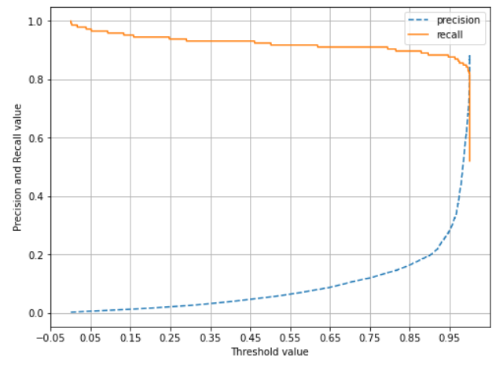

   - LightGBM 모델 적용

   ```python
   lgbm_clf = LGBMClassifier(n_estimators=1000, num_leaves=64, n_jobs=-1, boost_from_average=False)
   get_model_train_eval(lgbm_clf, ftr_train=X_train_over, ftr_test=X_test,
                     tgt_train=y_train_over, tgt_test=y_test)
   ```

   ```
   오차 행렬
   [[85283    12]
    [   22   124]]
   정확도: 0.9996, 정밀도: 0.9118, 재현율: 0.8493,    F1: 0.8794, AUC:0.9814 
   ```

   -> LightGBM 모델은 정밀도도 괜찮게 나왔다.
