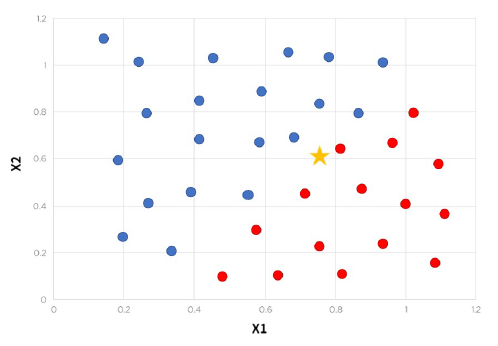
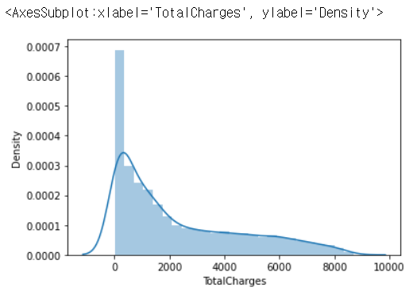
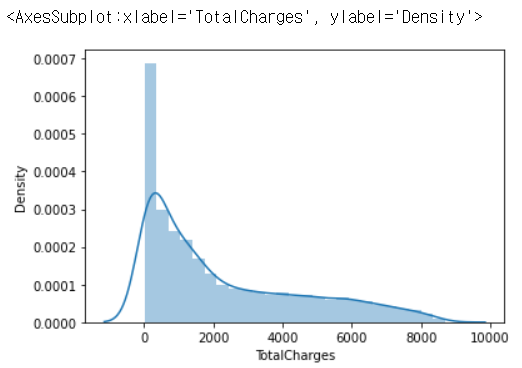
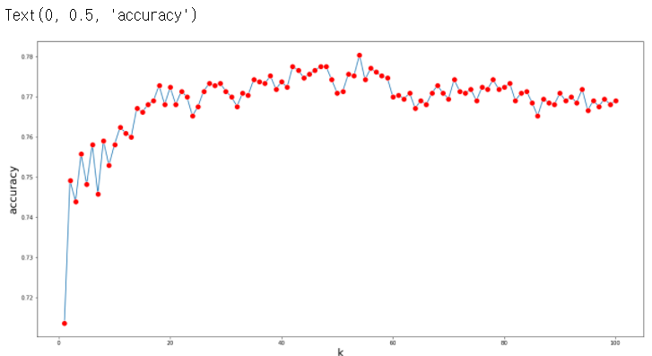

# KNN

**고객 이탈 예측**

**KNN**

K개의 이웃들과의 거리를 계산해서 더 가까운 쪽으로 분류하는 알고리즘 / 최적의 K를 찾아야 함



## 1. 데이터 확인 / 전처리

### 1) 모듈 및 데이터 로딩

```python
import pandas as pd
import numpy as np

import matplotlib.pyplot as plt
import seaborn as sns

# 워닝 무시
import warnings
warnings.filterwarnings('ignore')

data = pd.read_csv('churn.csv')
```

### 2) 데이터 특성 확인하기

```python
print(data.shape)
data.head()
```

|      | customerID | gender | SeniorCitizen | Partner | Dependents | tenure | PhoneService |    MultipleLines | InternetService | OnlineSecurity |  ... | DeviceProtection | TechSupport | StreamingTV | StreamingMovies |       Contract | PaperlessBilling |             PaymentMethod | MonthlyCharges | TotalCharges | Churn |
| ---: | ---------: | -----: | ------------: | ------: | ---------: | -----: | -----------: | ---------------: | --------------: | -------------: | ---: | ---------------: | ----------: | ----------: | --------------: | -------------: | ---------------: | ------------------------: | -------------: | -----------: | ----- |
|    0 | 7590-VHVEG | Female |             0 |     Yes |         No |      1 |           No | No phone service |             DSL |             No |  ... |               No |          No |          No |              No | Month-to-month |              Yes |          Electronic check |          29.85 |        29.85 | No    |
|    1 | 5575-GNVDE |   Male |             0 |      No |         No |     34 |          Yes |               No |             DSL |            Yes |  ... |              Yes |          No |          No |              No |       One year |               No |              Mailed check |          56.95 |      1889.50 | No    |
|    2 | 3668-QPYBK |   Male |             0 |      No |         No |      2 |          Yes |               No |             DSL |            Yes |  ... |               No |          No |          No |              No | Month-to-month |              Yes |              Mailed check |          53.85 |       108.15 | Yes   |
|    3 | 7795-CFOCW |   Male |             0 |      No |         No |     45 |           No | No phone service |             DSL |            Yes |  ... |              Yes |         Yes |          No |              No |       One year |               No | Bank transfer (automatic) |          42.30 |      1840.75 | No    |
|    4 | 9237-HQITU | Female |             0 |      No |         No |      2 |          Yes |               No |     Fiber optic |             No |  ... |               No |          No |          No |              No | Month-to-month |              Yes |          Electronic check |          70.70 |       151.65 | Yes   |

5 rows × 21 columns

```python
data.columns
```

```
Index(['customerID', 'gender', 'SeniorCitizen', 'Partner', 'Dependents',
       'tenure', 'PhoneService', 'MultipleLines', 'InternetService',
       'OnlineSecurity', 'OnlineBackup', 'DeviceProtection', 'TechSupport',
       'StreamingTV', 'StreamingMovies', 'Contract', 'PaperlessBilling',
       'PaymentMethod', 'MonthlyCharges', 'TotalCharges', 'Churn'],
      dtype='object')
```

``````
# 메인 피처
'customerID', 
'gender',           : 성별
'SeniorCitizen',    : 성인 여부
'Partner',          : 파트너 여부
'Dependents',       : 자녀 여부
'tenure',           : 이용 개월 수
'PhoneService',     : 폰 서비스 사용 여부
'MultipleLines',    : 회선 2개 이상 여부
'InternetService',  : 인터넷 서비스 사용 여부

# 서브 피처
'OnlineSecurity',  
'OnlineBackup', 
'DeviceProtection', 
'TechSupport',
'StreamingTV', 
'StreamingMovies', 
'Contract',         : 월 단위, 연 단위 계약 
'PaperlessBilling', : 전자영수증
'PaymentMethod',    : 결제 수단
'MonthlyCharges',   : 월 요금
'TotalCharges',     : 누적 요금

# 종속 변수
'Churn'             : 고객 이탈 여부
``````

```python
data.info()
```

```
<class 'pandas.core.frame.DataFrame'>
RangeIndex: 7043 entries, 0 to 7042
Data columns (total 21 columns):
 #   Column            Non-Null Count  Dtype  
---  ------            --------------  -----  
 0   customerID        7043 non-null   object 
 1   gender            7043 non-null   object 
 2   SeniorCitizen     7043 non-null   int64  
 3   Partner           7043 non-null   object 
 4   Dependents        7043 non-null   object 
 5   tenure            7043 non-null   int64  
 6   PhoneService      7043 non-null   object 
 7   MultipleLines     7043 non-null   object 
 8   InternetService   7043 non-null   object 
 9   OnlineSecurity    7043 non-null   object 
 10  OnlineBackup      7043 non-null   object 
 11  DeviceProtection  7043 non-null   object 
 12  TechSupport       7043 non-null   object 
 13  StreamingTV       7043 non-null   object 
 14  StreamingMovies   7043 non-null   object 
 15  Contract          7043 non-null   object 
 16  PaperlessBilling  7043 non-null   object 
 17  PaymentMethod     7043 non-null   object 
 18  MonthlyCharges    7043 non-null   float64
 19  TotalCharges      7043 non-null   object 
 20  Churn             7043 non-null   object 
dtypes: float64(1), int64(2), object(18)
memory usage: 1.1+ MB
```

-> TotalCharges는 숫자 데이터 타입으로 변경해줘야 함

### 3) 숫자 변수 데이터 타입 변경

```python
# pd.to_numeric : string을 numeric으로 변경해주는 함수
pd.to_numeric(data['TotalCharges'])
```

-> ValueError: Unable to parse string " " at position 488

```python
data.iloc[488]
```

```
customerID                         4472-LVYGI
gender                                 Female
SeniorCitizen                               0
Partner                                   Yes
Dependents                                Yes
tenure                                      0
PhoneService                               No
MultipleLines                No phone service
InternetService                           DSL
OnlineSecurity                            Yes
OnlineBackup                               No
DeviceProtection                          Yes
TechSupport                               Yes
StreamingTV                               Yes
StreamingMovies                            No
Contract                             Two year
PaperlessBilling                          Yes
PaymentMethod       Bank transfer (automatic)
MonthlyCharges                          52.55
TotalCharges                                 
Churn                                      No
Name: 488, dtype: object
```

```python
# replace 함수 : 값 변경
data['TotalCharges'] = data['TotalCharges'].replace(" ", "")
# -> 공백을 없애줌
```

```python
data['TotalCharges'] = pd.to_numeric(data['TotalCharges'])

data.info()
```

```
<class 'pandas.core.frame.DataFrame'>
RangeIndex: 7043 entries, 0 to 7042
Data columns (total 21 columns):
 #   Column            Non-Null Count  Dtype  
---  ------            --------------  -----  
 0   customerID        7043 non-null   object 
 1   gender            7043 non-null   object 
 2   SeniorCitizen     7043 non-null   int64  
 3   Partner           7043 non-null   object 
 4   Dependents        7043 non-null   object 
 5   tenure            7043 non-null   int64  
 6   PhoneService      7043 non-null   object 
 7   MultipleLines     7043 non-null   object 
 8   InternetService   7043 non-null   object 
 9   OnlineSecurity    7043 non-null   object 
 10  OnlineBackup      7043 non-null   object 
 11  DeviceProtection  7043 non-null   object 
 12  TechSupport       7043 non-null   object 
 13  StreamingTV       7043 non-null   object 
 14  StreamingMovies   7043 non-null   object 
 15  Contract          7043 non-null   object 
 16  PaperlessBilling  7043 non-null   object 
 17  PaymentMethod     7043 non-null   object 
 18  MonthlyCharges    7043 non-null   float64
 19  TotalCharges      7032 non-null   float64
 20  Churn             7043 non-null   object 
dtypes: float64(2), int64(2), object(17)
memory usage: 1.1+ MB
```

```python
data.describe()
```

|       | SeniorCitizen |      tenure | MonthlyCharges | TotalCharges |
| ----: | ------------: | ----------: | -------------: | ------------ |
| count |   7043.000000 | 7043.000000 |    7043.000000 | 7032.000000  |
|  mean |      0.162147 |   32.371149 |      64.761692 | 2283.300441  |
|   std |      0.368612 |   24.559481 |      30.090047 | 2266.771362  |
|   min |      0.000000 |    0.000000 |      18.250000 | 18.800000    |
|   25% |      0.000000 |    9.000000 |      35.500000 | 401.450000   |
|   50% |      0.000000 |   29.000000 |      70.350000 | 1397.475000  |
|   75% |      0.000000 |   55.000000 |      89.850000 | 3794.737500  |
|   max |      1.000000 |   72.000000 |     118.750000 | 8684.800000  |

```python
sns.distplot(data['TotalCharges'])
```



### 4) 카테고리 변수 처리

```python
# gender 컬럼만 원핫 인코딩 해보기
# pd.get_dummies : 원핫 인코딩 함수
pd.get_dummies(data, colums=['gender'], drop_first = True)
```

|      | customerID | SeniorCitizen | Partner | Dependents | tenure | PhoneService |    MultipleLines | InternetService | OnlineSecurity | OnlineBackup | DeviceProtection | TechSupport | StreamingTV | StreamingMovies |       Contract | PaperlessBilling |             PaymentMethod | MonthlyCharges | TotalCharges | Churn | gender_Male |
| ---: | ---------: | ------------: | ------: | ---------: | -----: | -----------: | ---------------: | --------------: | -------------: | -----------: | ---------------: | ----------: | ----------: | --------------: | -------------: | ---------------: | ------------------------: | -------------: | -----------: | ----: | ----------- |
|    0 | 7590-VHVEG |             0 |     Yes |         No |      1 |           No | No phone service |             DSL |             No |          Yes |               No |          No |          No |              No | Month-to-month |              Yes |          Electronic check |          29.85 |        29.85 |    No | 0           |
|    1 | 5575-GNVDE |             0 |      No |         No |     34 |          Yes |               No |             DSL |            Yes |           No |              Yes |          No |          No |              No |       One year |               No |              Mailed check |          56.95 |      1889.50 |    No | 1           |
|    2 | 3668-QPYBK |             0 |      No |         No |      2 |          Yes |               No |             DSL |            Yes |          Yes |               No |          No |          No |              No | Month-to-month |              Yes |              Mailed check |          53.85 |       108.15 |   Yes | 1           |
|    3 | 7795-CFOCW |             0 |      No |         No |     45 |           No | No phone service |             DSL |            Yes |           No |              Yes |         Yes |          No |              No |       One year |               No | Bank transfer (automatic) |          42.30 |      1840.75 |    No | 1           |
|    4 | 9237-HQITU |             0 |      No |         No |      2 |          Yes |               No |     Fiber optic |             No |           No |               No |          No |          No |              No | Month-to-month |              Yes |          Electronic check |          70.70 |       151.65 |   Yes | 0           |
|  ... |        ... |           ... |     ... |        ... |    ... |          ... |              ... |             ... |            ... |          ... |              ... |         ... |         ... |             ... |            ... |              ... |                       ... |            ... |          ... |   ... | ...         |
| 7038 | 6840-RESVB |             0 |     Yes |        Yes |     24 |          Yes |              Yes |             DSL |            Yes |           No |              Yes |         Yes |         Yes |             Yes |       One year |              Yes |              Mailed check |          84.80 |      1990.50 |    No | 1           |
| 7039 | 2234-XADUH |             0 |     Yes |        Yes |     72 |          Yes |              Yes |     Fiber optic |             No |          Yes |              Yes |          No |         Yes |             Yes |       One year |              Yes |   Credit card (automatic) |         103.20 |      7362.90 |    No | 0           |
| 7040 | 4801-JZAZL |             0 |     Yes |        Yes |     11 |           No | No phone service |             DSL |            Yes |           No |               No |          No |          No |              No | Month-to-month |              Yes |          Electronic check |          29.60 |       346.45 |    No | 0           |
| 7041 | 8361-LTMKD |             1 |     Yes |         No |      4 |          Yes |              Yes |     Fiber optic |             No |           No |               No |          No |          No |              No | Month-to-month |              Yes |              Mailed check |          74.40 |       306.60 |   Yes | 1           |
| 7042 | 3186-AJIEK |             0 |      No |         No |     66 |          Yes |               No |     Fiber optic |            Yes |           No |              Yes |         Yes |         Yes |             Yes |       Two year |              Yes | Bank transfer (automatic) |         105.65 |      6844.50 |    No | 1           |

7043 rows × 21 columns

```py
data['gender'].dtype == 'O'
```

``````
True
``````

#### (1) 카테고리 변수 전체 원핫 인코딩

```python
# 카테고리 변수 리스트 만들기
col_list =[]

for i in data.columns:
    if data[i].dtype == 'O':
        col_list.append(i)
```

```python
# 컬럼 별 unique 값 계산
for i in col_list:
    print(i, data[i].nunique())
```

```
customerID 7043
gender 2
Partner 2
Dependents 2
PhoneService 2
MultipleLines 3
InternetService 3
OnlineSecurity 3
OnlineBackup 3
DeviceProtection 3
TechSupport 3
StreamingTV 3
StreamingMovies 3
Contract 3
PaperlessBilling 2
PaymentMethod 4
Churn 2
```

```python
# Customer는 카테고리 변수가 아니므로 제외
col_list = col_list[1:]
```

```python
# 카테고리 변수 전체 -> 원핫 인코딩
data_new = pd.get_dummies(data, columns=col_list, drop_first = True)
```

```python
print(data_new.shape)
data_new.head()
```

```
(7043, 32)
```

Out[59]:

|      | customerID | SeniorCitizen | tenure | MonthlyCharges | TotalCharges | gender_Male | Partner_Yes | Dependents_Yes | PhoneService_Yes | MultipleLines_No phone service | MultipleLines_Yes | InternetService_Fiber optic | InternetService_No | OnlineSecurity_No internet service | OnlineSecurity_Yes |  ... | DeviceProtection_No internet service | DeviceProtection_Yes | TechSupport_No internet service | TechSupport_Yes | StreamingTV_No internet service | StreamingTV_Yes | StreamingMovies_No internet service | StreamingMovies_Yes | Contract_One year | Contract_Two year | PaperlessBilling_Yes | PaymentMethod_Credit card (automatic) | PaymentMethod_Electronic check | PaymentMethod_Mailed check | Churn_Yes |
| ---: | ---------: | ------------: | -----: | -------------: | -----------: | ----------: | ----------: | -------------: | ---------------: | -----------------------------: | ----------------: | --------------------------: | -----------------: | ---------------------------------: | -----------------: | ---: | -----------------------------------: | -------------------: | ------------------------------: | --------------: | ------------------------------: | --------------: | ----------------------------------: | ------------------: | ----------------: | ----------------: | -------------------: | ------------------------------------: | -----------------------------: | -------------------------: | --------: |
|    0 | 7590-VHVEG |             0 |      1 |          29.85 |        29.85 |           0 |           1 |              0 |                0 |                              1 |                 0 |                           0 |                  0 |                                  0 |                  0 |  ... |                                    0 |                    0 |                               0 |               0 |                               0 |               0 |                                   0 |                   0 |                 0 |                 0 |                    1 |                                     0 |                              1 |                          0 |         0 |
|    1 | 5575-GNVDE |             0 |     34 |          56.95 |      1889.50 |           1 |           0 |              0 |                1 |                              0 |                 0 |                           0 |                  0 |                                  0 |                  1 |  ... |                                    0 |                    1 |                               0 |               0 |                               0 |               0 |                                   0 |                   0 |                 1 |                 0 |                    0 |                                     0 |                              0 |                          1 |         0 |
|    2 | 3668-QPYBK |             0 |      2 |          53.85 |       108.15 |           1 |           0 |              0 |                1 |                              0 |                 0 |                           0 |                  0 |                                  0 |                  1 |  ... |                                    0 |                    0 |                               0 |               0 |                               0 |               0 |                                   0 |                   0 |                 0 |                 0 |                    1 |                                     0 |                              0 |                          1 |         1 |
|    3 | 7795-CFOCW |             0 |     45 |          42.30 |      1840.75 |           1 |           0 |              0 |                0 |                              1 |                 0 |                           0 |                  0 |                                  0 |                  1 |  ... |                                    0 |                    1 |                               0 |               1 |                               0 |               0 |                                   0 |                   0 |                 1 |                 0 |                    0 |                                     0 |                              0 |                          0 |         0 |
|    4 | 9237-HQITU |             0 |      2 |          70.70 |       151.65 |           0 |           0 |              0 |                1 |                              0 |                 0 |                           1 |                  0 |                                  0 |                  0 |  ... |                                    0 |                    0 |                               0 |               0 |                               0 |               0 |                                   0 |                   0 |                 0 |                 0 |                    1 |                                     0 |                              1 |                          0 |         1 |

5 rows × 32 columns

### 5) Missing Value 처리

```python
data_new.isna().sum()
```

```
customerID                                0
SeniorCitizen                             0
tenure                                    0
MonthlyCharges                            0
TotalCharges                             11
gender_Male                               0
Partner_Yes                               0
Dependents_Yes                            0
PhoneService_Yes                          0
MultipleLines_No phone service            0
MultipleLines_Yes                         0
InternetService_Fiber optic               0
InternetService_No                        0
OnlineSecurity_No internet service        0
OnlineSecurity_Yes                        0
OnlineBackup_No internet service          0
OnlineBackup_Yes                          0
DeviceProtection_No internet service      0
DeviceProtection_Yes                      0
TechSupport_No internet service           0
TechSupport_Yes                           0
StreamingTV_No internet service           0
StreamingTV_Yes                           0
StreamingMovies_No internet service       0
StreamingMovies_Yes                       0
Contract_One year                         0
Contract_Two year                         0
PaperlessBilling_Yes                      0
PaymentMethod_Credit card (automatic)     0
PaymentMethod_Electronic check            0
PaymentMethod_Mailed check                0
Churn_Yes                                 0
dtype: int64
```

```python
data_new.describe()
```

|       | SeniorCitizen |      tenure | MonthlyCharges | TotalCharges | gender_Male | Partner_Yes | Dependents_Yes | PhoneService_Yes | MultipleLines_No phone service | MultipleLines_Yes | InternetService_Fiber optic | InternetService_No | OnlineSecurity_No internet service | OnlineSecurity_Yes | OnlineBackup_No internet service |  ... | DeviceProtection_No internet service | DeviceProtection_Yes | TechSupport_No internet service | TechSupport_Yes | StreamingTV_No internet service | StreamingTV_Yes | StreamingMovies_No internet service | StreamingMovies_Yes | Contract_One year | Contract_Two year | PaperlessBilling_Yes | PaymentMethod_Credit card (automatic) | PaymentMethod_Electronic check | PaymentMethod_Mailed check |   Churn_Yes |
| ----: | ------------: | ----------: | -------------: | -----------: | ----------: | ----------: | -------------: | ---------------: | -----------------------------: | ----------------: | --------------------------: | -----------------: | ---------------------------------: | -----------------: | -------------------------------: | ---: | -----------------------------------: | -------------------: | ------------------------------: | --------------: | ------------------------------: | --------------: | ----------------------------------: | ------------------: | ----------------: | ----------------: | -------------------: | ------------------------------------: | -----------------------------: | -------------------------: | ----------: |
| count |   7043.000000 | 7043.000000 |    7043.000000 |  7032.000000 | 7043.000000 | 7043.000000 |    7043.000000 |      7043.000000 |                    7043.000000 |       7043.000000 |                 7043.000000 |        7043.000000 |                        7043.000000 |        7043.000000 |                      7043.000000 |  ... |                          7043.000000 |          7043.000000 |                     7043.000000 |     7043.000000 |                     7043.000000 |     7043.000000 |                         7043.000000 |         7043.000000 |       7043.000000 |       7043.000000 |          7043.000000 |                           7043.000000 |                    7043.000000 |                7043.000000 | 7043.000000 |
|  mean |      0.162147 |   32.371149 |      64.761692 |  2283.300441 |    0.504756 |    0.483033 |       0.299588 |         0.903166 |                       0.096834 |          0.421837 |                    0.439585 |           0.216669 |                           0.216669 |           0.286668 |                         0.216669 |  ... |                             0.216669 |             0.343888 |                        0.216669 |        0.290217 |                        0.216669 |        0.384353 |                            0.216669 |            0.387903 |          0.209144 |          0.240664 |             0.592219 |                              0.216101 |                       0.335794 |                   0.228880 |    0.265370 |
|   std |      0.368612 |   24.559481 |      30.090047 |  2266.771362 |    0.500013 |    0.499748 |       0.458110 |         0.295752 |                       0.295752 |          0.493888 |                    0.496372 |           0.412004 |                           0.412004 |           0.452237 |                         0.412004 |  ... |                             0.412004 |             0.475038 |                        0.412004 |        0.453895 |                        0.412004 |        0.486477 |                            0.412004 |            0.487307 |          0.406726 |          0.427517 |             0.491457 |                              0.411613 |                       0.472301 |                   0.420141 |    0.441561 |
|   min |      0.000000 |    0.000000 |      18.250000 |    18.800000 |    0.000000 |    0.000000 |       0.000000 |         0.000000 |                       0.000000 |          0.000000 |                    0.000000 |           0.000000 |                           0.000000 |           0.000000 |                         0.000000 |  ... |                             0.000000 |             0.000000 |                        0.000000 |        0.000000 |                        0.000000 |        0.000000 |                            0.000000 |            0.000000 |          0.000000 |          0.000000 |             0.000000 |                              0.000000 |                       0.000000 |                   0.000000 |    0.000000 |
|   25% |      0.000000 |    9.000000 |      35.500000 |   401.450000 |    0.000000 |    0.000000 |       0.000000 |         1.000000 |                       0.000000 |          0.000000 |                    0.000000 |           0.000000 |                           0.000000 |           0.000000 |                         0.000000 |  ... |                             0.000000 |             0.000000 |                        0.000000 |        0.000000 |                        0.000000 |        0.000000 |                            0.000000 |            0.000000 |          0.000000 |          0.000000 |             0.000000 |                              0.000000 |                       0.000000 |                   0.000000 |    0.000000 |
|   50% |      0.000000 |   29.000000 |      70.350000 |  1397.475000 |    1.000000 |    0.000000 |       0.000000 |         1.000000 |                       0.000000 |          0.000000 |                    0.000000 |           0.000000 |                           0.000000 |           0.000000 |                         0.000000 |  ... |                             0.000000 |             0.000000 |                        0.000000 |        0.000000 |                        0.000000 |        0.000000 |                            0.000000 |            0.000000 |          0.000000 |          0.000000 |             1.000000 |                              0.000000 |                       0.000000 |                   0.000000 |    0.000000 |
|   75% |      0.000000 |   55.000000 |      89.850000 |  3794.737500 |    1.000000 |    1.000000 |       1.000000 |         1.000000 |                       0.000000 |          1.000000 |                    1.000000 |           0.000000 |                           0.000000 |           1.000000 |                         0.000000 |  ... |                             0.000000 |             1.000000 |                        0.000000 |        1.000000 |                        0.000000 |        1.000000 |                            0.000000 |            1.000000 |          0.000000 |          0.000000 |             1.000000 |                              0.000000 |                       1.000000 |                   0.000000 |    1.000000 |
|   max |      1.000000 |   72.000000 |     118.750000 |  8684.800000 |    1.000000 |    1.000000 |       1.000000 |         1.000000 |                       1.000000 |          1.000000 |                    1.000000 |           1.000000 |                           1.000000 |           1.000000 |                         1.000000 |  ... |                             1.000000 |             1.000000 |                        1.000000 |        1.000000 |                        1.000000 |        1.000000 |                            1.000000 |            1.000000 |          1.000000 |          1.000000 |             1.000000 |                              1.000000 |                       1.000000 |                   1.000000 |    1.000000 |

8 rows × 31 columns

```python
sns.distplot(data_new['TotalCharges'])
```



-> 극단값들이 많은 데이터 분포는 mean보다 median을 사용하는 것이 더 좋다.

```python
# TotalCharges 컬럼 결측치 -> median으로 채우기
data_new['TotalCharges'] = data_new['TotalCharges'].fillna(data['TotalCharge'].median())
```

```python
data_new.isna().sum()
```

```
customerID                               0
SeniorCitizen                            0
tenure                                   0
MonthlyCharges                           0
TotalCharges                             0
gender_Male                              0
Partner_Yes                              0
Dependents_Yes                           0
PhoneService_Yes                         0
MultipleLines_No phone service           0
MultipleLines_Yes                        0
InternetService_Fiber optic              0
InternetService_No                       0
OnlineSecurity_No internet service       0
OnlineSecurity_Yes                       0
OnlineBackup_No internet service         0
OnlineBackup_Yes                         0
DeviceProtection_No internet service     0
DeviceProtection_Yes                     0
TechSupport_No internet service          0
TechSupport_Yes                          0
StreamingTV_No internet service          0
StreamingTV_Yes                          0
StreamingMovies_No internet service      0
StreamingMovies_Yes                      0
Contract_One year                        0
Contract_Two year                        0
PaperlessBilling_Yes                     0
PaymentMethod_Credit card (automatic)    0
PaymentMethod_Electronic check           0
PaymentMethod_Mailed check               0
Churn_Yes                                0
dtype: int64
```

### 6) Scaling

```python
from sklearn.preprocessing import StandardScaler, RobustScaler, MinMaxScaler
```

```python
data_new.info()
```

```
<class 'pandas.core.frame.DataFrame'>
RangeIndex: 7043 entries, 0 to 7042
Data columns (total 32 columns):
 #   Column                                 Non-Null Count  Dtype  
---  ------                                 --------------  -----  
 0   customerID                             7043 non-null   object 
 1   SeniorCitizen                          7043 non-null   int64  
 2   tenure                                 7043 non-null   int64  
 3   MonthlyCharges                         7043 non-null   float64
 4   TotalCharges                           7043 non-null   float64
 5   gender_Male                            7043 non-null   uint8  
 6   Partner_Yes                            7043 non-null   uint8  
 7   Dependents_Yes                         7043 non-null   uint8  
 8   PhoneService_Yes                       7043 non-null   uint8  
 9   MultipleLines_No phone service         7043 non-null   uint8  
 10  MultipleLines_Yes                      7043 non-null   uint8  
 11  InternetService_Fiber optic            7043 non-null   uint8  
 12  InternetService_No                     7043 non-null   uint8  
 13  OnlineSecurity_No internet service     7043 non-null   uint8  
 14  OnlineSecurity_Yes                     7043 non-null   uint8  
 15  OnlineBackup_No internet service       7043 non-null   uint8  
 16  OnlineBackup_Yes                       7043 non-null   uint8  
 17  DeviceProtection_No internet service   7043 non-null   uint8  
 18  DeviceProtection_Yes                   7043 non-null   uint8  
 19  TechSupport_No internet service        7043 non-null   uint8  
 20  TechSupport_Yes                        7043 non-null   uint8  
 21  StreamingTV_No internet service        7043 non-null   uint8  
 22  StreamingTV_Yes                        7043 non-null   uint8  
 23  StreamingMovies_No internet service    7043 non-null   uint8  
 24  StreamingMovies_Yes                    7043 non-null   uint8  
 25  Contract_One year                      7043 non-null   uint8  
 26  Contract_Two year                      7043 non-null   uint8  
 27  PaperlessBilling_Yes                   7043 non-null   uint8  
 28  PaymentMethod_Credit card (automatic)  7043 non-null   uint8  
 29  PaymentMethod_Electronic check         7043 non-null   uint8  
 30  PaymentMethod_Mailed check             7043 non-null   uint8  
 31  Churn_Yes                              7043 non-null   uint8  
dtypes: float64(2), int64(2), object(1), uint8(27)
memory usage: 460.9+ KB
```

#### (1) Min-Max Scaler

```python
mixmax = MinMaxScaler()
```

```python
# 불필요한 변수 제거
data_new.drop('customerID', axis = 1, inplace = True)

# fit : 데이터 특성값 학습
mixmax.fit(data_new)

# transform : 데이터에 scaler 적용
mixmax_scaled =  mixmax.transform(data_new)
mixmax_scaled
```

```
array([[0.        , 0.01388889, 0.11542289, ..., 1.        , 0.        ,
        0.        ],
       [0.        , 0.47222222, 0.38507463, ..., 0.        , 1.        ,
        0.        ],
       [0.        , 0.02777778, 0.35422886, ..., 0.        , 1.        ,
        1.        ],
       ...,
       [0.        , 0.15277778, 0.11293532, ..., 1.        , 0.        ,
        0.        ],
       [1.        , 0.05555556, 0.55870647, ..., 0.        , 1.        ,
        1.        ],
       [0.        , 0.91666667, 0.86965174, ..., 0.        , 0.        ,
        0.        ]])
```

```python
# 보기 편하게 dataframe으로 변환
scaled_data = pd.DataFrmae(mixmax_scaled, columns=data_new.columns)
scaled_data
```

|      | SeniorCitizen |   tenure | MonthlyCharges | TotalCharges | gender_Male | Partner_Yes | Dependents_Yes | PhoneService_Yes | MultipleLines_No phone service | MultipleLines_Yes | InternetService_Fiber optic | InternetService_No | OnlineSecurity_No internet service | OnlineSecurity_Yes | OnlineBackup_No internet service |  ... | DeviceProtection_No internet service | DeviceProtection_Yes | TechSupport_No internet service | TechSupport_Yes | StreamingTV_No internet service | StreamingTV_Yes | StreamingMovies_No internet service | StreamingMovies_Yes | Contract_One year | Contract_Two year | PaperlessBilling_Yes | PaymentMethod_Credit card (automatic) | PaymentMethod_Electronic check | PaymentMethod_Mailed check | Churn_Yes |
| ---: | ------------: | -------: | -------------: | -----------: | ----------: | ----------: | -------------: | ---------------: | -----------------------------: | ----------------: | --------------------------: | -----------------: | ---------------------------------: | -----------------: | -------------------------------: | ---: | -----------------------------------: | -------------------: | ------------------------------: | --------------: | ------------------------------: | --------------: | ----------------------------------: | ------------------: | ----------------: | ----------------: | -------------------: | ------------------------------------: | -----------------------------: | -------------------------: | --------: |
|    0 |           0.0 | 0.013889 |       0.115423 |     0.001275 |         0.0 |         1.0 |            0.0 |              0.0 |                            1.0 |               0.0 |                         0.0 |                0.0 |                                0.0 |                0.0 |                              0.0 |  ... |                                  0.0 |                  0.0 |                             0.0 |             0.0 |                             0.0 |             0.0 |                                 0.0 |                 0.0 |               0.0 |               0.0 |                  1.0 |                                   0.0 |                            1.0 |                        0.0 |       0.0 |
|    1 |           0.0 | 0.472222 |       0.385075 |     0.215867 |         1.0 |         0.0 |            0.0 |              1.0 |                            0.0 |               0.0 |                         0.0 |                0.0 |                                0.0 |                1.0 |                              0.0 |  ... |                                  0.0 |                  1.0 |                             0.0 |             0.0 |                             0.0 |             0.0 |                                 0.0 |                 0.0 |               1.0 |               0.0 |                  0.0 |                                   0.0 |                            0.0 |                        1.0 |       0.0 |
|    2 |           0.0 | 0.027778 |       0.354229 |     0.010310 |         1.0 |         0.0 |            0.0 |              1.0 |                            0.0 |               0.0 |                         0.0 |                0.0 |                                0.0 |                1.0 |                              0.0 |  ... |                                  0.0 |                  0.0 |                             0.0 |             0.0 |                             0.0 |             0.0 |                                 0.0 |                 0.0 |               0.0 |               0.0 |                  1.0 |                                   0.0 |                            0.0 |                        1.0 |       1.0 |
|    3 |           0.0 | 0.625000 |       0.239303 |     0.210241 |         1.0 |         0.0 |            0.0 |              0.0 |                            1.0 |               0.0 |                         0.0 |                0.0 |                                0.0 |                1.0 |                              0.0 |  ... |                                  0.0 |                  1.0 |                             0.0 |             1.0 |                             0.0 |             0.0 |                                 0.0 |                 0.0 |               1.0 |               0.0 |                  0.0 |                                   0.0 |                            0.0 |                        0.0 |       0.0 |
|    4 |           0.0 | 0.027778 |       0.521891 |     0.015330 |         0.0 |         0.0 |            0.0 |              1.0 |                            0.0 |               0.0 |                         1.0 |                0.0 |                                0.0 |                0.0 |                              0.0 |  ... |                                  0.0 |                  0.0 |                             0.0 |             0.0 |                             0.0 |             0.0 |                                 0.0 |                 0.0 |               0.0 |               0.0 |                  1.0 |                                   0.0 |                            1.0 |                        0.0 |       1.0 |
|  ... |           ... |      ... |            ... |          ... |         ... |         ... |            ... |              ... |                            ... |               ... |                         ... |                ... |                                ... |                ... |                              ... |  ... |                                  ... |                  ... |                             ... |             ... |                             ... |             ... |                                 ... |                 ... |               ... |               ... |                  ... |                                   ... |                            ... |                        ... |       ... |
| 7038 |           0.0 | 0.333333 |       0.662189 |     0.227521 |         1.0 |         1.0 |            1.0 |              1.0 |                            0.0 |               1.0 |                         0.0 |                0.0 |                                0.0 |                1.0 |                              0.0 |  ... |                                  0.0 |                  1.0 |                             0.0 |             1.0 |                             0.0 |             1.0 |                                 0.0 |                 1.0 |               1.0 |               0.0 |                  1.0 |                                   0.0 |                            0.0 |                        1.0 |       0.0 |
| 7039 |           0.0 | 1.000000 |       0.845274 |     0.847461 |         0.0 |         1.0 |            1.0 |              1.0 |                            0.0 |               1.0 |                         1.0 |                0.0 |                                0.0 |                0.0 |                              0.0 |  ... |                                  0.0 |                  1.0 |                             0.0 |             0.0 |                             0.0 |             1.0 |                                 0.0 |                 1.0 |               1.0 |               0.0 |                  1.0 |                                   1.0 |                            0.0 |                        0.0 |       0.0 |
| 7040 |           0.0 | 0.152778 |       0.112935 |     0.037809 |         0.0 |         1.0 |            1.0 |              0.0 |                            1.0 |               0.0 |                         0.0 |                0.0 |                                0.0 |                1.0 |                              0.0 |  ... |                                  0.0 |                  0.0 |                             0.0 |             0.0 |                             0.0 |             0.0 |                                 0.0 |                 0.0 |               0.0 |               0.0 |                  1.0 |                                   0.0 |                            1.0 |                        0.0 |       0.0 |
| 7041 |           1.0 | 0.055556 |       0.558706 |     0.033210 |         1.0 |         1.0 |            0.0 |              1.0 |                            0.0 |               1.0 |                         1.0 |                0.0 |                                0.0 |                0.0 |                              0.0 |  ... |                                  0.0 |                  0.0 |                             0.0 |             0.0 |                             0.0 |             0.0 |                                 0.0 |                 0.0 |               0.0 |               0.0 |                  1.0 |                                   0.0 |                            0.0 |                        1.0 |       1.0 |
| 7042 |           0.0 | 0.916667 |       0.869652 |     0.787641 |         1.0 |         0.0 |            0.0 |              1.0 |                            0.0 |               0.0 |                         1.0 |                0.0 |                                0.0 |                1.0 |                              0.0 |  ... |                                  0.0 |                  1.0 |                             0.0 |             1.0 |                             0.0 |             1.0 |                                 0.0 |                 1.0 |               0.0 |               1.0 |                  1.0 |                                   0.0 |                            0.0 |                        0.0 |       0.0 |

7043 rows × 31 columns

#### (2) Standard Scaler

```python
standard = DtandardScaler()
```

```python
# 종속 변수는 스케일링 시 제거해준다.
standard.fit(data_new.drop('Churn_Yes'), axis =1)

standard_scaled = standard.transform(data_new.drop('Churn_Yes', axis=1))
pd.DataFrame(standard_scaled, columns = data_new.drop('Churn_Yes', axis=1).columns)
```

|      | SeniorCitizen |    tenure | MonthlyCharges | TotalCharges | gender_Male | Partner_Yes | Dependents_Yes | PhoneService_Yes | MultipleLines_No phone service | MultipleLines_Yes | InternetService_Fiber optic | InternetService_No | OnlineSecurity_No internet service | OnlineSecurity_Yes | OnlineBackup_No internet service | OnlineBackup_Yes | DeviceProtection_No internet service | DeviceProtection_Yes | TechSupport_No internet service | TechSupport_Yes | StreamingTV_No internet service | StreamingTV_Yes | StreamingMovies_No internet service | StreamingMovies_Yes | Contract_One year | Contract_Two year | PaperlessBilling_Yes | PaymentMethod_Credit card (automatic) | PaymentMethod_Electronic check | PaymentMethod_Mailed check |
| ---: | ------------: | --------: | -------------: | -----------: | ----------: | ----------: | -------------: | ---------------: | -----------------------------: | ----------------: | --------------------------: | -----------------: | ---------------------------------: | -----------------: | -------------------------------: | ---------------: | -----------------------------------: | -------------------: | ------------------------------: | --------------: | ------------------------------: | --------------: | ----------------------------------: | ------------------: | ----------------: | ----------------: | -------------------: | ------------------------------------: | -----------------------------: | -------------------------: |
|    0 |     -0.439916 | -1.277445 |      -1.160323 |    -0.994242 |   -1.009559 |    1.034530 |      -0.654012 |        -3.054010 |                       3.054010 |         -0.854176 |                   -0.885660 |          -0.525927 |                          -0.525927 |          -0.633933 |                        -0.525927 |         1.378241 |                            -0.525927 |            -0.723968 |                       -0.525927 |       -0.639439 |                       -0.525927 |       -0.790132 |                           -0.525927 |           -0.796070 |         -0.514249 |         -0.562975 |             0.829798 |                             -0.525047 |                       1.406418 |                  -0.544807 |
|    1 |     -0.439916 |  0.066327 |      -0.259629 |    -0.173244 |    0.990532 |   -0.966622 |      -0.654012 |         0.327438 |                      -0.327438 |         -0.854176 |                   -0.885660 |          -0.525927 |                          -0.525927 |           1.577454 |                        -0.525927 |        -0.725563 |                            -0.525927 |             1.381277 |                       -0.525927 |       -0.639439 |                       -0.525927 |       -0.790132 |                           -0.525927 |           -0.796070 |          1.944582 |         -0.562975 |            -1.205113 |                             -0.525047 |                      -0.711026 |                   1.835513 |
|    2 |     -0.439916 | -1.236724 |      -0.362660 |    -0.959674 |    0.990532 |   -0.966622 |      -0.654012 |         0.327438 |                      -0.327438 |         -0.854176 |                   -0.885660 |          -0.525927 |                          -0.525927 |           1.577454 |                        -0.525927 |         1.378241 |                            -0.525927 |            -0.723968 |                       -0.525927 |       -0.639439 |                       -0.525927 |       -0.790132 |                           -0.525927 |           -0.796070 |         -0.514249 |         -0.562975 |             0.829798 |                             -0.525047 |                      -0.711026 |                   1.835513 |
|    3 |     -0.439916 |  0.514251 |      -0.746535 |    -0.194766 |    0.990532 |   -0.966622 |      -0.654012 |        -3.054010 |                       3.054010 |         -0.854176 |                   -0.885660 |          -0.525927 |                          -0.525927 |           1.577454 |                        -0.525927 |        -0.725563 |                            -0.525927 |             1.381277 |                       -0.525927 |        1.563872 |                       -0.525927 |       -0.790132 |                           -0.525927 |           -0.796070 |          1.944582 |         -0.562975 |            -1.205113 |                             -0.525047 |                      -0.711026 |                  -0.544807 |
|    4 |     -0.439916 | -1.236724 |       0.197365 |    -0.940470 |   -1.009559 |   -0.966622 |      -0.654012 |         0.327438 |                      -0.327438 |         -0.854176 |                    1.129102 |          -0.525927 |                          -0.525927 |          -0.633933 |                        -0.525927 |        -0.725563 |                            -0.525927 |            -0.723968 |                       -0.525927 |       -0.639439 |                       -0.525927 |       -0.790132 |                           -0.525927 |           -0.796070 |         -0.514249 |         -0.562975 |             0.829798 |                             -0.525047 |                       1.406418 |                  -0.544807 |
|  ... |           ... |       ... |            ... |          ... |         ... |         ... |            ... |              ... |                            ... |               ... |                         ... |                ... |                                ... |                ... |                              ... |              ... |                                  ... |                  ... |                             ... |             ... |                             ... |             ... |                                 ... |                 ... |               ... |               ... |                  ... |                                   ... |                            ... |                        ... |
| 7038 |     -0.439916 | -0.340876 |       0.665992 |    -0.128655 |    0.990532 |    1.034530 |       1.529024 |         0.327438 |                      -0.327438 |          1.170719 |                   -0.885660 |          -0.525927 |                          -0.525927 |           1.577454 |                        -0.525927 |        -0.725563 |                            -0.525927 |             1.381277 |                       -0.525927 |        1.563872 |                       -0.525927 |        1.265612 |                           -0.525927 |            1.256171 |          1.944582 |         -0.562975 |             0.829798 |                             -0.525047 |                      -0.711026 |                   1.835513 |
| 7039 |     -0.439916 |  1.613701 |       1.277533 |     2.243151 |   -1.009559 |    1.034530 |       1.529024 |         0.327438 |                      -0.327438 |          1.170719 |                    1.129102 |          -0.525927 |                          -0.525927 |          -0.633933 |                        -0.525927 |         1.378241 |                            -0.525927 |             1.381277 |                       -0.525927 |       -0.639439 |                       -0.525927 |        1.265612 |                           -0.525927 |            1.256171 |          1.944582 |         -0.562975 |             0.829798 |                              1.904590 |                      -0.711026 |                  -0.544807 |
| 7040 |     -0.439916 | -0.870241 |      -1.168632 |    -0.854469 |   -1.009559 |    1.034530 |       1.529024 |        -3.054010 |                       3.054010 |         -0.854176 |                   -0.885660 |          -0.525927 |                          -0.525927 |           1.577454 |                        -0.525927 |        -0.725563 |                            -0.525927 |            -0.723968 |                       -0.525927 |       -0.639439 |                       -0.525927 |       -0.790132 |                           -0.525927 |           -0.796070 |         -0.514249 |         -0.562975 |             0.829798 |                             -0.525047 |                       1.406418 |                  -0.544807 |
| 7041 |      2.273159 | -1.155283 |       0.320338 |    -0.872062 |    0.990532 |    1.034530 |      -0.654012 |         0.327438 |                      -0.327438 |          1.170719 |                    1.129102 |          -0.525927 |                          -0.525927 |          -0.633933 |                        -0.525927 |        -0.725563 |                            -0.525927 |            -0.723968 |                       -0.525927 |       -0.639439 |                       -0.525927 |       -0.790132 |                           -0.525927 |           -0.796070 |         -0.514249 |         -0.562975 |             0.829798 |                             -0.525047 |                      -0.711026 |                   1.835513 |
| 7042 |     -0.439916 |  1.369379 |       1.358961 |     2.014288 |    0.990532 |   -0.966622 |      -0.654012 |         0.327438 |                      -0.327438 |         -0.854176 |                    1.129102 |          -0.525927 |                          -0.525927 |           1.577454 |                        -0.525927 |        -0.725563 |                            -0.525927 |             1.381277 |                       -0.525927 |        1.563872 |                       -0.525927 |        1.265612 |                           -0.525927 |            1.256171 |         -0.514249 |          1.776278 |             0.829798 |                             -0.525047 |                      -0.711026 |                  -0.544807 |

7043 rows × 30 columns

#### (3) Robust Scaler

```python
rob = RobustScaler()
```

```py
rob.fit(data_new.drop('Churn_Yes', axis=1))

robust_scaled = rob.transform(data_new.drop('Churn_Yes', axis=1))

pd.DataFrame(robust_scaled, columns = data_new.drop('Churn_Yes', axis=1).columns)
```

| SeniorCitizen | tenure | MonthlyCharges | TotalCharges | gender_Male | Partner_Yes | Dependents_Yes | PhoneService_Yes | MultipleLines_No phone service | MultipleLines_Yes | InternetService_Fiber optic | InternetService_No | OnlineSecurity_No internet service | OnlineSecurity_Yes | OnlineBackup_No internet service | OnlineBackup_Yes | DeviceProtection_No internet service | DeviceProtection_Yes | TechSupport_No internet service | TechSupport_Yes | StreamingTV_No internet service | StreamingTV_Yes | StreamingMovies_No internet service | StreamingMovies_Yes | Contract_One year | Contract_Two year | PaperlessBilling_Yes | PaymentMethod_Credit card (automatic) | PaymentMethod_Electronic check | PaymentMethod_Mailed check |      |
| ------------: | -----: | -------------: | -----------: | ----------: | ----------: | -------------: | ---------------: | -----------------------------: | ----------------: | --------------------------: | -----------------: | ---------------------------------: | -----------------: | -------------------------------: | ---------------: | -----------------------------------: | -------------------: | ------------------------------: | --------------: | ------------------------------: | --------------: | ----------------------------------: | ------------------: | ----------------: | ----------------: | -------------------: | ------------------------------------: | -----------------------------: | -------------------------: | ---- |
|             0 |    0.0 |      -0.608696 |    -0.745170 |   -0.404100 |        -1.0 |            1.0 |              0.0 |                           -1.0 |               1.0 |                         0.0 |                0.0 |                                0.0 |                0.0 |                              0.0 |              0.0 |                                  1.0 |                  0.0 |                             0.0 |             0.0 |                             0.0 |             0.0 |                                 0.0 |                 0.0 |               0.0 |               0.0 |                  0.0 |                                   0.0 |                            0.0 |                        1.0 | 0.0  |
|             1 |    0.0 |       0.108696 |    -0.246550 |    0.145381 |         0.0 |            0.0 |              0.0 |                            0.0 |               0.0 |                         0.0 |                0.0 |                                0.0 |                0.0 |                              1.0 |              0.0 |                                  0.0 |                  0.0 |                             1.0 |             0.0 |                             0.0 |             0.0 |                                 0.0 |                 0.0 |               0.0 |               1.0 |                  0.0 |                                  -1.0 |                            0.0 |                        0.0 | 1.0  |
|             2 |    0.0 |      -0.586957 |    -0.303588 |   -0.380964 |         0.0 |            0.0 |              0.0 |                            0.0 |               0.0 |                         0.0 |                0.0 |                                0.0 |                0.0 |                              1.0 |              0.0 |                                  1.0 |                  0.0 |                             0.0 |             0.0 |                             0.0 |             0.0 |                                 0.0 |                 0.0 |               0.0 |               0.0 |                  0.0 |                                   0.0 |                            0.0 |                        0.0 | 1.0  |
|             3 |    0.0 |       0.347826 |    -0.516099 |    0.130977 |         0.0 |            0.0 |              0.0 |                           -1.0 |               1.0 |                         0.0 |                0.0 |                                0.0 |                0.0 |                              1.0 |              0.0 |                                  0.0 |                  0.0 |                             1.0 |             0.0 |                             1.0 |             0.0 |                                 0.0 |                 0.0 |               0.0 |               1.0 |                  0.0 |                                  -1.0 |                            0.0 |                        0.0 | 0.0  |
|             4 |    0.0 |      -0.586957 |     0.006440 |   -0.368111 |        -1.0 |            0.0 |              0.0 |                            0.0 |               0.0 |                         0.0 |                1.0 |                                0.0 |                0.0 |                              0.0 |              0.0 |                                  0.0 |                  0.0 |                             0.0 |             0.0 |                             0.0 |             0.0 |                                 0.0 |                 0.0 |               0.0 |               0.0 |                  0.0 |                                   0.0 |                            0.0 |                        1.0 | 0.0  |
|           ... |    ... |            ... |          ... |         ... |         ... |            ... |              ... |                            ... |               ... |                         ... |                ... |                                ... |                ... |                              ... |              ... |                                  ... |                  ... |                             ... |             ... |                             ... |             ... |                                 ... |                 ... |               ... |               ... |                  ... |                                   ... |                            ... |                        ... | ...  |
|          7038 |    0.0 |      -0.108696 |     0.265869 |    0.175224 |         0.0 |            1.0 |              1.0 |                            0.0 |               0.0 |                         1.0 |                0.0 |                                0.0 |                0.0 |                              1.0 |              0.0 |                                  0.0 |                  0.0 |                             1.0 |             0.0 |                             1.0 |             0.0 |                                 1.0 |                 0.0 |               1.0 |               1.0 |                  0.0 |                                   0.0 |                            0.0 |                        0.0 | 1.0  |
|          7039 |    0.0 |       0.934783 |     0.604416 |    1.762637 |        -1.0 |            1.0 |              1.0 |                            0.0 |               0.0 |                         1.0 |                1.0 |                                0.0 |                0.0 |                              0.0 |              0.0 |                                  1.0 |                  0.0 |                             1.0 |             0.0 |                             0.0 |             0.0 |                                 1.0 |                 0.0 |               1.0 |               1.0 |                  0.0 |                                   0.0 |                            1.0 |                        0.0 | 0.0  |
|          7040 |    0.0 |      -0.391304 |    -0.749770 |   -0.310552 |        -1.0 |            1.0 |              1.0 |                           -1.0 |               1.0 |                         0.0 |                0.0 |                                0.0 |                0.0 |                              1.0 |              0.0 |                                  0.0 |                  0.0 |                             0.0 |             0.0 |                             0.0 |             0.0 |                                 0.0 |                 0.0 |               0.0 |               0.0 |                  0.0 |                                   0.0 |                            0.0 |                        1.0 | 0.0  |
|          7041 |    1.0 |      -0.543478 |     0.074517 |   -0.322327 |         0.0 |            1.0 |              0.0 |                            0.0 |               0.0 |                         1.0 |                1.0 |                                0.0 |                0.0 |                              0.0 |              0.0 |                                  0.0 |                  0.0 |                             0.0 |             0.0 |                             0.0 |             0.0 |                                 0.0 |                 0.0 |               0.0 |               0.0 |                  0.0 |                                   0.0 |                            0.0 |                        0.0 | 1.0  |
|          7042 |    0.0 |       0.804348 |     0.649494 |    1.609463 |         0.0 |            0.0 |              0.0 |                            0.0 |               0.0 |                         0.0 |                1.0 |                                0.0 |                0.0 |                              1.0 |              0.0 |                                  0.0 |                  0.0 |                             1.0 |             0.0 |                             1.0 |             0.0 |                                 1.0 |                 0.0 |               1.0 |               0.0 |                  1.0 |                                   0.0 |                            0.0 |                        0.0 | 0.0  |

7043 rows × 30 columns

#### (4) 최종적으로 Min-Max 스케일러로 데이터 저장

```python
mixmax_scaled = pd.DataFrame(scaled_data, columns = data_new.columns)
```

## 2. KNN 모델 만들기

### 1) Train Test Split

```python
from sklearn.model_selection import train_test_split

X = mixmax_scaled.drop('Churn_Yes', axis = 1)
y = mixmax_scaled['Churn_Yes']

X_train, X_test, y_train, y_test = train_test_split(X, y, test_size = 0.3, random_state =100)
```

### 2) Modeling

```python
from sklearn.neighbors import KNeighborsClassifier

knn = KNeighborsClassifier(n_neighbors=10) # 주변 10개
```

```python
# knn 모델 학습
knn.fit(X_train, y_train)

# test 데이터 예측
pred = knn.predict(X_test)
```

```python
# 예측값과 실제값 비교
pd.DataFrame({'acutal_value' : y_test, 'pred_value' : pred }).head(30)
```

|      | acutal_value | pred_value |
| ---: | -----------: | ---------- |
| 4880 |          0.0 | 0.0        |
| 1541 |          0.0 | 0.0        |
| 1289 |          0.0 | 0.0        |
| 5745 |          0.0 | 0.0        |
| 4873 |          0.0 | 0.0        |
| 4168 |          0.0 | 0.0        |
| 1557 |          0.0 | 0.0        |
| 2892 |          0.0 | 0.0        |
|  664 |          0.0 | 0.0        |
| 1588 |          0.0 | 0.0        |
| 1338 |          1.0 | 0.0        |
| 6000 |          0.0 | 0.0        |
| 2310 |          0.0 | 0.0        |
| 3294 |          1.0 | 1.0        |
|  290 |          1.0 | 1.0        |
| 2505 |          0.0 | 0.0        |
| 3171 |          0.0 | 0.0        |
| 1366 |          1.0 | 1.0        |
| 6560 |          0.0 | 0.0        |
| 2420 |          0.0 | 0.0        |
| 5210 |          1.0 | 0.0        |
| 2836 |          0.0 | 1.0        |
| 1325 |          1.0 | 1.0        |
| 4900 |          1.0 | 0.0        |
| 6311 |          0.0 | 0.0        |
| 1025 |          0.0 | 0.0        |
| 2031 |          0.0 | 0.0        |
| 4459 |          1.0 | 1.0        |
| 5324 |          0.0 | 0.0        |
| 3441 |          0.0 | 0.0        |

## 3. 모델 정확도 확인 및 최적의 k값 찾기

### 1) 모델 정확도 확인

```python
from sklearn.metrics import accuracy_score, confusion_matrix

accuracy_score(y_test, pred)
```

``````
0.7581637482252721
``````

```python
confusion_matrix(y_test, pred)
```

```
array([[1353,  194],
       [ 317,  249]], dtype=int64)
```

### 2) 최적의 k값 구하기

```python
list(range(1, 101))[53]
```

``````
54
``````

```python
# for문으로 k값을 1~100까지 바꿔가면서 모델 예측
accuracy_list = []
for i in range(1, 101):
    knn = KNeighborsClassifier(n_neighbors = i)
    knn.fit(X_train, y_train)
    pred = knn.predict(X_test)
    accuracy_list.append(accuracy_score(y_test, pred))
```

```python
accuracy_list
```

```
[0.7136772361571225,
 0.7491717936583058,
 0.7439659252247989,
 0.7557974443918599,
 0.7482252721249408,
 0.7581637482252721,
 0.7458589682915286,
 0.759110269758637,
 0.7529578797917653,
 0.7581637482252721,
 0.7624230951254141,
 0.7610033128253668,
 0.7600567912920019,
 0.7671557027922385,
 0.7662091812588736,
 0.7681022243256034,
 0.7690487458589683,
 0.7728348319924279,
 0.7681022243256034,
 0.7723615712257453,
 0.7681022243256034,
 0.7714150496923805,
 0.7699952673923331,
 0.7652626597255088,
 0.767628963558921,
 0.7714150496923805,
 0.7733080927591103,
 0.7728348319924279,
 0.7733080927591103,
 0.7714150496923805,
 0.7699952673923331,
 0.767628963558921,
 0.7709417889256981,
 0.7704685281590156,
 0.7742546142924751,
 0.7737813535257927,
 0.7733080927591103,
 0.77520113582584,
 0.7718883104590629,
 0.7737813535257927,
 0.7723615712257453,
 0.7775674396592522,
 0.7766209181258874,
 0.7747278750591576,
 0.7756743965925225,
 0.7766209181258874,
 0.7775674396592522,
 0.7775674396592522,
 0.7742546142924751,
 0.7709417889256981,
 0.7714150496923805,
 0.7756743965925225,
 0.77520113582584,
 0.780407004259347,
 0.7742546142924751,
 0.7770941788925698,
 0.7761476573592049,
 0.77520113582584,
 0.7747278750591576,
 0.7699952673923331,
 0.7704685281590156,
 0.7695220066256507,
 0.7709417889256981,
 0.7671557027922385,
 0.7690487458589683,
 0.7681022243256034,
 0.7709417889256981,
 0.7728348319924279,
 0.7709417889256981,
 0.7695220066256507,
 0.7742546142924751,
 0.7714150496923805,
 0.7709417889256981,
 0.7718883104590629,
 0.7690487458589683,
 0.7723615712257453,
 0.7718883104590629,
 0.7742546142924751,
 0.7718883104590629,
 0.7723615712257453,
 0.7733080927591103,
 0.7690487458589683,
 0.7709417889256981,
 0.7714150496923805,
 0.7685754850922859,
 0.7652626597255088,
 0.7695220066256507,
 0.7685754850922859,
 0.7681022243256034,
 0.7709417889256981,
 0.7690487458589683,
 0.7699952673923331,
 0.7685754850922859,
 0.7718883104590629,
 0.7666824420255561,
 0.7690487458589683,
 0.767628963558921,
 0.7695220066256507,
 0.7681022243256034,
 0.7690487458589683]
```

```python
# 그래프 그려보기
plt.figure(figsize=(20,10))
sns.lineplot(x = range(1,101), y = accuracy_list, marker = 'o', markersize=10, markerfacecolor='red')

plt.xlabel('k', fontsize=20)
plt.ylabel('accuracy', fontsize=20)
```



```python
# accuracy 최대값
max(accuracy_list)
```

``````
0.780407004259347
``````

```python
# accuracy 최대값일 때의 k값
accuracy_list.index(max(accuracy_list))
```

``````
53
-> 인덱스는 0부터 시작하므로, 최적의 k값은 index+1 = 54
``````

```python
# argmax 함수로 accuracy 최대값 찾기
np.array(accuracy_list).argmax()
```

``````
53
``````

```python
accuracy_list[53]
```

``````
0.780407004259347
``````

### 3) 최적의 k값을 넣고 최종 예측

```python
knn = KNeighborsClassifier(n_neighbors = 54)

knn.fit(X_train, y_train)

pred = knn.predict(X_test)

print(accuracy_score(y_test, pred))
print(confusion_matrix(y_test,pred))
```

``````
0.780407004259347

array([[1332,  215],
       [ 249,  317]], dtype=int64)
``````

