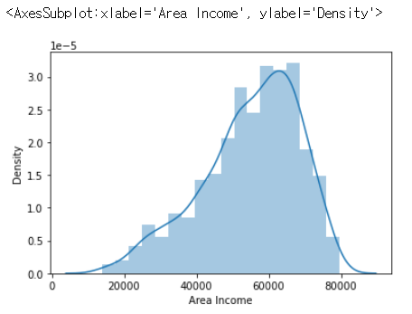
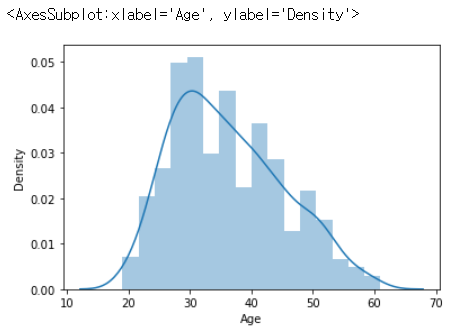

# 로지스틱 회귀

**광고반응률예측**

**로지스틱 리그레션**

- 주어진 데이터에 따라 0(False) or 1(True)을 예측하고 싶을 때

- X값(피처)에 따른 결과 확률값(y)이 0.5 이상이면 1(True), 0.5 이하이면 0(False)로 예측

## 1. 데이터 확인 / 전처리

### 1) 모듈 및 데이터 로딩

```python
import pandas as pd
import numpy as np

# 데이터 시각화 모듈
import matplotlib.pyplot as plt
import seaborn as sns

# 워닝 무시
import warnings
warnings.filterwarnings('ignore')

data = pd.read_csv('advertising.csv')
```

### 2) 데이터 특성 확인하기

```python
data
```

|      | Daily Time Spent on Site |  Age | Area Income | Daily Internet Usage |                         Ad Topic Line |           City | Male |                Country |       Timestamp | Clicked on Ad |
| ---: | -----------------------: | ---: | ----------: | -------------------: | ------------------------------------: | -------------: | ---: | ---------------------: | --------------: | ------------- |
|    0 |                    68.95 |  NaN |    61833.90 |               256.09 |    Cloned 5thgeneration orchestration |    Wrightburgh |    0 |                Tunisia |  3/27/2016 0:53 | 0             |
|    1 |                    80.23 | 31.0 |    68441.85 |               193.77 |    Monitored national standardization |      West Jodi |    1 |                  Nauru |   4/4/2016 1:39 | 0             |
|    2 |                    69.47 | 26.0 |    59785.94 |               236.50 |      Organic bottom-line service-desk |       Davidton |    0 |             San Marino | 3/13/2016 20:35 | 0             |
|    3 |                    74.15 | 29.0 |    54806.18 |               245.89 | Triple-buffered reciprocal time-frame | West Terrifurt |    1 |                  Italy |  1/10/2016 2:31 | 0             |
|    4 |                    68.37 | 35.0 |    73889.99 |               225.58 |         Robust logistical utilization |   South Manuel |    0 |                Iceland |   6/3/2016 3:36 | 0             |
|  ... |                      ... |  ... |         ... |                  ... |                                   ... |            ... |  ... |                    ... |             ... | ...           |
|  995 |                    72.97 | 30.0 |    71384.57 |               208.58 |         Fundamental modular algorithm |      Duffystad |    1 |                Lebanon | 2/11/2016 21:49 | 1             |
|  996 |                    51.30 | 45.0 |    67782.17 |               134.42 |       Grass-roots cohesive monitoring |    New Darlene |    1 | Bosnia and Herzegovina |  4/22/2016 2:07 | 1             |
|  997 |                    51.63 | 51.0 |    42415.72 |               120.37 |          Expanded intangible solution |  South Jessica |    1 |               Mongolia |  2/1/2016 17:24 | 1             |
|  998 |                    55.55 | 19.0 |    41920.79 |               187.95 |  Proactive bandwidth-monitored policy |    West Steven |    0 |              Guatemala |  3/24/2016 2:35 | 0             |
|  999 |                    45.01 | 26.0 |    29875.80 |               178.35 |       Virtual 5thgeneration emulation |    Ronniemouth |    0 |                 Brazil |  6/3/2016 21:43 | 1             |

1000 rows × 10 columns

``````
@종속변수(레이블) : Clicked on Ad(광고 클릭 여부)

@독립변수(피처) : 
Daily Time Spent on Site : 사이트에서 사용된 시간
Age : 나이
Area Income : 개인이 속한 지역의 평균 수입
Daily Internet Usage : 하루에 인터넷 사용시간
Ad Topic Line : 광고에 대한 설명
City : 도시
Male : 성별
Country : 국가
Timestamp : 
``````

```python
print(data.shape)
data.head()
```

```
(1000, 10)
```

Out[4]:

|      | Daily Time Spent on Site |  Age | Area Income | Daily Internet Usage |                         Ad Topic Line |           City | Male |    Country |       Timestamp | Clicked on Ad |
| ---: | -----------------------: | ---: | ----------: | -------------------: | ------------------------------------: | -------------: | ---: | ---------: | --------------: | ------------: |
|    0 |                    68.95 |  NaN |    61833.90 |               256.09 |    Cloned 5thgeneration orchestration |    Wrightburgh |    0 |    Tunisia |  3/27/2016 0:53 |             0 |
|    1 |                    80.23 | 31.0 |    68441.85 |               193.77 |    Monitored national standardization |      West Jodi |    1 |      Nauru |   4/4/2016 1:39 |             0 |
|    2 |                    69.47 | 26.0 |    59785.94 |               236.50 |      Organic bottom-line service-desk |       Davidton |    0 | San Marino | 3/13/2016 20:35 |             0 |
|    3 |                    74.15 | 29.0 |    54806.18 |               245.89 | Triple-buffered reciprocal time-frame | West Terrifurt |    1 |      Italy |  1/10/2016 2:31 |             0 |
|    4 |                    68.37 | 35.0 |    73889.99 |               225.58 |         Robust logistical utilization |   South Manuel |    0 |    Iceland |   6/3/2016 3:36 |             0 |

```python
data.info()
```

```
<class 'pandas.core.frame.DataFrame'>
RangeIndex: 1000 entries, 0 to 999
Data columns (total 10 columns):
 #   Column                    Non-Null Count  Dtype  
---  ------                    --------------  -----  
 0   Daily Time Spent on Site  1000 non-null   float64
 1   Age                       916 non-null    float64
 2   Area Income               1000 non-null   float64
 3   Daily Internet Usage      1000 non-null   float64
 4   Ad Topic Line             1000 non-null   object 
 5   City                      1000 non-null   object 
 6   Male                      1000 non-null   int64  
 7   Country                   1000 non-null   object 
 8   Timestamp                 1000 non-null   object 
 9   Clicked on Ad             1000 non-null   int64  
dtypes: float64(4), int64(2), object(4)
memory usage: 78.2+ KB
```

-> age에 null 값이 있으므로 처리해줘야 함

```python
data.describe()
```

|       | Daily Time Spent on Site |        Age |  Area Income | Daily Internet Usage |        Male | Clicked on Ad |
| ----: | -----------------------: | ---------: | -----------: | -------------------: | ----------: | ------------- |
| count |              1000.000000 | 916.000000 |  1000.000000 |          1000.000000 | 1000.000000 | 1000.00000    |
|  mean |                65.000200 |  36.128821 | 55000.000080 |           180.000100 |    0.481000 | 0.50000       |
|   std |                15.853615 |   9.018548 | 13414.634022 |            43.902339 |    0.499889 | 0.50025       |
|   min |                32.600000 |  19.000000 | 13996.500000 |           104.780000 |    0.000000 | 0.00000       |
|   25% |                51.360000 |  29.000000 | 47031.802500 |           138.830000 |    0.000000 | 0.00000       |
|   50% |                68.215000 |  35.000000 | 57012.300000 |           183.130000 |    0.000000 | 0.50000       |
|   75% |                78.547500 |  42.000000 | 65470.635000 |           218.792500 |    1.000000 | 1.00000       |
|   max |                91.430000 |  61.000000 | 79484.800000 |           269.960000 |    1.000000 | 1.00000       |

### 3) 그래프 그려보기 (시각화)

```python
sns.distplot(data['Area Income'])
```



```python
sns.distplot(data['Age'])
```



### 4) 텍스트로 된 컬럼 확인

```python
data['Country'].nunique()
```

``````
237    # 국가가 237개
``````

```python
data['City'].nunique()
```

``````
969    # 도시가 969개
``````

```python
data['Ad Topic Line'].nunique()
```

``````
1000   # 광고에 대한 설명은 1000개로 중복되는 것이 없다.
``````

### 5) Missing Value 확인 및 처리

#### (1) 결측치 확인

``````
# missing value (결측치)
nan
na
null
``````

```python
data.info()
```

```
<class 'pandas.core.frame.DataFrame'>
RangeIndex: 1000 entries, 0 to 999
Data columns (total 10 columns):
 #   Column                    Non-Null Count  Dtype  
---  ------                    --------------  -----  
 0   Daily Time Spent on Site  1000 non-null   float64
 1   Age                       916 non-null    float64
 2   Area Income               1000 non-null   float64
 3   Daily Internet Usage      1000 non-null   float64
 4   Ad Topic Line             1000 non-null   object 
 5   City                      1000 non-null   object 
 6   Male                      1000 non-null   int64  
 7   Country                   1000 non-null   object 
 8   Timestamp                 1000 non-null   object 
 9   Clicked on Ad             1000 non-null   int64  
dtypes: float64(4), int64(2), object(4)
memory usage: 78.2+ KB
```

```python
# missing value(결측치) 확인
data.isna()
```

|      | Daily Time Spent on Site |   Age | Area Income | Daily Internet Usage | Ad Topic Line |  City |  Male | Country | Timestamp | Clicked on Ad |
| ---: | -----------------------: | ----: | ----------: | -------------------: | ------------: | ----: | ----: | ------: | --------: | ------------- |
|    0 |                    False |  True |       False |                False |         False | False | False |   False |     False | False         |
|    1 |                    False | False |       False |                False |         False | False | False |   False |     False | False         |
|    2 |                    False | False |       False |                False |         False | False | False |   False |     False | False         |
|    3 |                    False | False |       False |                False |         False | False | False |   False |     False | False         |
|    4 |                    False | False |       False |                False |         False | False | False |   False |     False | False         |
|  ... |                      ... |   ... |         ... |                  ... |           ... |   ... |   ... |     ... |       ... | ...           |
|  995 |                    False | False |       False |                False |         False | False | False |   False |     False | False         |
|  996 |                    False | False |       False |                False |         False | False | False |   False |     False | False         |
|  997 |                    False | False |       False |                False |         False | False | False |   False |     False | False         |
|  998 |                    False | False |       False |                False |         False | False | False |   False |     False | False         |
|  999 |                    False | False |       False |                False |         False | False | False |   False |     False | False         |

1000 rows × 10 columns

```python
# missing value(결측치) 갯수 확인
data.isna().sum()
```

```
Daily Time Spent on Site     0
Age                         84
Area Income                  0
Daily Internet Usage         0
Ad Topic Line                0
City                         0
Male                         0
Country                      0
Timestamp                    0
Clicked on Ad                0
dtype: int64
```

```python
# missing value(결측치) 비율 확인
data.isna().sum() / len(data)
```

```
Daily Time Spent on Site    0.000
Age                         0.084
Area Income                 0.000
Daily Internet Usage        0.000
Ad Topic Line               0.000
City                        0.000
Male                        0.000
Country                     0.000
Timestamp                   0.000
Clicked on Ad               0.000
dtype: float64
```

#### (2) 결측치 처리하기

``````
1. 결측치가 있는 행 제거 : dropna
   -> 결측치가 10% 미만인 경우
2. 결측치를 추정치로 채워넣기 (평균값 등) : fillna
   -> 결측치가 20~30% 정도인 경우
3. 결측치가 있는 컬럼 제거 : drop
   -> 결측치가 한 컬럼에 70~80% 인 경우
4. 그냥 두기
   -> 고의적인 정보 비공개인 경우
``````

```py
# 결측치 제거
data.dropna()

# 컬럼 삭제
data.drop('Age', axis=1)

# 결측치를 평균값으로 채워넣기
data = data.fillna(round(data['Age'].mean()))
```

```py
# mean : 평균값
round(data['Age'].mean())

# median : 중간값 - 이상치의 영향을 없앨 수 있음.
data['Age'].median()
```

## 2. Train, Test 데이터 분리

```python
from sklearn.model_selection import train_test_split

X = data[['Daily Time Spent on Site','Age','Area Income', 'Daily Internet Usage','Male']]
y = data['Clicked on Ad']

X_train, X_test, y_train, y_test = train_test_split(X, y, test_size = 0.2, random_state = 100)
```

## 3. 로지스틱 리그레션 모델 만들기

#### (1) 모델 학습

```python
# 사이킷런의 로지스틱 리그레션 가져오기
from sklearn.linear_model import LogisticRegression

model = LogisticRegression()

# 모델 학습
model.fit(X_train, y_train)
```

```
LogisticRegression()
```

```python
# Coefficient 확인
model.coef_
```

```
array([[-6.64737762e-02,  2.66015818e-01, -1.15501902e-05,
        -2.44285539e-02,  2.00758165e-03]])
```

#### (2) test 데이터 예측

```python
# predict : 예측
pred = model.predict(X_test)
```

#### (3) 모델 평가

```python
from sklearn.metrics import accuracy_score, confusion_matrix
```

```python
accuracy_score(y_test, pred)
```

``````
0.9
``````

```python
confusion_matrix(y_test, pred)
```

```
array([[92,  8],
       [12, 88]], dtype=int64)
```