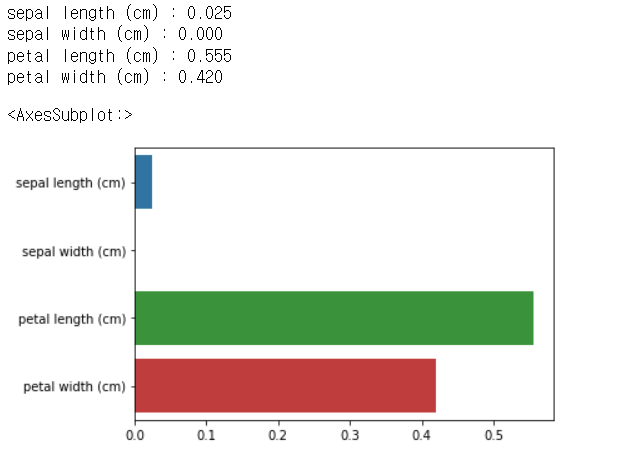

# 피처 중요도 확인

```python
import seaborn as sns
import numpy as np
%matplotlib inline
```

**iris 데이터의 피처 4개 확인**

```python
iris_data.feature_names
```

```
['sepal length (cm)',
 'sepal width (cm)',
 'petal length (cm)',
 'petal width (cm)']
```


**피처 4개에 대한 각각의 feature importance 확인

```python
dt_clf.feature_importances_
```

```
array([0.02500521, 0.        , 0.55490281, 0.42009198])
```

```python
# feature importance 소수 3째 자리까지
print("Feature importances:\n{0}".format(np.round(dt_clf.feature_importances_, 3)))
```

**피처 중요도 시각화**

```python
# feature별 importane 매핑
for name, value in zip(iris_data.feature_names, dt_clf.feature_importances_):
    print('{0} : {1:.3f}'.format(name, value))
    
# feature importance를 column별로 시각화 하기
sns.barplot(x=dt_clf.feature_importances_, y=iris_data.feature_names)
```




## 1. Human Activity Recognition Data

```python
# 피처 중요도 확인해보기
import seaborn as sns

ftr_importances_values = best_df_clf.feature_importances_
```

```python
# Top 중요도로 정렬을 쉽게 하고, 시본(Seaborn)의 막대그래프로 쉽게 표현하기 위해 Series변환
ftr_importances = pd.Series(ftr_importances_values, index=X_train.columns)

# 중요도값 순으로 Series를 정렬. 피처는 중요도 상위 20개만 추출해서 정렬.
ftr_top20 = ftr_importances.sort_values(ascending=False)[:20]

plt.figure(figsize=(8, 6))
plt.title('Feature importances Top 20')
sns.barplot(x=ftr_top20 , y = ftr_top20.index)
plt.show()
```


## 2. XGBoost_유방암데이터,산탄테르 고객만족 예측 데이터

```python
import matplotlib.pyplot as plt
%matplotlib inline

fig, ax = plt.subplots(figsize=(10,12))
plot_importance(xgb_model, ax=ax)
```


**피처 갯수 제한**

```python
from xgboost import plot_importance
import matplotlib.pyplot as plt
%matplotlib inline

fig, ax = plt.subplots(1,1,figsize=(10,8))
plot_importance(xgb_clf, ax=ax , max_num_features=20,height=0.4)
```


*** figure 와 ax 객체를 생성하는 방법**

1. fig = plt.figure() : ax 없는 빈 figure 생성 (후에 ax를 추가해줘야함)
2. fig, ax = plt.subplots() : 하나의 ax 만을 가지는 하나의 figure 생성
3. fig, axes = plt.subplots(2,2) : 4개(2*2)이 ax들을 가지는 하나의 figure 생성


## 3. 피처들의 상관 관계

**corr() : 각 피처들의 상관 관계. 결정 레이블인 class 값과 가장 상관도가 높은 피처 추출**

```python
import seaborn as sns

plt.figure(figsize=(9,9))
corr = card_df.corr()
sns.heatmap(corr, cmap='RdBu')
```


- class와 상관관계가 높은 피처는 V12, V14, V17이 있는 것을 알 수 있다.