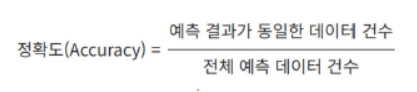
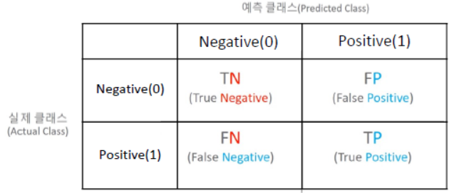
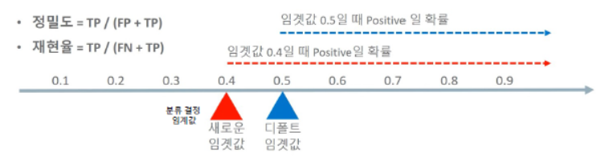
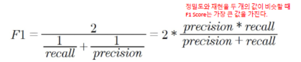

# 머신러닝_평가지표

데이터 전처리를 마친 후, 트레인 데이터로 학습을 하여 모델을 만들고, 테스트 데이터에 넣어서 좋은 모델인지 성능 검증을 한다.

이 과정에서 성능을 평가할 수 있는 지표들에는 아래와 같은 지표들이 있다.

1. 분류의 평가 지표
   - 정확도 (Accuracy)
   - 오차행렬 (Confusion Matrix)
   - 정밀도 (Precision)
   - 재현율 (Recall)
   - F1 Score
   - ROC AUC
2. 회귀의 평가 지표
   - MSE : 오차의 제곱
   - MAE : 오차의 절대값
   - MSLE : 오차의 제곱에 로그 적용
   - RMSE : 오차의 제곱에 루트 적용
   - RMSLE : RMSE에 로그 적용

##  1. 각 평가지표 개념 및 함수

### 1) 정확도 (Accuracy)

- 정확도(Accuracy) = 예측 결과가 동일한 데이터 건수 / 전체 예측 데이터 건수

  

- 직관적으로 모델 예측 성능을 나타내는 평가지표이나, 이진 분류의 경우 데이터의 구성에 따라 ML 모델의 성능을 왜곡할 수 있기 때문에 정확도 수치만으로 성능을 평가하는 것은 한계가 있다.

- 특히, 불균형한 레이블 값 분포에서 정확도는 적합한 평가지표가 아니다.

  ```python
  from sklearn.metrics import accuracy_score
  
  accuracy_score(실제값 , 예측값)
  ```

### 2) 오차행렬 (Confusion Matrix)

- 오차행렬은 이진 분류의 예측 오류가 얼마인지와 더불어 어떠한 유형의 예측 오류가 발생하고 있는지를 함께 나타내는 지표

  

  - 위의 오차행렬에서 정확도는 (TN+TP) / (TN+TP+FN+FP)

  ```python
  from sklearn.metrics import confusion_matrix
  
  confusion_matrix(실제값, 예측값)
  ```

### 3) 정밀도 (Precision), 재현율 (Recall)

- 정밀도

  - TP / (FP + TP)
  - 정밀도는 예측을 Positive로 한 대상 중에 예측과 실제 값이 Positive로 일치한 데이터의 비율 (긍정으로 예측한 것 중에 얼마나 맞췄는지)

- 재현율

  - TP / (FN + TP)
  - 재현율은 실제 값이 Positive인 대상 중에 예측과 실제 값이 Positive로 일치한 데이터의 비율 (긍정 값 중에 얼마나 맞췄는지)

- 정밀도와 재현율의 관계 (trade off)

  - 정밀도와 재현율은 상호 보완적인 평가 지표이기 때문에 어느 한 쪽을 높이면 다른 하나의 수치는 떨어지게 된다.

  - 분류하려는 업무의 특성상 정밀도 또는 재현율이 특별히 강조되어야 할 경우 분류의 결정 임곗값(Threshold)을 조정해 정밀도 또는 재현율의 수치를 높일 수 있다.

    - ex1) 암진단, 금융사기 판별 

      실제 양성인 데이터 예측을 잘못 판단하게 되면 업무상 큰 영향이 발생하는 경우

      암의 경우 조금이라도 의심스러운 상황에서는 추가 검사를 받게 해야되므로 재현율이 더 중요한 지표

    - ex2) 스팸 메일

      실제 음성인 데이터 예측을 양성으로 잘못 판단하게 되면 업무상 큰 여향이 발생하는 경우

      업무에 중요한 메일(음성)이 스팸메일(양성)으로 빠지면 안 되기 때문에 정밀도가 더 중요한 지표

  - 이진 분류의 경우, 0은 음성(negative) / 1은 양성(positive)

  - 임곗값에 따른 Posirive 결정 변화

    

    - 분류 결정 임곗값이 낮아질수록 Positive로 예측할 확률이 높아짐 (재현율 증가)
    - 암진단의 경우, 임곗값을 낮춰서 Positive 값을 늘린다.

### 4) F1 Score

- F1 Score는 정밀도와 재현율을 결합한 지표

- F1 Score는 정밀도와 재현율이 어느 한 쪽으로 치우치지 않는 수치를 나타낼 때 상대적으로 높은 값을 갖는다.

  

- A예측 모델 - 정밀도 0.9 / 재현율 0.1 => F1 Score = 0.18

- B예측 모델 - 정밀도 0.5 / 재현율 0.5 => F1 Score = 0.5

  ```python
  from sklearn.metrics import f1_score 
  
  f1_score(실제값, 예측값)
  ```

### 5) ROC Curve, AUC

- ROC 곡선은 FPR(False Positive Rate)이 변할 때 TPR(True Positive Rate)이 어떻게 변하는지를 나타내는 곡선

- FPR을 X축으로, TPR을 Y축으로 잡으면 FPR의 변화에 따른 TPR의 변화가 곡선 형태로 나타난다.

- 그리고, 이 ROC 커브의 아래쪽에 위치한 면적을 AUC 값이라고 한다.

- AUC 값은 1에 가까울수록 좋은 수치이다.

- TPR = TP / (FN + TP)

- FPR = FP / (FP + TN)

  ```python
  from sklearn.metrics import roc_curve
  from sklearn.metrics import roc_auc_score
  
  roc_curve(실제 값, 예측 확률)
  roc_auc_score(실제 값, 예측 확률)
  ```


## 2. 파이썬 함수 적용

### 1) 평가 지표 함수

```python
def get_clf_eval(y_test, pred=None, pred_proba=None):
    confusion = confusion_matrix( y_test, pred)
    accuracy = accuracy_score(y_test , pred)
    precision = precision_score(y_test , pred)
    recall = recall_score(y_test , pred)
    f1 = f1_score(y_test,pred)
    roc_auc = roc_auc_score(y_test, pred_proba)
    print('오차 행렬')
    print(confusion)
    print('정확도: {0:.4f}, 정밀도: {1:.4f}, 재현율: {2:.4f},\
          F1: {3:.4f}, AUC:{4:.4f}'.format(accuracy, precision, recall, f1, roc_auc), '\n')
```

### 2) 임계값 변화 함수

**Binarize**

> 요소가 기준값(threshold)과 비교해서, 같거나 작으면 0을 반환하고 크면 1을 반환

```python
X = [[ 1, -1, 2],
     [ 2, 0, 0],
     [ 0, 1.1, 1.2]]
```

```python
from sklearn.preprocessing import Binarizer

# Binarizer의 threshold를 1.1로 세팅.
binarizer = Binarizer(threshold = 1.1)

# array X의 값들이 1.1보다 작거나 같으면 0, 크면 1을 반환한다.
binarizer.fit_transform(X)
```

``````
array([[0., 0., 1.],
       [1., 0., 0.],
       [0., 0., 1.]])
``````

#### (1) 분류 임곗값 변화에 따른 예측값 변환 함수

```python
thresholds = [0.4, 0.45, 0.50, 0.55, 0.60]
```

```python
def get_eval_by_threshold(y_test , pred_proba_c1, thresholds):
    # 임계값을 차례로 돌면서 Evaluation 수행.
    for custom_threshold in thresholds:
        binarizer = Binarizer(threshold=custom_threshold).fit(pred_proba_c1) 
        custom_predict = binarizer.transform(pred_proba_c1)
        
        # 임계값에 따른 결과들이 출력된다.
        print('임곗값:', custom_threshold)
        get_clf_eval(y_test , custom_predict)
```

- thresholds 리스트 안에 변화해 볼 임계값 수치를 적고, 아래 형태로 get_eval_by_threshold 함수를 사용한다.
- get_eval_by_threshold(y_test, pred_proba[:,1].reshape(-1,1), thresholds)
