# 회귀 (Regression)

## 1. 회귀 개요

### 1) 회귀 개요

- 분류의 결과값은 Category 값(이산값)이고, 회귀의 결과값은 숫자값이다.

- 여러 개의 독립변수와 한 개의 종속변수 간의 상관관계를 모델링하는 기법
- 머신러닝 회귀 예측의 핵심은 주어진 피처와 결정 값 데이터 기반에서 학습을 통해 최적의 회귀 계수를 찾아내는 것

### 2) 회귀 유형

1. 회귀 계수의 결합에 의해
   - 선형 회귀
   - 비선형 회귀
2. 독립 변수의 개수에 의해
   - 1개 : 일반 선형회귀
   - n개 : 다중 선형회귀

### 3) 단순 선형 회귀를 통한 회귀의 이해

> RSS : 오류 값의 제곱을 구해서 더하는 방식. 일반적으로 미분 등의 계산을 편리하게 하기 위해서 RSS 방식으로 오류 합을 구한다.

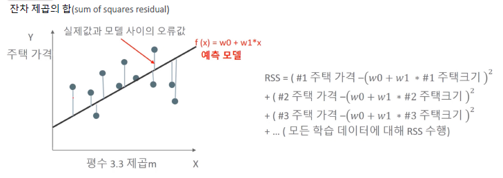

- 쉽게 이야기하면, 실제값과 모델 사이의 오류값을 최소화하는  것이 최적의 머신러닝 모델이다.

  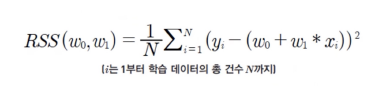

- RSS는 회귀식의 독립변수 X, 종속변수 Y가 중심 변수가 아니라 w 변수(회귀 계수)가 중심 변수이다.

## 2. 경사하강법

> 경사 하강법은 '점진적으로' 반복적인 계산을 통해 w 파라미터 값을 업데이트 하면서 오류 값이 최소가 되는 w 파라미터를 구하는 방식

- f(x) = w0 + w1*x

- RSS = 실제값과 오류값과의 차이의 제곱

  

- 위의 RSS가 최소값이 되는 가중치 w 값들을 구해야 하며, w0와 w1을 구하는 방식은 위의 식을 편미분한 값이며, 아래와 같다.

  - w1 =

    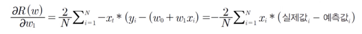

  - w0 =

    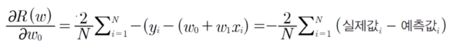		

## 3. 파이썬 실습

### 1) 모두의 딥러닝

1. 공부시간 x와 성적 y의 상관관계를 보기 위해 각각의 리스트를 만들고, 그래프로 그린다.

   ```python
   import numpy as np
   import pandas as pd
   import matplotlib.pyplot as plt
   
   # 공부시간 X와 성적 Y의 리스트를 만든다.
   data = [[2, 81], [4, 93], [6, 91], [8, 97]]
   x = [i[0] for i in data]
   y = [i[1] for i in data]
   
   # 그래프로 그리면,
   plt.figure(figsize=(8, 5))
   plt.scatter(x, y)
   plt.show()
   ```

   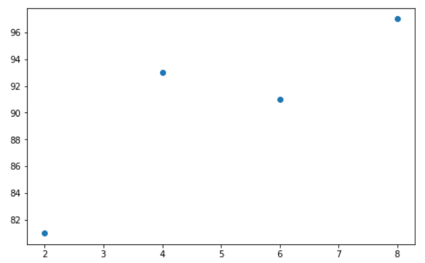

2. w0, w1 값을 구하기 위해 경사 하강법을 시작한다.

   ```python
   #리스트로 되어 있는 x와 y값을 넘파이 배열로 바꾼다.(인덱스를 주어 하나씩 불러와 계산이 가능해 지도록 하기 위함)
   x_data = np.array(x)
   y_data = np.array(y)
   
   # 기울기 a와 절편 b의 값을 초기화
   a = 0      # w1
   b = 0      # w0   
   
   #학습률을 정한다.
   lr = 0.03 
   
   #몇 번 반복될지를 설정한다.
   epochs = 2001 
   ```

   ```python
   #경사 하강법 시작
   for i in range(epochs):                               # epoch 수 만큼 반복
       y_hat = a * x_data + b                            # y를 구하는 식_예측 값 y = w0(b) + x1(x_data)w1(a) 
       error = y_data - y_hat                            # 오차를 구하는 식_실제 값 - 예측 값 오차
       a_diff = -(2/len(x_data)) * sum(x_data * (error)) # 오차함수를 a로 미분한 값 
       b_diff = -(2/len(x_data)) * sum(error)            # 오차함수를 b로 미분한 값
       a = a - lr * a_diff                               # 학습률을 곱해 기존의 a값을 업데이트
       b = b - lr * b_diff                               # 학습률을 곱해 기존의 b값을 업데이트
       if i % 100 == 0:                                  # 100번 반복될 때마다 현재의 a값, b값을 출력합니다.
           print("epoch=%.f, 기울기=%.04f, 절편=%.04f" % (i, a, b))
   ```

   ``````
   epoch=0, 기울기=27.8400, 절편=5.4300
   epoch=100, 기울기=7.0739, 절편=50.5117
   epoch=200, 기울기=4.0960, 절편=68.2822
   epoch=300, 기울기=2.9757, 절편=74.9678
   epoch=400, 기울기=2.5542, 절편=77.4830
   epoch=500, 기울기=2.3956, 절편=78.4293
   epoch=600, 기울기=2.3360, 절편=78.7853
   epoch=700, 기울기=2.3135, 절편=78.9192
   epoch=800, 기울기=2.3051, 절편=78.9696
   epoch=900, 기울기=2.3019, 절편=78.9886
   epoch=1000, 기울기=2.3007, 절편=78.9957
   epoch=1100, 기울기=2.3003, 절편=78.9984
   epoch=1200, 기울기=2.3001, 절편=78.9994
   epoch=1300, 기울기=2.3000, 절편=78.9998
   epoch=1400, 기울기=2.3000, 절편=78.9999
   epoch=1500, 기울기=2.3000, 절편=79.0000
   epoch=1600, 기울기=2.3000, 절편=79.0000
   epoch=1700, 기울기=2.3000, 절편=79.0000
   epoch=1800, 기울기=2.3000, 절편=79.0000
   epoch=1900, 기울기=2.3000, 절편=79.0000
   epoch=2000, 기울기=2.3000, 절편=79.0000
   ``````

3. 위에서 구한 기울기(a=w1), 절편(b=w0)를 이용해 그래프를 그린다.

   ```python
   y_pred = a * x_data + b
   plt.scatter(x, y)
   plt.plot([min(x_data), max(x_data)], [min(y_pred), max(y_pred)])
   plt.show()
   ```

   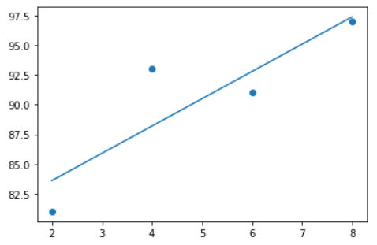


### 2) 파머완가 Gradient Descent

1. 실제 값을 Y = 4X + 6 시뮬레이션하는 데이터 값 생성

   ```python
   import numpy as np
   import matplotlib.pyplot as plt
   %matplotlib inline
   
   np.random.seed(0)
   # y = 4X + 6 식을 근사(w1=4, w0=6). random값은 Noise를 위해 만듬
   X = 2 * np.random.rand(100,1)
   y = 6 +4 * X+ np.random.randn(100,1)
   
   # X, y 데이터 셋 scatter plot 으로 시각화
   plt.scatter(X, y)
   ```

   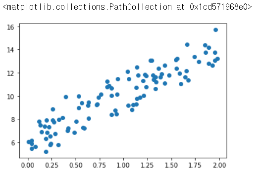

2. 오차 함수를 최소화 할 수 있도록 w0과 w1의 값을 업데이트 수행하는 함수 생성

   - y_pred = w1*x + w0
     - 예측배열 y_pred는 np.dot(X, w1.T) + w0임.
     - 입력 데이터 X(1,2,...,100)이 있다면, 예측값은 w0 + X(1)w1 + X(2)w1 +..+X(100)w1이며, 이는 입력 배열 X와 w1 배열의 내적임.
     - 새로운 w1과 w0을 update함

   ```python
   # w1 과 w0 를 업데이트 할 w1_update, w0_update를 반환. 
   def get_weight_updates(w1, w0, X, y, learning_rate=0.01):
       N = len(y)
       
       # 먼저 w1_update, w0_update를 각각 w1, w0의 shape와 동일한 크기를 가진 0 값으로 초기화
       w1_update = np.zeros_like(w1)    # np.zeros_like(x) = x와 형상이 같고 원소가 모두 0인 배열 생성
       w0_update = np.zeros_like(w0)
       
       # 예측 배열 계산하고 예측과 실제 값의 차이 계산
       y_pred = np.dot(X, w1.T) + w0     # w0 + w1*x1
       diff = y-y_pred
       
       # w0_update를 dot 행렬 연산으로 구하기 위해 모두 1 값을 가진 행렬 생성
       w0_factors = np.ones((N,1))
       
       # w1과 w0을 업데이트 할 w1_update와 w0_update 계산
       w1_update = -(2/N)*learning_rate*(np.dot(X.T, diff))
       w0_update = -(2/N)*learning_rate*(np.dot(w0_factors.T, diff))
       
       return w1_update, w0_update    
   ```

3. 반복적으로 경사 하강법을 이용하여 get_weight_updates()를 호출하여 w1과 w0을 업데이트하는 함수 생성

   ```python
   # 입력 인자 iters로 주어진 횟수만큼 반복적으로 w1과 w0을 업데이트 적용함
   def gradient_descent_steps(X, y, iters=10000):
       # w0와 w1을 모두 0으로 초기화
       w0 = np.zeros((1,1))
       w1 = np.zeros((1,1))
       
       # 인자로 주어진 iters 만큼 반복적으로 get_weight_updates() 호출하여 w1, w0 업데이트 수행
       for ind in range(iters):
           w1_update, w0_update = get_weight_updates(w1, w0, X, y, learning_rate=0.01)
           w1 = w1 - w1_update
           w0 = w0 - w0_update
           
       return w1, w0
   ```

4. 예측 오차 비용 계산을 수행하는 함수 생성 및 경사 하강법 수행

   ```python
   def get_cost(y, y_pred):
       N = len(y)
       cost = np.sum(np.square(y - y_pred))/N
       return cost
   
   w1, w0 = gradient_descent_steps(X, y, iters=1000)
   print("w1:{0:.3f} w0:{1:.3f}".format(w1[0,0], w0[0,0]))
   y_pred = w1[0,0] * X + w0
   print('Gradient Descent Total Cost:{0:.4f}'.format(get_cost(y, y_pred)))
   ```

   ``````
   w1:4.022 w0:6.162
   Gradient Descent Total Cost:0.9935
   ``````

   ```python
   plt.scatter(X, y)
   plt.plot(X,y_pred)
   ```

   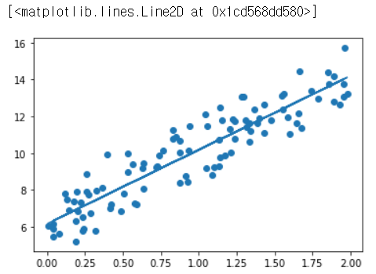

#### (1) 미니 배치 확률적 경사 하강법을 이용한 최적 비용함수 도출

- 전체 데이터에 대해 경사하강법 연산을 수행하려면 시간이 오래 걸리기 때문에 미니 배치로 샘플링하면 빠르게 경사하강법을 수행할 수 있음

```python
def stochastic_gradient_descent_steps(X, y, batch_size=10, iters=1000):
    w0 = np.zeros((1,1))
    w1 = np.zeros((1,1))
    prev_cost = 100000
    iter_index = 0
    
    for ind in range(iters):
        np.random.seed(ind)
        # 전체 X, y 데이터에서 랜덤하게 batch_size만큼 데이터 추출하여 sample_X, sample_y로 저장
        stochastic_random_index = np.random.permutation(X.shape[0])
        sample_X = X[stochastic_random_index[0:batch_size]]
        sample_y = y[stochastic_random_index[0:batch_size]]
        
        # 미니 배치 임의로 추출
        # 랜덤하게 batch_size만큼 추출된 데이터 기반으로 w1_update, w0_update 계산 후 업데이트
        w1_update, w0_update = get_weight_updates(w1, w0, sample_X, sample_y, learning_rate=0.01)
        w1 = w1 - w1_update
        w0 = w0 - w0_update
    
    return w1, w0
```

```python
w1, w0 = stochastic_gradient_descent_steps(X, y, iters=50000)
print("w1:", round(w1[0,0],3),"w0:", round(w0[0,0],3))
y_pred = w1[0,0] * X + w0
print('Stochastic Gradient Descent Total Cost:{0:.4f}'.format(get_cost(y, y_pred)))
```

``````
w1: 3.991 w0: 6.202
Stochastic Gradient Descent Total Cost:0.9926
``````

## 4. LinearRegression

### 1) 사이킷런 LinearRegression 클래스

- LinearRegression 클래스는 예측값과 실제 값의 RSS를 최소화해 OLS(Ordinary Least Squares) 추정 방식으로 구현한 클래스

- LinearRegression 클래스는 fir() 메서드로 X, y 배열을 입력받으면 회귀 계수(Coefficients)인 W를 coef_속성에 저장한다.

- `_class_ sklearn.linear_model.LinearRegression(_fit_intercept=TRUE, normalize=False, copy_X=True, n_jobs=1_)

  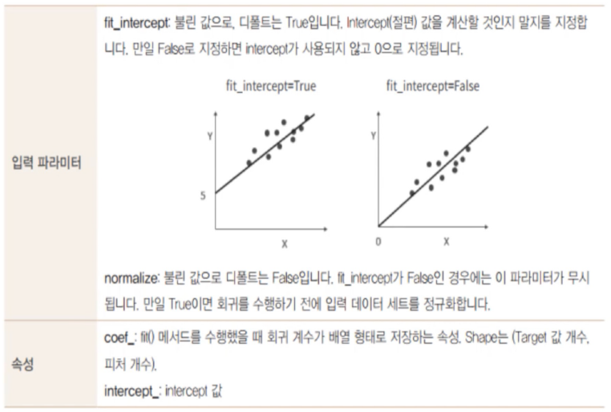

### 2) 회귀 평가 지표

- MAE = Mean Absolute Error 이며, 실제 값과 예측 값의 차이를 절댓값으로 변환해 평균한 것
- MSE = Mean Squared Error이며, 실제 값과 예측 값의 차이를 제곱해 평균한 것
- MSLE = MSE에 로그를 적용한 것, 결정값이 클수록 오류값도 커지기 때문에 일부 큰 오류 값들로 인해 전체 오류값이 커지는 것을 막아준다.
- RMSE = MSE 값은 오류의 제곱을 구하므로 실제 오류 평균보다  더 커지는 특성이 있으므로 MSE에 루트를 씌운 것이 RMSE(Root Mean Squared Error)
- RMSLE = RMSE에 로그를 적용한 거, 결정값이 클수록 오류값도 커지기 때문에 일부 큰 오류값들로 인해 전체 오류값이 커지는 것을 막아준다.

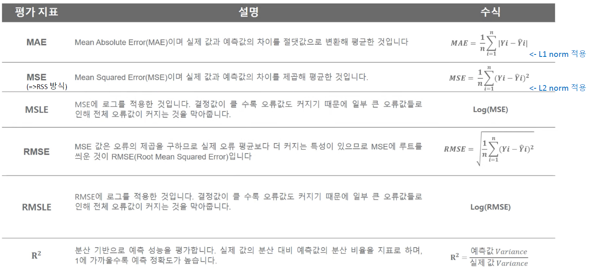

### 3) 사이킷런 회귀 평가 API

- cross_val_score나 GridSearchCV에서 평가 시, 사용되는 scoring 파라미터의 적용 값

  | 평가 방법 | 사이킷런 평가 지표 API      | Scoring 함수 적용 값      |
  | --------- | --------------------------- | ------------------------- |
  | MAE       | metrics.mean_absolute_error | 'neg_mean_absolute_error' |
  | MSE       | metrics.mean_squared_error  | 'neg_mean_squared_error'  |
  | R2        | metrics.r2_score            | 'r2'                      |

  - RMSE는 제공하지 않아, RMSE를 구할 때는 MSE에 제곱근을 씌워서 계산하는 함수를 직접 만들어야 함.

### 4) LinearRegression을 이용한 보스턴 주택 가격 예측

1. 데이터 로드 및 확인

   ```python
   import numpy as np
   import matplotlib.pyplot as plt
   import pandas as pd
   import seaborn as sns
   from scipy import stats      # 과학 계산 라이브러리
   
   from sklearn.datasets import load_boston
   %matplotlib inline
   ```

   ```python
   # boston 데이터셋 로드
   boston = load_boston()
   
   # boston 데이터셋 DataFrame 변환
   bostonDF = pd.DataFrame(boston.data, columns = boston.feature_names)
   
   # boston 데이터셋의 target array는 주택 가격. 이를 PRICE 컬럼으로 DataFrame에 추가
   bostonDF['PRICE'] = boston.target
   print('Boston 데이터셋 크기 :', bostonDF.shape)
   bostonDF.head()
   ```

   ```
   Boston 데이터셋 크기 : (506, 14)
   ```

   Out[37]:

   |      |    CRIM |   ZN | INDUS | CHAS |   NOX |    RM |  AGE |    DIS |  RAD |   TAX | PTRATIO |      B | LSTAT | PRICE |
   | ---: | ------: | ---: | ----: | ---: | ----: | ----: | ---: | -----: | ---: | ----: | ------: | -----: | ----: | ----: |
   |    0 | 0.00632 | 18.0 |  2.31 |  0.0 | 0.538 | 6.575 | 65.2 | 4.0900 |  1.0 | 296.0 |    15.3 | 396.90 |  4.98 |  24.0 |
   |    1 | 0.02731 |  0.0 |  7.07 |  0.0 | 0.469 | 6.421 | 78.9 | 4.9671 |  2.0 | 242.0 |    17.8 | 396.90 |  9.14 |  21.6 |
   |    2 | 0.02729 |  0.0 |  7.07 |  0.0 | 0.469 | 7.185 | 61.1 | 4.9671 |  2.0 | 242.0 |    17.8 | 392.83 |  4.03 |  34.7 |
   |    3 | 0.03237 |  0.0 |  2.18 |  0.0 | 0.458 | 6.998 | 45.8 | 6.0622 |  3.0 | 222.0 |    18.7 | 394.63 |  2.94 |  33.4 |
   |    4 | 0.06905 |  0.0 |  2.18 |  0.0 | 0.458 | 7.147 | 54.2 | 6.0622 |  3.0 | 222.0 |    18.7 | 396.90 |  5.33 |  36.2 |

   ``````
   * CRIM: 지역별 범죄 발생률
   * ZN: 25,000평방피트를 초과하는 거주 지역의 비율
   * INDUS: 비상업 지역 넓이 비율
   * CHAS: 찰스강에 대한 더미 변수(강의 경계에 위치한 경우는 1, 아니면 0)
   * NOX: 일산화질소 농도
   * RM: 거주할 수 있는 방 개수
   * AGE: 1940년 이전에 건축된 소유 주택의 비율
   * DIS: 5개 주요 고용센터까지의 가중 거리
   * RAD: 고속도로 접근 용이도
   * TAX: 10,000달러당 재산세율
   * PTRATIO: 지역의 교사와 학생 수 비율
   * B: 지역의 흑인 거주 비율
   * LSTAT: 하위 계층의 비율
   * MEDV: 본인 소유의 주택 가격(중앙값)
   ``````

2. 각 컬럼별로 주택가격에 미치는 영향도 조사

   ```python
   # 2개의 행과 4개의 열을 가진 subplots를 이용. axs는 4x2개의 ax를 가짐.
   fig, axs = plt.subplots(figsize=(16,8) , ncols=4 , nrows=2)
   lm_features = ['RM','ZN','INDUS','NOX','AGE','PTRATIO','LSTAT','RAD']
   for i , feature in enumerate(lm_features):
       row = int(i/4)
       col = i%4
       # 시본의 regplot을 이용해 산점도와 선형 회귀 직선을 함께 표현
       sns.regplot(x=feature , y='PRICE',data=bostonDF , ax=axs[row][col])
   ```

   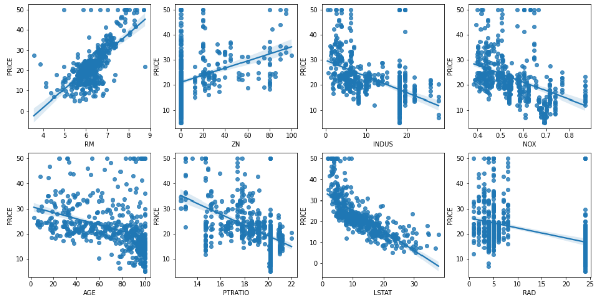

   - 강한 양의 상관관계 best : RM
   - 강한 음의 상관관계 best : LSTAT

3. 학습과 테스트 데이터 세트로 분리하고 학습/예측/평가 수행

   ```python
   from sklearn.model_selection import train_test_split
   from sklearn.linear_model import LinearRegression
   from sklearn.metrics import mean_squared_error, r2_score
   
   # feature, target 데이터 분리
   y_target = bostonDF['PRICE']       # 레이블/라벨(종속변수)
   X_data = bostonDF.drop(['PRICE'], axis=1, inplace=False)   # 피쳐(독립변수)
   
   # train, test 데이터 분리
   X_train, X_test, y_train, y_test = train_test_split(X_data, y_target, test_size=0.3, random_state=156)
   
   # Linear Regression OLS로 학습/예측/평가 수행
   # Linear Regression 
   lr = LinearRegression()
   
   # 학습
   lr.fit(X_train , y_train )
   
   # 예측
   y_preds = lr.predict(X_test)
   
   # 평가
   mse = mean_squared_error(y_test, y_preds)
   rmse = np.sqrt(mse)
   
   print('MSE : {0:.3f}, RMSE : {1:.3f}'.format(mse, rmse))
   print('Variance score : {0:.3f}'.format(r2_score(y_test, y_preds)))
   ```

   ``````
   MSE : 17.297, RMSE : 4.159
   Variance score : 0.757
   ``````

   - 절편 값과 회귀 계수 살펴보기

   ```python
   print('절편 값:', lr.intercept_)
   print('회귀 계수값:', np.round(lr.coef_, 1))
   ```

   ``````
   절편 값: 40.995595172164336
   회귀 계수값: [ -0.1   0.1   0.    3.  -19.8   3.4   0.   -1.7   0.4  -0.   -0.9   0.
     -0.6]
   ``````

   ```python
   # 회귀 계수를 큰 값 순으로 정렬하기 위해 Series로 생성, index가 컬럼명에 유의
   coeff = pd.Series(data=np.round(lr.coef_, 1), index=X_data.columns)
   coeff.sort_values(ascending = False)
   ```

   ``````
   RM          3.4
   CHAS        3.0
   RAD         0.4
   ZN          0.1
   INDUS       0.0
   AGE         0.0
   TAX        -0.0
   B           0.0
   CRIM       -0.1
   LSTAT      -0.6
   PTRATIO    -0.9
   DIS        -1.7
   NOX       -19.8
   dtype: float64
   ``````

   - RM의 양의 절대값이 제일 크다.
   - NOX가 음의 절대값이 너무 크다.

#### (1) cross_val_score()로 MSE 구한 뒤, 이를 기반으로 RMSE 구하기

1. MSE 구하기

   ```python
   from sklearn.model_selection import cross_val_score
   
   # features, target 데이터 정의
   y_target = bostonDF['PRICE']
   X_data = bostonDF.drop(['PRICE'], axis = 1, inplace=False)
   
   # 선형 회귀 객체 생성
   lr = LinearRegression()
   
   # 5 folds의 개별 Negative MSE scores
   neg_mse_scores = cross_val_score(lr, X_data, y_target, scoring="neg_mean_squared_error", cv=5)
   neg_mse_scores
   ```

   ``````
   array([-12.46030057, -26.04862111, -33.07413798, -80.76237112,
          -33.31360656])
   ``````

2. MSE를 갖고 RMSE 구하기

   ```python
   # RMSE를 구하기 위해서는 MSE 값들에 -1을 곱한 후 평균을 내면 된다.
   rmse_scores = np.sqrt(-1 * neg_mse_scores)
   rmse_scores
   ```

   ``````
   array([3.52991509, 5.10378498, 5.75101191, 8.9867887 , 5.77179405])
   ``````

3. 평균 RMSE

   ```python
   # 5 folds의 평균 RMSE
   avg_rmse = np.mean(rmse_scores)
   avg_rmse
   ```

   ``````
   5.828658946215808
   ``````

4. 최종 평가 지표들 모음

   ```python
   # cross_val_score(scoring="neg_mean_squared_error")로 반환된 값은 모두 음수
   print('5 folds의 개별 Negative MSE scores:', np.round(neg_mse_scores, 2))
   print('5 folds의 개별 RMSE scores:', np.round(rmse_scores, 2))
   print('5 folds의 평균 RMSE : {0:.3f}'.format(avg_rmse))
   ```

   ``````
   5 folds의 개별 Negative MSE scores: [-12.46 -26.05 -33.07 -80.76 -33.31]
   5 folds의 개별 RMSE scores: [3.53 5.1  5.75 8.99 5.77]
   5 folds의 평균 RMSE : 5.829
   ``````