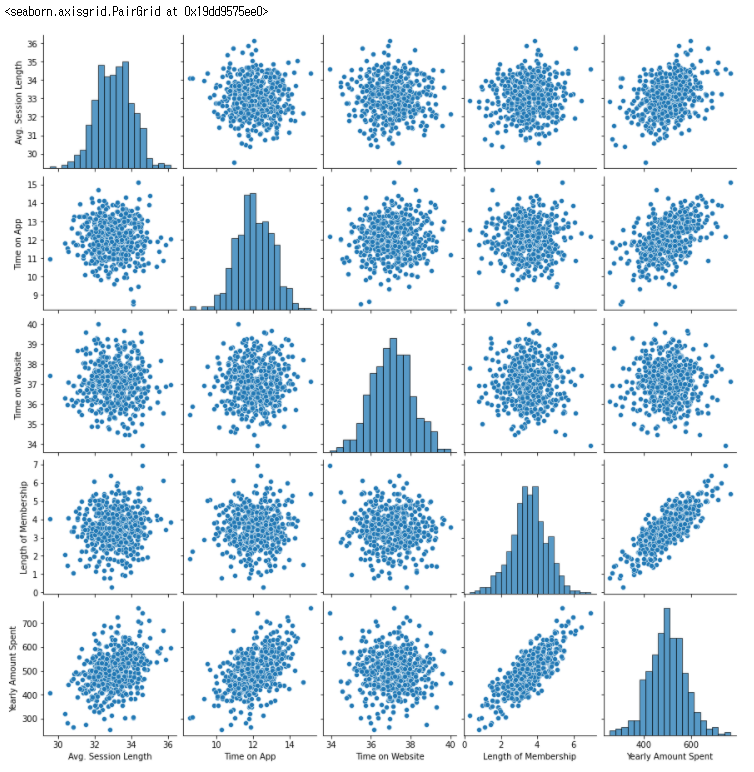
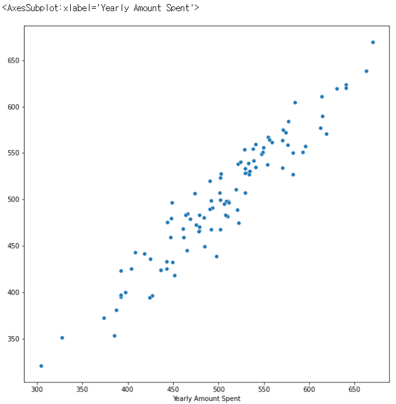

# 선형 회귀

**고객별 연간 지출액 예측**

**선형회귀**

> X값과 y값의 선형 상관관계를 모델링하는 알고리즘

- 선형 상관관계 : x가 증가하면 y가 증가하거나 감소하는 관계


## 1. 데이터 확인 / 전처리

### 1) 모듈 및 데이터 로딩

```python
# 데이터 분석
import pandas as pd   # 엑셀
import numpy as np  # 행렬 계산

# 그래프 및 시각화
import matplotlib.pyplot as plt
import seaborn as sns

# 데이터 불러오기
data = pd.read_csv('ecommerce.csv')
```

### 2) 데이터 특성 확인하기

```python
# 데이터 확인
data
```

|      |                         Email |                                           Address |           Avatar | Avg. Session Length | Time on App | Time on Website | Length of Membership | Yearly Amount Spent |
| ---: | ----------------------------: | ------------------------------------------------: | ---------------: | ------------------: | ----------: | --------------: | -------------------: | ------------------- |
|    0 |     mstephenson@fernandez.com |      835 Frank Tunnel\nWrightmouth, MI 82180-9605 |           Violet |           34.497268 |   12.655651 |       39.577668 |             4.082621 | 587.951054          |
|    1 |             hduke@hotmail.com |    4547 Archer Common\nDiazchester, CA 06566-8576 |        DarkGreen |           31.926272 |   11.109461 |       37.268959 |             2.664034 | 392.204933          |
|    2 |              pallen@yahoo.com | 24645 Valerie Unions Suite 582\nCobbborough, D... |           Bisque |           33.000915 |   11.330278 |       37.110597 |             4.104543 | 487.547505          |
|    3 |       riverarebecca@gmail.com |  1414 David Throughway\nPort Jason, OH 22070-1220 |      SaddleBrown |           34.305557 |   13.717514 |       36.721283 |             3.120179 | 581.852344          |
|    4 | mstephens@davidson-herman.com | 14023 Rodriguez Passage\nPort Jacobville, PR 3... | MediumAquaMarine |           33.330673 |   12.795189 |       37.536653 |             4.446308 | 599.406092          |
|  ... |                           ... |                                               ... |              ... |                 ... |         ... |             ... |                  ... | ...                 |
|  495 |  lewisjessica@craig-evans.com | 4483 Jones Motorway Suite 872\nLake Jamiefurt,... |              Tan |           33.237660 |   13.566160 |       36.417985 |             3.746573 | 573.847438          |
|  496 |           katrina56@gmail.com | 172 Owen Divide Suite 497\nWest Richard, CA 19320 |    PaleVioletRed |           34.702529 |   11.695736 |       37.190268 |             3.576526 | 529.049004          |
|  497 |            dale88@hotmail.com | 0787 Andrews Ranch Apt. 633\nSouth Chadburgh, ... |         Cornsilk |           32.646777 |   11.499409 |       38.332576 |             4.958264 | 551.620146          |
|  498 |           cwilson@hotmail.com | 680 Jennifer Lodge Apt. 808\nBrendachester, TX... |             Teal |           33.322501 |   12.391423 |       36.840086 |             2.336485 | 456.469510          |
|  499 |     hannahwilson@davidson.com | 49791 Rachel Heights Apt. 898\nEast Drewboroug... |      DarkMagenta |           33.715981 |   12.418808 |       35.771016 |             2.735160 | 497.778642          |

500 rows × 8 columns

``````
<컬럼 확인>
1. 종속 변수 : Yeary Amount Spent
2. 독립변수 
- Email : 이메일주소
- Address : 집주소
- Avatar : 아바타 캐릭터. 중요x
- Avg. Session Length : 접속해서 머무른 평균 시간
- Time on App : 어플리케이션 사용 시간
- Time on Website : 웹 사이트 접속 시간
- Length of Membership : 회원가입한 지 얼마나 되었는지
``````

```python
# 컬럼 별 데이터 정보 확인하기
data.info()
```

```
<class 'pandas.core.frame.DataFrame'>
RangeIndex: 500 entries, 0 to 499
Data columns (total 8 columns):
 #   Column                Non-Null Count  Dtype  
---  ------                --------------  -----  
 0   Email                 500 non-null    object 
 1   Address               500 non-null    object 
 2   Avatar                500 non-null    object 
 3   Avg. Session Length   500 non-null    float64
 4   Time on App           500 non-null    float64
 5   Time on Website       500 non-null    float64
 6   Length of Membership  500 non-null    float64
 7   Yearly Amount Spent   500 non-null    float64
dtypes: float64(5), object(3)
memory usage: 31.4+ KB
```

```python
# 컬럼 별 통계값 확인하기
data.describe()
```

|       | Avg. Session Length | Time on App | Time on Website | Length of Membership | Yearly Amount Spent |
| ----: | ------------------: | ----------: | --------------: | -------------------: | ------------------- |
| count |          500.000000 |  500.000000 |      500.000000 |           500.000000 | 500.000000          |
|  mean |           33.053194 |   12.052488 |       37.060445 |             3.533462 | 499.314038          |
|   std |            0.992563 |    0.994216 |        1.010489 |             0.999278 | 79.314782           |
|   min |           29.532429 |    8.508152 |       33.913847 |             0.269901 | 256.670582          |
|   25% |           32.341822 |   11.388153 |       36.349257 |             2.930450 | 445.038277          |
|   50% |           33.082008 |   11.983231 |       37.069367 |             3.533975 | 498.887875          |
|   75% |           33.711985 |   12.753850 |       37.716432 |             4.126502 | 549.313828          |
|   max |           36.139662 |   15.126994 |       40.005182 |             6.922689 | 765.518462          |

```python
# pairplot 그래프 : 변수 간 상관관계 확인
sns.pairplot(data)
```



### 3) 전처리

#### (1) 불필요한 컬럼 제거

**drop()**

```python
data.drop(['Email','Address','Avatar'], axis =1, inplace =True)

print(data.shape)
data
```

```
(500, 5)
```

Out[10]:

|      | Avg. Session Length | Time on App | Time on Website | Length of Membership | Yearly Amount Spent |
| ---: | ------------------: | ----------: | --------------: | -------------------: | ------------------: |
|    0 |           34.497268 |   12.655651 |       39.577668 |             4.082621 |          587.951054 |
|    1 |           31.926272 |   11.109461 |       37.268959 |             2.664034 |          392.204933 |
|    2 |           33.000915 |   11.330278 |       37.110597 |             4.104543 |          487.547505 |
|    3 |           34.305557 |   13.717514 |       36.721283 |             3.120179 |          581.852344 |
|    4 |           33.330673 |   12.795189 |       37.536653 |             4.446308 |          599.406092 |
|  ... |                 ... |         ... |             ... |                  ... |                 ... |
|  495 |           33.237660 |   13.566160 |       36.417985 |             3.746573 |          573.847438 |
|  496 |           34.702529 |   11.695736 |       37.190268 |             3.576526 |          529.049004 |
|  497 |           32.646777 |   11.499409 |       38.332576 |             4.958264 |          551.620146 |
|  498 |           33.322501 |   12.391423 |       36.840086 |             2.336485 |          456.469510 |
|  499 |           33.715981 |   12.418808 |       35.771016 |             2.735160 |          497.778642 |

500 rows × 5 columns

## 2. Train, Test 데이터 분리

```python
from sklearn.model_selection import train_test_split

# 피처 : 독립 변수
X = data.drop('Yearly Amount Spent', axis=1)
# 레이블 : 종속 변수
y = data['Yearly Amount Spent']

X_train, X_test, y_train, y_test = train_test_split(X, y, test_size = 0.2, random_state=100)
```

## 3. Linear regression (선형 회귀) 모델 만들기

*statsmodels 모듈 안에 OLS라는 게 있는데 이게 Linear regression이다.*

```python
import statsmodels.api as sm

# fit() : 모델 학습
lm = sm.OLS(y_train, X_train).fit()

lm.summary()
```

|    Dep. Variable: | Yearly Amount Spent | R-squared (uncentered):      | 0.998     |
| ----------------: | ------------------: | ---------------------------- | --------- |
|            Model: |                 OLS | Adj. R-squared (uncentered): | 0.998     |
|           Method: |       Least Squares | F-statistic:                 | 4.798e+04 |
|             Date: |    Fri, 04 Feb 2022 | Prob (F-statistic):          | 0.00      |
|             Time: |            10:25:01 | Log-Likelihood:              | -1820.0   |
| No. Observations: |                 400 | AIC:                         | 3648.     |
|     Df Residuals: |                 396 | BIC:                         | 3664.     |
|         Df Model: |                   4 |                              |           |
|  Covariance Type: |           nonrobust |                              |           |

|                      |     coef | std err |       t | P>\|t\| |  [0.025 | 0.975]  |
| -------------------: | -------: | ------: | ------: | ------: | ------: | ------- |
|  Avg. Session Length |  11.9059 |   0.869 |  13.696 |   0.000 |  10.197 | 13.615  |
|          Time on App |  34.3257 |   1.121 |  30.610 |   0.000 |  32.121 | 36.530  |
|      Time on Website | -14.1405 |   0.812 | -17.405 |   0.000 | -15.738 | -12.543 |
| Length of Membership |  61.0149 |   1.144 |  53.318 |   0.000 |  58.765 | 63.265  |

|       Omnibus: |  0.490 | Durbin-Watson:    | 1.987 |
| -------------: | -----: | ----------------- | ----- |
| Prob(Omnibus): |  0.783 | Jarque-Bera (JB): | 0.606 |
|          Skew: | -0.022 | Prob(JB):         | 0.739 |
|      Kurtosis: |  2.814 | Cond. No.         | 55.4  |


Notes:
[1] R² is computed without centering (uncentered) since the model does not contain a constant.
[2] Standard Errors assume that the covariance matrix of the errors is correctly specified.

## 4. 예측 / 평가

```python
# predict : 예측
predictions = lm.predict(X_test)

# 산포도 그래프 그려서 예측값과 실제값 차이 확인
plt.figure(figsize=(10, 10))
sns.scatterplot(y_test, predictions)
```



```python
from sklearn import metrics

print('MSE:', metrics.mean_squared_error(y_test, predictions))
print('RMSE:', np.sqrt(metrics.mean_squared_error(y_test, predictions)))
```

```
MSE: 482.2890138817763
RMSE: 21.961079524508268
```

``````
"이 선형회귀 모델은 평균값이 499인 Yearly Amount Spent에서 에러(RMSE)가 21 정도다."
RMSE 값이 작을수록 예측을 잘하는 모델이다.
``````

