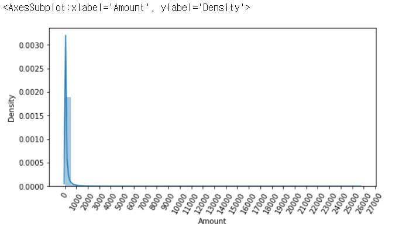

# Classification_데이터 전처리

## 1. 데이터 확인

```python
# 데이터 모양 보기
diabetes_data.shape

# 데이터프레임 위의 5줄 미리보기
diabetes_data.head()

# 전체 데이터 정보 보기
diabetes_data.info()

# Null 값 확인
diabetes_data.isnull().sum().sum()

# 피처, 타겟값 이름 보기
dataset.feature_names
dataset.target_names

# 피처들의 값 4분위 분포 확인
diabetes_data.describe()

# 'Glucose' 피처의 분포도(히스토그램)
plt.hist(diabetes_data['Glucose'], bins=10)

# 타겟 값의 레이블 분포 확인
cancer_df['target'].value_counts()
```

## 2. 데이터 전처리

### 1) null값 처리 / 이상치 값 처리

1. Null 처리 함수

   ```python
   def fillna(df):
       df['Age'].fillna(df['Age'].mean(),inplace=True)
       df['Cabin'].fillna('N',inplace=True)
       df['Embarked'].fillna('N',inplace=True)
       df['Fare'].fillna(0,inplace=True)
       return df
   ```

2. 이상치 값 확인 및 처리

   ```python
   # 'var3' 피처 값의 분포 확인하기(상위 10개)
   print(cust_df['var3'].value_counts( )[:10])
   ```

   ``````
    2         74165
    8           138
   -999999      116
    9           110
    3           108
    1           105
    13           98
    7            97
    4            86
    12           85
   Name: var3, dtype: int64
   ``````

   ```python
   # -999999의 값들은 가장 많은 2로 대체
   cust_df['var3'].replace(-999999, 2, inplace=True)   # inplace = 객체 자체를 바꿔라
   ```

3. get_outlier 함수 정의하여 활용

   **이상치 찾는 함수**

   ```python
   import numpy as np
   
   # 이상치를 찾는 함수
   def get_outlier(df=None, column=None, weight=1.5):
       # fraud에 해당하는 column 데이터만 추출, 1/4 분위와 3/4 분위 지점을 np.percentile로 구함. 
       fraud = df[df['Class']==1][column]
       quantile_25 = np.percentile(fraud.values, 25)  # 1/4 분위
       quantile_75 = np.percentile(fraud.values, 75)  # 3/4 분위
       
       # IQR을 구하고, IQR에 1.5를 곱하여 최대값과 최소값 지점 구함. 
       iqr = quantile_75 - quantile_25
       iqr_weight = iqr * weight
       lowest_val = quantile_25 - iqr_weight  # 이상치 최소 기준
       highest_val = quantile_75 + iqr_weight # 이상치 최대 기준
       
       # 최대값 보다 크거나, 최소값 보다 작은 값을 아웃라이어로 설정하고 DataFrame index 반환. 
       outlier_index = fraud[(fraud < lowest_val) | (fraud > highest_val)].index
       
       return outlier_index
   ```

   **이상치 찾기**

   ```python
   outlier_index = get_outlier(df=card_df, column='V14', weight=1.5)
   print('이상치 데이터 인덱스:', outlier_index)
   ```

   ``````
   이상치 데이터 인덱스: Int64Index([8296, 8615, 9035, 9252], dtype='int64')
   ``````

   **이상치 삭제 로직**

   ```python
   # 이상치가 있는 행이 삭제되므로, axis=0
   df_copy.drop(outlier_index, axis=0, inplace=True)
   ```

   - 이상치 찾는 함수 + get_processed_df( )를 로그 변환 후 V14 피처의 이상치 데이터를 삭제하는 로직으로 변경

     ```python
     import numpy as np
     
     # 이상치를 찾는 함수
     def get_outlier(df=None, column=None, weight=1.5):
         # fraud에 해당하는 column 데이터만 추출, 1/4 분위와 3/4 분위 지점을 np.percentile로 구함. 
         fraud = df[df['Class']==1][column]
         quantile_25 = np.percentile(fraud.values, 25)  # 1/4 분위
         quantile_75 = np.percentile(fraud.values, 75)  # 3/4 분위
         
         # IQR을 구하고, IQR에 1.5를 곱하여 최대값과 최소값 지점 구함. 
         iqr = quantile_75 - quantile_25
         iqr_weight = iqr * weight
         lowest_val = quantile_25 - iqr_weight  # 이상치 최소 기준
         highest_val = quantile_75 + iqr_weight # 이상치 최대 기준
         
         # 최대값 보다 크거나, 최소값 보다 작은 값을 아웃라이어로 설정하고 DataFrame index 반환. 
         outlier_index = fraud[(fraud < lowest_val) | (fraud > highest_val)].index
         
         return outlier_index
     ```

     ```python
     def get_preprocessed_df(df=None):
         df_copy = df.copy()
         amount_n = np.log1p(df_copy['Amount'])
         df_copy.insert(0, 'Amount_Scaled', amount_n)
         df_copy.drop(['Time','Amount'], axis=1, inplace=True)
         
         # 이상치 데이터 삭제하는 로직 추가
         outlier_index = get_outlier(df=df_copy, column='V14', weight=1.5)
         df_copy.drop(outlier_index, axis=0, inplace=True)
         return df_copy
     ```


### 2) 필요없는 속성 제거

- 필요없는 열 제거

  ```python
  # 필요없는 ID열 삭제 (컬럼 삭제 시, axis=1, inplace=True)
  cust_df.drop('ID', axis=1, inplace=True)
  ```

- 필요없는 속성 제거

  ```python
  # 머신러닝 알고리즘에 불필요한 속성 제거
  def drop_features(df):
      df.drop(['PassengerId','Name','Ticket'],axis=1,inplace=True)
      return df
  ```

  

### 3) 중복 feature 명 처리

- 중복 feature명에 대해서 원본 feature 명에 '_1(또는2)'를 추가로 부여하는 함수인 get_new_feature_name_df() 생성

  ```python
  def get_new_feature_name_df(old_feature_name_df):
      feature_dup_df = pd.DataFrame(data=old_feature_name_df.groupby('column_name').cumcount(), columns=['dup_cnt'])
      feature_dup_df = feature_dup_df.reset_index()
      new_feature_name_df = pd.merge(old_feature_name_df.reset_index(), feature_dup_df, how='outer')
      new_feature_name_df['column_name'] = new_feature_name_df[['column_name', 'dup_cnt']].apply(lambda x : x[0]+'_'+str(x[1]) 
                                                                                             if x[1] >0 else x[0] ,  axis=1)
      new_feature_name_df = new_feature_name_df.drop(['index'], axis=1)
      return new_feature_name_df
  ```


### 4) 레이블 인코딩

```python
import pandas as pd
from sklearn.preprocessing import LabelEncoder

# 레이블 인코딩 수행. 
def format_features(df):
    df['Cabin'] = df['Cabin'].str[:1]
    features = ['Cabin','Sex','Embarked']
    for feature in features:
        le = LabelEncoder()
        le = le.fit(df[feature])
        df[feature] = le.transform(df[feature])
    return df
```


### 5) 롱테일 구조 피처 변환 후 다시 학습

1. 피처 구조 확인하기

   ```python
   # Amount feature의 분포도 확인
   import seaborn as sns
   
   plt.figure(figsize=(8,4))
   plt.xticks(range(0, 30000, 1000), rotation=60)
   
   sns.distplot(card_df['Amount'])
   ```

   

2. Amount 피처에 StandardScaler 적용

   ```python
   from sklearn.preprocessing import StandardScaler
   
   # Amount 피처값을 StandardScaler 적용하는 함수
   def get_preprocessed_df(df=None):
       df_copy = df.copy()
       scaler = StandardScaler()
       amount_n = scaler.fit_transform(df_copy['Amount'].values.reshape(-1,1))
       
       # 변환된 Amount를 Amount_Scaled로 피처명 변경 후, DataFrame 맨 앞 컬럼으로 입력
       df_copy.insert(0, 'Amount_Scaled', amount_n)
       
       # 기존 Time, Amount 피처 삭제
       df_copy.drop(['Time', 'Amount'], axis=1, inplace=True)
       
       return df_copy
   ```

   **StandardScaler 변환 후, 로지스틱 회귀 및 LightGBM 학습/예측/평가**

   ```python
   # 사전 데이터 가공 후 학습과 테스트 데이터 세트를 반환하는 함수.
   def get_train_test_dataset(df=None):
       # 인자로 입력된 DataFrame의 사전 데이터 가공이 완료된 복사 DataFrame 반환
       df_copy = get_preprocessed_df(df)
       
       # 피처, 클래스 분리
       X_features = df_copy.iloc[:, :-1]
       y_target = df_copy.iloc[:, -1]
       
       # train_test_split( )으로 학습과 테스트 데이터 분할. 
       X_train, X_test, y_train, y_test = \
       train_test_split(X_features, y_target, test_size=0.3, random_state=0, stratify=y_target)
       
       # 학습과 테스트 데이터 세트 반환
       return X_train, X_test, y_train, y_test
   
   X_train, X_test, y_train, y_test = get_train_test_dataset(card_df)
   ```

   ```python
   # Amount를 정규분포 형태로 변환 후 로지스틱 회귀 및 LightGBM 수행. 
   X_train, X_test, y_train, y_test = get_train_test_dataset(card_df)
   
   print('### 로지스틱 회귀 예측 성능 ###')
   lr_clf = LogisticRegression()
   get_model_train_eval(lr_clf, ftr_train=X_train, ftr_test=X_test, tgt_train=y_train, tgt_test=y_test)
   
   print('### LightGBM 예측 성능 ###')
   lgbm_clf = LGBMClassifier(n_estimators=1000, num_leaves=64, n_jobs=-1, boost_from_average=False)
   get_model_train_eval(lgbm_clf, ftr_train=X_train, ftr_test=X_test, tgt_train=y_train, tgt_test=y_test)
   ```

3. Amount 피처를 로그 변환

   ```python
   def get_preprocessed_df(df=None):
       df_copy = df.copy()
       
       # 넘파이의 log1p()를 이용하여 Amount를 로그 변환
       amount_n = np.log1p(df_copy['Amount'])
       df_copy.insert(0, 'Amount_Scaled', Amount_n)
       df_copy.drop(['Time', 'Amount'], axis=1, inplace=True)
       return df_copy
   ```

   ```python
   # train, test 데이터 분리
   X_train, X_test, y_train, y_test = get_train_test_dataset(card_df)
   
   print('### 로지스틱 회귀 예측 성능 ###')
   get_model_train_eval(lr_clf, ftr_train=X_train, ftr_test=X_test, tgt_train=y_train, tgt_test=y_test)
   
   print('### LightGBM 예측 성능 ###')
   get_model_train_eval(lgbm_clf, ftr_train=X_train, ftr_test=X_test, tgt_train=y_train, tgt_test=y_test)
   ```
