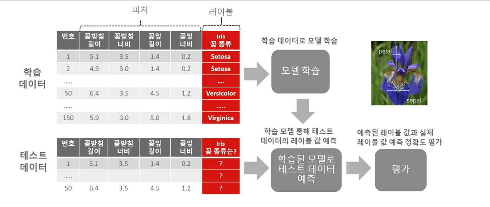
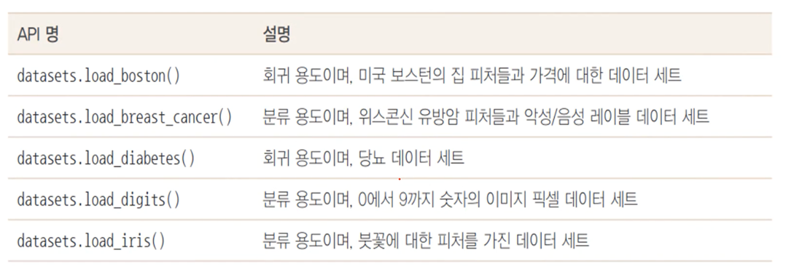
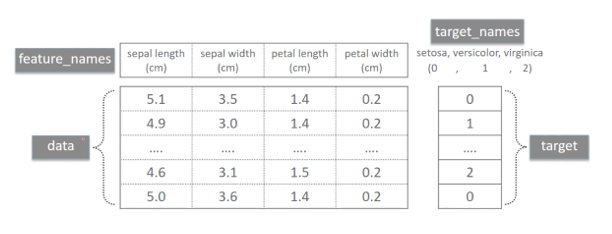

# 사이킷런으로 시작하는 머신러닝

[TOC]

## 1. 개요

### 1) 용어

- 피처(Feature) : 
  - 데이터 세트의 일반 속성
  - 타겟값을 제외한 나머지 속성을 모두 피처로 지칭
- 레이블, 클래스, 타겟(값), 결정(값) (label, target) :
  - 타겟값 또는 결정값은 지도 학습 시 데이터의 학습을 위해 주어지는 정답 데이터
  - 지도 학습 중 분류의 경우에는 이 결정값을 레이블 또는 클래스로 지칭

### 2) 프로세스

1. 데이터 세트 분리 : 데이터를 학습 데이터와 테스트 데이터로 분리
2. 모델 학습 : 학습 데이터를 기반으로 ML 알고리즘을 적용해 모델을 학습 (model.fit(X_train, y_train))
3. 예측 수행 : 학습된 ML 모델을 이용해 테스트 데이터의 분류를 예측 (model.predict(X_test))
4. 평가 : 예측된 결과값과 테스트 데이터의 실제 결과값을 비교해 ML 모델 성능을 평가

## 2. 사이킷런 머신러닝 만들기_붓꽃 품종 예측

*붓꽃 예측을 위한 사이킷런 필요 모듈 로딩*

```python
from sklearn.datasets import load_iris  # iris 데이터 로드
from sklearn.tree import DecisionTreeClassifier  # 의사결정나무 분류기
from sklearn.model_selection import train_test_split  # 학습,테스트 데이터 분리
```

### 1) 데이터 세트 로딩

```python
import pandas as pd

# 붓꽃 데이터 세트 로딩
iris = load_iris()

# iris 데이터 세트에서 피처(feature)만으로 된 데이터인 iris.data를 iris_data에 지정한다.
iris_data = iris.data

# iris 데이터 세트에서 레이블(label) 데이터인 iris.target을 iris_label에 지정한다.
iris_label = iris.target

# 붓꽃 데이터 세트를 자세히 보기 위해 DataFrame으로 변환
iris_df = pd.DataFrame(data=iris_data, columns=iris.feature_names)
iris_df['label'] = iris_label

print(iris_df.shape)
iris_df.head()
```

```
(150, 5)
```

Out[8]:

|      | sepal length (cm) | sepal width (cm) | petal length (cm) | petal width (cm) | label |
| ---: | ----------------: | ---------------: | ----------------: | ---------------: | ----: |
|    0 |               5.1 |              3.5 |               1.4 |              0.2 |     0 |
|    1 |               4.9 |              3.0 |               1.4 |              0.2 |     0 |
|    2 |               4.7 |              3.2 |               1.3 |              0.2 |     0 |
|    3 |               4.6 |              3.1 |               1.5 |              0.2 |     0 |
|    4 |               5.0 |              3.6 |               1.4 |              0.2 |     0 |

### 2) 데이터 세트 분리

```python
# train, test 데이터 분리
X_train, X_test, y_train, y_test = train_test_split(iris_data, iris_label, 
                                                    test_size=0.2, random_state=11)
```

### 3) 모델 학습

```python
# DecisionTreeClassifier 객체 생성
dt_clf = DecisionTreeClassifier(random_state = 11)

# 학습 수행
dt_clf.fit(X_train, y_train)
```

```
DecisionTreeClassifier(random_state=11)
```

### 4) 예측 수행

```python
# 학습이 완료된 DecisionTreeClassifier 객체에서 테스트 데이터 세트로 예측 수행. 
pred = dt_clf.predict(X_test)
```

### 5) 평가

```python
from sklearn.metrics import accuracy_score
print('예측 정확도: {0:.4f}'.format(accuracy_score(y_test, pred)))
```

```
예측 정확도: 0.9333
93% 정확도로 iris 데이터의 품종을 예측함.
```

## 3. 사이킷런 프레임워크

### 1) 붓꽃 데이터 분류 예측 프로세스



- 학습 데이터인 X_train(피처), y_train(레이블)으로 모델 학습
- X_test 로 테스트 데이터의 레이블 값인 pred 예측
- 예측된 pred와 실제 레이블 값인 y_test의 비교를 통해 예측 정확도 평가

### 2) 사이킷런 내장 예제 데이터 셋 - 분류 및 회귀용



### 3) 내장 예제 데이터 셋 구성



## 4. sklearn.model_selection

### 1) train_test_split

>  `sklearn.model_selection` 의 `train_test_split()` 함수를 이용하면, 쉽게 X_train, y_train, X_test, y_test 로 분리할 수 있다.

```python
from sklearn.model_selection import train_test_split

X_train, X_test, y_train, y_test = train_test_split(iris_data.data, iris_data.target, 
                                                    test_size=0.3, random_state=121)
```

- test_size = 전체 데이터에서 테스트 데이터 세트 크기를 얼마로 샘플링할 것인가. 보통 0.2~0.3 사이를 지정한다.

- random_stae = 호출할 때마다 동일한 학습/테스트용 데이터 세트를 생성하기 위해 주어지는 난수 값

  무작위로 데이터를 분리하므로 random_state를 지정하지 않으면 수행할 때마다 다른 학습/테스트 용 데이터를 생성하기 때문에, 특정 임의값을 넣어줘야 한다.

- (피처값, 레이블값, test_size, random_state)

### 2) 교차 검증

> 학습 데이터를 다시 분할하여 학습 데이터와 학습된 모델의 성능을 일차 평가하는 검증 데이터로 나눠 수차례의 검증을 진행하는 형태

#### (1) 일반 k폴드

1. 데이터 로드

   ```python
   from sklearn.tree import DecisionTreeClassifier
   from sklearn.metrics import accuracy_score
   from sklearn.model_selection import KFold
   import numpy as np
   
   # 데이터 로드
   iris = load_iris()
   label = iris.target
   features = iris.data
   ```

2. 모델 정의 및 KFold 객체와 폴드 세트별 정확도를 담을 리스트 객체 생성

   ```python
   # 모델 정의
   dt_clf = DecisionTreeClassifier(random_state=156)
   
   # 5개의 폴드 세트로 분리하는 KFold 객체와 폴드 세트별 정확도를 담을 리스트 객체 생성
   kfold = KFold(n_splits=5)  # n=5
   cv_accuracy = []           # 최종적으로는 n번의 교차검증의 평균 정확도 계산
   ```

3. Kfold 폴드별 정확도 및 평균 정확도 계산

   ```python
   n_iter = 0
   
   # KFold객체의 split( ) 호출하면 폴드 별 학습용, 검증용 테스트의 row 인덱스를 array로 반환  
   for train_index, test_index  in kfold.split(features):
       # kfold.split( )으로 반환된 인덱스를 이용하여 학습용, 검증용 테스트 데이터 추출
       X_train, X_test = features[train_index], features[test_index]
       y_train, y_test = label[train_index], label[test_index]
       
       # 학습 및 예측 
       dt_clf.fit(X_train , y_train)    
       pred = dt_clf.predict(X_test)
       n_iter += 1
       
       # 반복 시 마다 정확도 측정
       accuracy = np.round(accuracy_score(y_test,pred), 4)  # 정확도 : 소수점 4자리까지 구함
       train_size = X_train.shape[0]
       test_size = X_test.shape[0]
       print('\n#{0} 교차 검증 정확도 :{1}, 학습 데이터 크기: {2}, 검증 데이터 크기: {3}'
             .format(n_iter, accuracy, train_size, test_size))
       print('#{0} 검증 세트 인덱스:{1}'.format(n_iter,test_index))
       
       cv_accuracy.append(accuracy)
       
   # 개별 iteration별 정확도를 합하여 평균 정확도 계산 
   print('\n## 평균 검증 정확도:', np.mean(cv_accuracy)) 
   ```

   ```
   #1 교차 검증 정확도 :1.0, 학습 데이터 크기: 120, 검증 데이터 크기: 30
   #1 검증 세트 인덱스:[ 0  1  2  3  4  5  6  7  8  9 10 11 12 13 14 15 16 17 18 19 20 21 22 23
    24 25 26 27 28 29]
   
   #2 교차 검증 정확도 :0.9667, 학습 데이터 크기: 120, 검증 데이터 크기: 30
   #2 검증 세트 인덱스:[30 31 32 33 34 35 36 37 38 39 40 41 42 43 44 45 46 47 48 49 50 51 52 53
    54 55 56 57 58 59]
   
   #3 교차 검증 정확도 :0.8667, 학습 데이터 크기: 120, 검증 데이터 크기: 30
   #3 검증 세트 인덱스:[60 61 62 63 64 65 66 67 68 69 70 71 72 73 74 75 76 77 78 79 80 81 82 83
    84 85 86 87 88 89]
   
   #4 교차 검증 정확도 :0.9333, 학습 데이터 크기: 120, 검증 데이터 크기: 30
   #4 검증 세트 인덱스:[ 90  91  92  93  94  95  96  97  98  99 100 101 102 103 104 105 106 107
    108 109 110 111 112 113 114 115 116 117 118 119]
   
   #5 교차 검증 정확도 :0.7333, 학습 데이터 크기: 120, 검증 데이터 크기: 30
   #5 검증 세트 인덱스:[120 121 122 123 124 125 126 127 128 129 130 131 132 133 134 135 136 137
    138 139 140 141 142 143 144 145 146 147 148 149]
   
   ## 평균 검증 정확도: 0.9
   ```

#### (2) Stratified K 폴드

> KFold 교차 검증의 문제점 : 불균형한 데이터에는 적용이 안된다.
>
> 이를 해결할 방법이 StratifiedKFold : 불균형한 분포도를 가진 레이블 데이터 집합을 균형하게 섞어주고 교차검증을 진행한다.

1. 모델 정의 및 StratifiedKFold 객체와 폴드 세트별 정확도를 담을 리스트 객체 생성

   ```python
   from sklearn.model_selection import StratifiedKFold
   
   dt_clf = DecisionTreeClassifier(random_state=156)
   
   skfold = StratifiedKFold(n_splits=3)
   n_iter=0
   cv_accuracy=[]
   ```

2. StratifiedKFold를 활용한 교차 검증 정확도 확인

   ```python
   # StratifiedKFold의 split( ) 호출시 반드시 레이블 데이터 셋도 추가 입력 필요  
   for train_index, test_index  in skfold.split(features, label):
       # split( )으로 반환된 인덱스를 이용하여 학습용, 검증용 테스트 데이터 추출
       X_train, X_test = features[train_index], features[test_index]
       y_train, y_test = label[train_index], label[test_index]
       
       #학습 및 예측 
       dt_clf.fit(X_train , y_train)    
       pred = dt_clf.predict(X_test)
   
       # 반복 시 마다 정확도 측정 
       n_iter += 1
       accuracy = np.round(accuracy_score(y_test,pred), 4)
       train_size = X_train.shape[0]
       test_size = X_test.shape[0]
       
       print('\n#{0} 교차 검증 정확도 :{1}, 학습 데이터 크기: {2}, 검증 데이터 크기: {3}'
             .format(n_iter, accuracy, train_size, test_size))
       print('#{0} 검증 세트 인덱스:{1}'.format(n_iter,test_index))
       cv_accuracy.append(accuracy)
       
   # 교차 검증별 정확도 및 평균 정확도 계산 
   print('\n## 교차 검증별 정확도:', np.round(cv_accuracy, 4))
   print('## 평균 검증 정확도:', np.mean(cv_accuracy)) 
   ```

   ```
   #1 교차 검증 정확도 :0.98, 학습 데이터 크기: 100, 검증 데이터 크기: 50
   #1 검증 세트 인덱스:[  0   1   2   3   4   5   6   7   8   9  10  11  12  13  14  15  16  50
     51  52  53  54  55  56  57  58  59  60  61  62  63  64  65  66 100 101
    102 103 104 105 106 107 108 109 110 111 112 113 114 115]
   
   #2 교차 검증 정확도 :0.94, 학습 데이터 크기: 100, 검증 데이터 크기: 50
   #2 검증 세트 인덱스:[ 17  18  19  20  21  22  23  24  25  26  27  28  29  30  31  32  33  67
     68  69  70  71  72  73  74  75  76  77  78  79  80  81  82 116 117 118
    119 120 121 122 123 124 125 126 127 128 129 130 131 132]
   
   #3 교차 검증 정확도 :0.98, 학습 데이터 크기: 100, 검증 데이터 크기: 50
   #3 검증 세트 인덱스:[ 34  35  36  37  38  39  40  41  42  43  44  45  46  47  48  49  83  84
     85  86  87  88  89  90  91  92  93  94  95  96  97  98  99 133 134 135
    136 137 138 139 140 141 142 143 144 145 146 147 148 149]
   
   ## 교차 검증별 정확도: [0.98 0.94 0.98]
   ## 평균 검증 정확도: 0.9666666666666667
   ```

### 3) 교차 검증을 보다 간편하게

#### (1) cross_val_score()

> KFold는 폴드 세트를 설정하고, for문을 이용해 반복적으로 학습, 검증 데이터 분리 및 학습과 예측을 수행하고, 각 폴드별 예측 성능을 구하고 평균 예측 정확도를 통해 최종 성능을 평가한다.
>
> 이런 복잡한 과정을 cross_val_score() 함수를 쓰면 한번에 수행할 수 있다.

1. 데이터 로드

   ```python
   from sklearn.tree import DecisionTreeClassifier
   # cross_val_score
   from sklearn.model_selection import cross_val_score , cross_validate
   from sklearn.datasets import load_iris
   import numpy as np
   
   iris_data = load_iris()
   dt_clf = DecisionTreeClassifier(random_state=156)
   
   data = iris_data.data
   label = iris_data.target
   ```

2. cross_val_score() 함수 

   ```python
   # 성능 지표는 정확도(accuracy), 교차 검증 세트는 3개 
   scores = cross_val_score(dt_clf , data , label , scoring='accuracy', cv=3)
   print('교차 검증별 정확도:',np.round(scores, 4))
   print('평균 검증 정확도:', np.round(np.mean(scores), 4))
   ```

   ```
   교차 검증별 정확도: [0.98 0.94 0.98]
   평균 검증 정확도: 0.9667
   ```

   - cross_val_score(`학습모델`, `feature data`, `label data`, `평가 지표`, `교차검증 세트 수`)

#### (2) GridSearchCV : 교차 검증 + 하이퍼파라미터 튜닝

``````
- 하이퍼 파라미터 : 모델의 성능을 최대로 끌어올리는 학습 조건
- 하이퍼 파라미터 튜닝의 중요성 : 학습 조건을 잘 설정해야 최대의 성능을 내는 머신러닝 모델을 얻을 수 있다.
``````

1. 데이터 로드 / 분리 / 모델 정의

   ```python
   from sklearn.datasets import load_iris
   from sklearn.tree import DecisionTreeClassifier
   # GridSearchCV
   from sklearn.model_selection import GridSearchCV, train_test_split
   from sklearn.metrics import accuracy_score
   
   # iris 데이터를 로드
   iris_data = load_iris()
   
   # 학습/테스트 데이터 분리
   X_train, X_test, y_train, y_test = train_test_split(iris_data.data, iris_data.target, 
                                                       test_size=0.2, random_state=121)
   
   # 모델 정의
   dtree = DecisionTreeClassifier()
   ```

2. 하이퍼 파라미터 튜닝하여 학습

   ```python
   # hyper-parameter 들을 딕셔너리 형태로 설정
   parameters = {'max_depth':[1, 2, 3], 'min_samples_split':[2,3]}
   
   # param_grid의 하이퍼 파라미터들을 3개의 train, test set fold 로 나누어서 테스트 수행 설정  
   grid_dtree = GridSearchCV(dtree, param_grid=parameters, cv=3, refit=True, return_train_score=True)
   ### refit=True 가 default : 가장 좋은 파라미터 설정으로 재 학습 시킴.  
   
   # 붓꽃 Train 데이터로 param_grid의 하이퍼 파라미터들을 순차적으로 학습
   grid_dtree.fit(X_train, y_train)
   ```

3. 하이퍼 파라미터 값에 대한 평가

   ```python
   import pandas as pd
   
   # GridSearchCV 결과는 cv_results_ 라는 딕셔너리로 저장됨
   # 이를 DataFrame으로 변환해서 확인
   scores_df = pd.DataFrame(grid_dtree.cv_results_)
   scores_df[['params', 'mean_test_score', 'rank_test_score', 
              'split0_test_score', 'split1_test_score', 'split2_test_score']]
   ```

   | params |                          mean_test_score | rank_test_score | split0_test_score | split1_test_score | split2_test_score |      |
   | -----: | ---------------------------------------: | --------------: | ----------------: | ----------------: | ----------------: | ---- |
   |      0 | {'max_depth': 1, 'min_samples_split': 2} |        0.700000 |                 5 |             0.700 |               0.7 | 0.70 |
   |      1 | {'max_depth': 1, 'min_samples_split': 3} |        0.700000 |                 5 |             0.700 |               0.7 | 0.70 |
   |      2 | {'max_depth': 2, 'min_samples_split': 2} |        0.958333 |                 3 |             0.925 |               1.0 | 0.95 |
   |      3 | {'max_depth': 2, 'min_samples_split': 3} |        0.958333 |                 3 |             0.925 |               1.0 | 0.95 |
   |      4 | {'max_depth': 3, 'min_samples_split': 2} |        0.975000 |                 1 |             0.975 |               1.0 | 0.95 |
   |      5 | {'max_depth': 3, 'min_samples_split': 3} |        0.975000 |                 1 |             0.975 |               1.0 | 0.95 |

   **가장 좋은 hyper-parameter는 {'max_depth': 3, 'min_samples_split': 2}**

   ```python
   print('GridSearchCV 최적 파라미터:', grid_dtree.best_params_)
   print('GridSearchCV 최고 정확도: {0:.4f}'.format(grid_dtree.best_score_))
   ```

   ```
   GridSearchCV 최적 파라미터: {'max_depth': 3, 'min_samples_split': 2}
   GridSearchCV 최고 정확도: 0.9750
   ```

4. 테스트 데이터로 예측 및 정확도 확인

   ```python
   # refit=True로 설정된 GridSearchCV 객체가 fit()을 수행 시 학습이 완료된 Estimator를 내포하고 있으므로 predict()를 통해 예측도 가능. 
   pred = grid_dtree.predict(X_test)
   print('테스트 데이터 세트 정확도: {0:.4f}'.format(accuracy_score(y_test, pred)))
   ```

   테스트 데이터 세트 정확도: 0.9667


