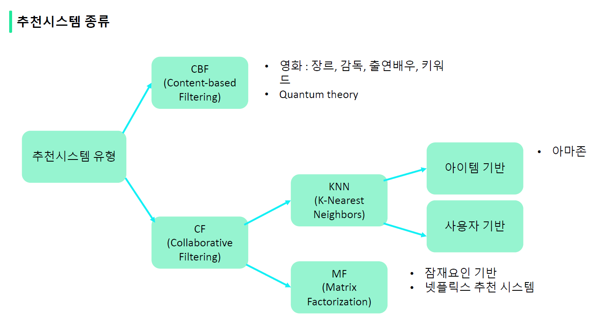
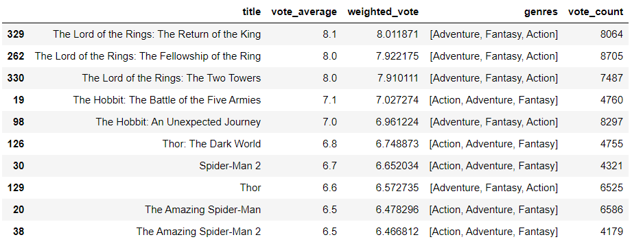
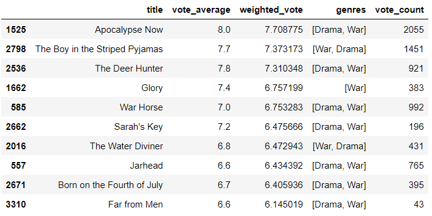

# 추천 시스템

**추천 시스템은 왜 뜨고 있을까?**

- 롱테일 문제를 해결할 수 있다.
- 고객, 기업 양측 모두에게 이익이 된다.

**추천시스템 종류** (데이터 알고리즘에 의한 추천은 3번부터)

1. 사용자 프로파일링 기반
2. Segment 기반
3. 상품 연관규칙 기반
4. CF(협업 필터링) 기반
5. CBF(컨텐츠 베이스 필터링) 기반
6. 딥러닝 기반


# CBF_장르 유사도 기반 영화 추천



Quantum theory - 태거(태그 다는 사람)가 장르를 디테일하게 정리 (액션이 많이 들어갔는데 로맨스 등 수천개의 키워드) / 영화 장르를 양자 이론만큼 쪼개 놨다. / - 넷플릭스

[넷플릭스 양자이론](https://headnheart.tistory.com/19)


**특정 영화에 대해 장르가 유사한 영화를 추천해주는 서비스를 기획해보자!**


# 1. 데이터 로드

```python
import pandas as pd  # 데이터 분석을 위한 라이브러리
import numpy as np   # 넘파이 : 숫자 계산

# 워닝(버전, 업데이트 문제, 에러는 아님) 코드는 실행되는데 정보. 귀찮을 때 워닝 끄기
import warnings
warnings.filterwarnings('ignore')

movies = pd.read_csv('tmdb_5000_movies.csv')

print(movies.shape)  # 행, 열 개수 파악
movies.head()
```

```
(4803, 20)
```

Out[13]:

|      |    budget |                                            genres |                                     homepage |     id |                                          keywords | original_language |                           original_title |                                          overview | popularity |                              production_companies |                              production_countries | release_date |    revenue | runtime |                                  spoken_languages |   status |                                        tagline |                                    title | vote_average | vote_count |
| ---: | --------: | ------------------------------------------------: | -------------------------------------------: | -----: | ------------------------------------------------: | ----------------: | ---------------------------------------: | ------------------------------------------------: | ---------: | ------------------------------------------------: | ------------------------------------------------: | -----------: | ---------: | ------: | ------------------------------------------------: | -------: | ---------------------------------------------: | ---------------------------------------: | -----------: | ---------: |
|    0 | 237000000 | [{"id": 28, "name": "Action"}, {"id": 12, "nam... |                  http://www.avatarmovie.com/ |  19995 | [{"id": 1463, "name": "culture clash"}, {"id":... |                en |                                   Avatar | In the 22nd century, a paraplegic Marine is di... | 150.437577 | [{"name": "Ingenious Film Partners", "id": 289... | [{"iso_3166_1": "US", "name": "United States o... |   2009-12-10 | 2787965087 |   162.0 | [{"iso_639_1": "en", "name": "English"}, {"iso... | Released |                    Enter the World of Pandora. |                                   Avatar |          7.2 |      11800 |
|    1 | 300000000 | [{"id": 12, "name": "Adventure"}, {"id": 14, "... | http://disney.go.com/disneypictures/pirates/ |    285 | [{"id": 270, "name": "ocean"}, {"id": 726, "na... |                en | Pirates of the Caribbean: At World's End | Captain Barbossa, long believed to be dead, ha... | 139.082615 | [{"name": "Walt Disney Pictures", "id": 2}, {"... | [{"iso_3166_1": "US", "name": "United States o... |   2007-05-19 |  961000000 |   169.0 |          [{"iso_639_1": "en", "name": "English"}] | Released | At the end of the world, the adventure begins. | Pirates of the Caribbean: At World's End |          6.9 |       4500 |
|    2 | 245000000 | [{"id": 28, "name": "Action"}, {"id": 12, "nam... |  http://www.sonypictures.com/movies/spectre/ | 206647 | [{"id": 470, "name": "spy"}, {"id": 818, "name... |                en |                                  Spectre | A cryptic message from Bond’s past sends him o... | 107.376788 | [{"name": "Columbia Pictures", "id": 5}, {"nam... | [{"iso_3166_1": "GB", "name": "United Kingdom"... |   2015-10-26 |  880674609 |   148.0 | [{"iso_639_1": "fr", "name": "Fran\u00e7ais"},... | Released |                          A Plan No One Escapes |                                  Spectre |          6.3 |       4466 |
|    3 | 250000000 | [{"id": 28, "name": "Action"}, {"id": 80, "nam... |           http://www.thedarkknightrises.com/ |  49026 | [{"id": 849, "name": "dc comics"}, {"id": 853,... |                en |                    The Dark Knight Rises | Following the death of District Attorney Harve... | 112.312950 | [{"name": "Legendary Pictures", "id": 923}, {"... | [{"iso_3166_1": "US", "name": "United States o... |   2012-07-16 | 1084939099 |   165.0 |          [{"iso_639_1": "en", "name": "English"}] | Released |                                The Legend Ends |                    The Dark Knight Rises |          7.6 |       9106 |
|    4 | 260000000 | [{"id": 28, "name": "Action"}, {"id": 12, "nam... |         http://movies.disney.com/john-carter |  49529 | [{"id": 818, "name": "based on novel"}, {"id":... |                en |                              John Carter | John Carter is a war-weary, former military ca... |  43.926995 |       [{"name": "Walt Disney Pictures", "id": 2}] | [{"iso_3166_1": "US", "name": "United States o... |   2012-03-07 |  284139100 |   132.0 |          [{"iso_639_1": "en", "name": "English"}] | Released |           Lost in our world, found in another. |                              John Carter |          6.1 |       2124 |

```python
# 필요한 컬럼만 추출
movies_df = movies[['id','title','genres','vote_average','vote_count','popularity','keywords','overview']]
movies_df.head(3)
```

|      |     id |                                    title |                                            genres | vote_average | vote_count | popularity |                                          keywords | overview                                          |
| ---: | -----: | ---------------------------------------: | ------------------------------------------------: | -----------: | ---------: | ---------: | ------------------------------------------------: | ------------------------------------------------- |
|    0 |  19995 |                                   Avatar | [{"id": 28, "name": "Action"}, {"id": 12, "nam... |          7.2 |      11800 | 150.437577 | [{"id": 1463, "name": "culture clash"}, {"id":... | In the 22nd century, a paraplegic Marine is di... |
|    1 |    285 | Pirates of the Caribbean: At World's End | [{"id": 12, "name": "Adventure"}, {"id": 14, "... |          6.9 |       4500 | 139.082615 | [{"id": 270, "name": "ocean"}, {"id": 726, "na... | Captain Barbossa, long believed to be dead, ha... |
|    2 | 206647 |                                  Spectre | [{"id": 28, "name": "Action"}, {"id": 12, "nam... |          6.3 |       4466 | 107.376788 | [{"id": 470, "name": "spy"}, {"id": 818, "name... | A cryptic message from Bond’s past sends him o... |

```python
movies_df['genres'][0]
```

```
'[{"id": 28, "name": "Action"}, {"id": 12, "name": "Adventure"}, {"id": 14, "name": "Fantasy"}, {"id": 878, "name": "Science Fiction"}]'
```

```python
type(movies_df['genres'][0])
# str 타입인 것을 확인할 수 있다.
```

``````
str
``````


# 2. 데이터 전처리

## 1) genres, keywords 컬럼들의 str 형태를 list 형태로 바꿔주기

```python
from ast import literal_eval   # 문자열 파싱 라이브러리
movies_df['genres'] = movies_df['genres'].apply(literal_eval)
movies_df['keywords'] = movies_df['keywords'].apply(literal_eval)
```

```python
movies_df['genres'][0]
```

```
[{'id': 28, 'name': 'Action'},
 {'id': 12, 'name': 'Adventure'},
 {'id': 14, 'name': 'Fantasy'},
 {'id': 878, 'name': 'Science Fiction'}]
```

```python
type(movies_df['genres'][0])
# str타입에서 list타입으로 바뀐 것을 확인할 수 있다.
```

``````
list
``````

## 2) list 내 여러개 딕셔너리의 name키에 해당하는 값들을 리스트로 변환

```python
movies_df['genres']
```

```
0       [{'id': 28, 'name': 'Action'}, {'id': 12, 'nam...
1       [{'id': 12, 'name': 'Adventure'}, {'id': 14, '...
2       [{'id': 28, 'name': 'Action'}, {'id': 12, 'nam...
3       [{'id': 28, 'name': 'Action'}, {'id': 80, 'nam...
4       [{'id': 28, 'name': 'Action'}, {'id': 12, 'nam...
                              ...                        
4798    [{'id': 28, 'name': 'Action'}, {'id': 80, 'nam...
4799    [{'id': 35, 'name': 'Comedy'}, {'id': 10749, '...
4800    [{'id': 35, 'name': 'Comedy'}, {'id': 18, 'nam...
4801                                                   []
4802                  [{'id': 99, 'name': 'Documentary'}]
Name: genres, Length: 4803, dtype: object
```

```python
movies_df['genres'][0][2]['name']  
```

```
'Fantasy'
```

```python
movies_df['genres'] = movies_df['genres'].apply(lambda x : [ y['name'] for y in x])
movies_df['keywords'] = movies_df['keywords'].apply(lambda x : [ y['name'] for y in x])
```

```python
movies_df[['genres']][0:3]
```

|      |                                        genres |
| ---: | --------------------------------------------: |
|    0 | [Action, Adventure, Fantasy, Science Fiction] |
|    1 |                  [Adventure, Fantasy, Action] |
|    2 |                    [Action, Adventure, Crime] |

# 3. 장르 컨텐츠 유사도 측정

**문서(ex. 영화의 장르들) 유사도를 측정하는 방법들**

1. 거리 기반
   - 유클리디안 유사도
2. 각도 기반
   - 코사인 유사도
   - 자카드 유사도
   - 피어슨 유사도
   - ...

[장르 CBF 추천]

장르를 피처 벡터화한 후 행렬 데이터 값을 코사인 유사도 (0~1)로 계산하기

- 프로세스
  1. 장르 피처 벡터화 : 문자열로 변환된 genres 컬럼을 Count 기반으로 피처 벡터화
  2. 코사인 유사도 계산 : genres 문자열을 피처 벡터화한 행렬로 변환한 데이터 세트를 코사인 유사도로 비교
  3. 평점으로 계산 : 장르 유사도가 높은 영화 중 평점이 높은 순으로 영화 추천

```python
# 참고 : CountVectorizer에 대하여
CountVectorizer는 다음 세가지를 수행한다.
1. 문서를 토큰 리스트로 변환한다.
2. 각 문서에서 토큰의 출현 빈도를 센다.
3. 각 문서를 BOW(Bag of Words) 인코딩 벡터로 변환한다.

from sklearn.feature_extraction.text import CountVectorizer
corpus = [
    'This is the first document.',
    'This is the second second document.',
    'And the third one.',
    'Is this the first document?',
    'The last document?',
]

# 토큰 별 인덱스 사전을 만들어준다.
vect = CountVectorizer()
vect.fit(corpus)

vext.vocabulary_
```

```
{'this': 9,
 'is': 3,
 'the': 7,
 'first': 2,
 'document': 1,
 'second': 6,
 'and': 0,
 'third': 8,
 'one': 5,
 'last': 4}
```

**CountVectorizer를 적용하기 위해 공백문자로 word 단위가 구분되는 문자열로 변환** 

```python
movies_df['genres']
```

```
0       [Action, Adventure, Fantasy, Science Fiction]
1                        [Adventure, Fantasy, Action]
2                          [Action, Adventure, Crime]
3                    [Action, Crime, Drama, Thriller]
4                [Action, Adventure, Science Fiction]
                            ...                      
4798                        [Action, Crime, Thriller]
4799                                [Comedy, Romance]
4800               [Comedy, Drama, Romance, TV Movie]
4801                                               []
4802                                    [Documentary]
Name: genres, Length: 4803, dtype: object
```

```python
# CountVectorizer를 적용하기 위해 공백문자로 word 단위가 구분되는 문자열로 변환. 
movies_df['genres_literal'] = movies_df['genres'].apply(lambda x : (' ').join(x))
movies_df['genres_literal']
```

```
0       Action Adventure Fantasy Science Fiction
1                       Adventure Fantasy Action
2                         Action Adventure Crime
3                    Action Crime Drama Thriller
4               Action Adventure Science Fiction
                          ...                   
4798                       Action Crime Thriller
4799                              Comedy Romance
4800               Comedy Drama Romance TV Movie
4801                                            
4802                                 Documentary
Name: genres_literal, Length: 4803, dtype: object
```

```python
movies_df['genres_literal'][0]
print(type(movies_df['genres_literal'][0]))
```

```
'Action Adventure Fantasy Science Fiction'
<class 'str'>
```

**영화 별 장르 인덱스 사전을 만들어준다.**

```python
# CountVectorizer로 학습시켰더니 4803개 영화에 대한 276개 장르의 '장르 매트릭스'가 생성되었다.

count_vect = CountVectorizer(min_df=0, ngram_range=(1, 2))  # min_df: 단어장에 들어갈 최소빈도, ngram_range: 1 <= n <= 2 1단어, 2단어까지
genre_mat = count_vect.fit_transform(movies_df['genres_literal'])
print(genre_mat.shape)
print(genre_mat)
# 영화별 장르 인덱스 사전을 만들어준다
```

```
(4803, 276)
  (0, 0)	1
  (0, 16)	1
  (0, 124)	1
  (0, 232)	1
  (0, 138)	1
  (0, 1)	1
  (0, 24)	1
  (0, 135)	1
  (0, 233)	1
  (1, 0)	1
  (1, 16)	1
  (1, 124)	1
  (1, 24)	1
  (1, 125)	1
  (2, 0)	1
  (2, 16)	1
  (2, 1)	1
  (2, 64)	1
  (2, 20)	1
  (3, 0)	1
  (3, 64)	1
  (3, 90)	1
  (3, 234)	1
  (3, 4)	1
  (3, 68)	1
  :	:
  (4796, 90)	1
  (4796, 234)	1
  (4796, 106)	1
  (4796, 144)	1
  (4797, 234)	1
  (4797, 153)	1
  (4797, 157)	1
  (4798, 0)	1
  (4798, 64)	1
  (4798, 234)	1
  (4798, 4)	1
  (4798, 78)	1
  (4799, 44)	1
  (4799, 214)	1
  (4799, 58)	1
  (4800, 90)	1
  (4800, 44)	1
  (4800, 214)	1
  (4800, 104)	1
  (4800, 50)	1
  (4800, 250)	1
  (4800, 182)	1
  (4800, 251)	1
  (4800, 229)	1
  (4802, 80)	1
```

-> 장르 단어 1개 + 2개 사전으로

```python
# CountVectorizer로 학습시켰더니 4803개 영화에 대한 22개 장르의 '장르 매트릭스'가 생성되었다.
count_vect2 = CountVectorizer(min_df=1, ngram_range=(1, 1))  # min_df: 단어장에 들어갈 최소빈도, ngram_range: 1 <= n <= 2
genre_mat2 = count_vect2.fit_transform(movies_df['genres_literal'])
print(genre_mat2.shape)
print(genre_mat2)
```

```
(4803, 22)
  (0, 0)	1
  (0, 1)	1
  (0, 8)	1
  (0, 17)	1
  (0, 9)	1
  (1, 0)	1
  (1, 1)	1
  (1, 8)	1
  (2, 0)	1
  (2, 1)	1
  (2, 4)	1
  (3, 0)	1
  (3, 4)	1
  (3, 6)	1
  (3, 18)	1
  (4, 0)	1
  (4, 1)	1
  (4, 17)	1
  (4, 9)	1
  (5, 0)	1
  (5, 1)	1
  (5, 8)	1
  (6, 2)	1
  (6, 7)	1
  (7, 0)	1
  :	:
  (4792, 18)	1
  (4792, 12)	1
  (4792, 15)	1
  (4793, 6)	1
  (4794, 18)	1
  (4794, 3)	1
  (4794, 12)	1
  (4795, 6)	1
  (4796, 17)	1
  (4796, 9)	1
  (4796, 6)	1
  (4796, 18)	1
  (4797, 18)	1
  (4797, 10)	1
  (4798, 0)	1
  (4798, 4)	1
  (4798, 18)	1
  (4799, 3)	1
  (4799, 16)	1
  (4800, 6)	1
  (4800, 3)	1
  (4800, 16)	1
  (4800, 19)	1
  (4800, 13)	1
  (4802, 5)	1
```

-> 장르 단어 1개만 사전으로

## 1) 코사인 유사도(cosine_similarity)이용해서 영화별 유사도 계산

```python
# 코사인 유사도에 의해 4,803개 영화 각각 유사한 영화들이 계산됨
from sklearn.metrics.pairwise import cosine_similarity
genre_sim = cosine_similarity(genre_mat, genre_mat)

print(genre_sim.shape)
print(genre_sim[:10])
```

```
(4803, 4803)
[[1.         0.59628479 0.4472136  ... 0.         0.         0.        ]
 [0.59628479 1.         0.4        ... 0.         0.         0.        ]
 [0.4472136  0.4        1.         ... 0.         0.         0.        ]
 ...
 [0.75592895 0.3380617  0.50709255 ... 0.         0.         0.        ]
 [0.4472136  0.6        0.2        ... 0.         0.         0.        ]
 [0.74535599 0.8        0.6        ... 0.         0.         0.        ]]
```

```python
# 자료를 정렬하는 것이 아니라 순서만 알고 싶다면 argsort
# 유사도가 높은 영화를 앞에서부터 순서대로 보여줌

# 0번째 영화의 경우 유사도 순서 : 0번, 3493번, 813번, ..., 2401번 순서
genre_sim_sorted_ind = genre_sim.argsort()[:, ::-1] # ::-1 : 역순으로 정렬
print(genre_sim_sorted_ind[:5])
```

```
[[   0 3494  813 ... 3038 3037 2401]
 [ 262    1  129 ... 3069 3067 2401]
 [   2 1740 1542 ... 3000 2999 2401]
 [2195 1850 3316 ...  887 2544 4802]
 [ 102 2995   56 ... 3046 3045 2401]]
```

## 2) 추천 Ver1. 장르 코사인 유사도에 의해 영화를 추천하는 함수

### (1) 함수 분석

```python
# 인자로 입력된 movies_df DataFrame에서 'title' 컬럼이 입력된 title_name 값인 DataFrame 추출
title_movie = movies_df[movies_df['title'] == 'The Godfather']
title_movie
```

|      |   id |         title |         genres | vote_average | vote_count | popularity |                                          keywords |                                          overview | genres_literal |
| ---: | ---: | ------------: | -------------: | -----------: | ---------: | ---------: | ------------------------------------------------: | ------------------------------------------------: | -------------- |
| 3337 |  238 | The Godfather | [Drama, Crime] |          8.4 |       5893 | 143.659698 | [italy, love at first sight, loss of father, p... | Spanning the years 1945 to 1955, a chronicle o... | Drama Crime    |

```python
# title_named을 가진 DataFrame의 index 객체를 ndarray로 반환하고
# sorted_ind 인자로 입력된 genre_sim_sorted_ind 객체에서 유사도 순으로 top_n 개의 index 추출
title_index = title_movie.index.values
title_index
```

```ew
array([3337], dtype=int64)
```

```python
similar_indexes = genre_sim_sorted_ind[title_index, :10]
similar_indexes
```

```
array([[2731, 1243, 3636, 1946, 2640, 4065, 1847, 4217,  883, 3866]],
      dtype=int64)
```

```python
# 추출된 top_n index들 출력. top_n index는 2차원 데이터임.
# DataFrame에서 index로 사용하기 위해서 2차원 array를 1차원 array로 변경
similar_indexes = similar_indexes.reshape(-1)
print(similar_indexes)
```

```
[2731 1243 3636 1946 2640 4065 1847 4217  883 3866]
```

```python
movies_df.iloc[similar_indexes]
```

|      |     id |                                          title |         genres | vote_average | vote_count | popularity |                                          keywords |                                          overview | genres_literal |
| ---: | -----: | ---------------------------------------------: | -------------: | -----------: | ---------: | ---------: | ------------------------------------------------: | ------------------------------------------------: | -------------: |
| 2731 |    240 |                         The Godfather: Part II | [Drama, Crime] |          8.3 |       3338 | 105.792936 | [italo-american, cuba, vororte, melancholy, pr... | In the continuing saga of the Corleone crime f... |    Drama Crime |
| 1243 |    203 |                                   Mean Streets | [Drama, Crime] |          7.2 |        345 |  17.002096 | [epilepsy, protection money, secret love, mone... | A small-time hood must choose from among love,... |    Drama Crime |
| 3636 |  36351 |                                  Light Sleeper | [Drama, Crime] |          5.7 |         15 |   6.063868 | [suicide, drug dealer, redemption, addict, exi... | A drug dealer with upscale clientele is having... |    Drama Crime |
| 1946 |  11699 | The Bad Lieutenant: Port of Call - New Orleans | [Drama, Crime] |          6.0 |        326 |  17.339852 | [police brutality, organized crime, policeman,... | Terrence McDonagh, a New Orleans Police sergea... |    Drama Crime |
| 2640 |    400 |        Things to Do in Denver When You're Dead | [Drama, Crime] |          6.7 |         85 |   6.932221 | [father son relationship, bounty hunter, boat,... | A mafia film in Tarantino style with a star-st... |    Drama Crime |
| 4065 | 364083 |                                     Mi America | [Drama, Crime] |          0.0 |          0 |   0.039007 |                      [new york state, hate crime] | A hate-crime has been committed in a the small... |    Drama Crime |
| 1847 |    769 |                                     GoodFellas | [Drama, Crime] |          8.2 |       3128 |  63.654244 | [prison, based on novel, florida, 1970s, mass ... | The true story of Henry Hill, a half-Irish, ha... |    Drama Crime |
| 4217 |   9344 |                                           Kids | [Drama, Crime] |          6.8 |        279 |  13.291991 |                             [puberty, first time] | A controversial portrayal of teens in New York... |    Drama Crime |
|  883 |    640 |                            Catch Me If You Can | [Drama, Crime] |          7.7 |       3795 |  73.944049 | [con man, biography, fbi agent, overhead camer... | A true story about Frank Abagnale Jr. who, bef... |    Drama Crime |
| 3866 |    598 |                                    City of God | [Drama, Crime] |          8.1 |       1814 |  44.356711 | [male nudity, street gang, brazilian, photogra... | Cidade de Deus is a shantytown that started du... |    Drama Crime |

### (2) 실제 함수

```python
def find_sim_movie_ver1(df, sorted_ind, title_name, top_n=10):
    
    # 인자로 입력된 movies_df DataFrame에서 'title' 컬럼이 입력된 title_name 값인 DataFrame추출
    title_movie = df[df['title'] == title_name]
    
    # title_named을 가진 DataFrame의 index 객체를 ndarray로 반환하고 
    # sorted_ind 인자로 입력된 genre_sim_sorted_ind 객체에서 유사도 순으로 top_n 개의 index 추출
    title_index = title_movie.index.values
    similar_indexes = sorted_ind[title_index, :(top_n)]
    
    # 추출된 top_n index들 출력. top_n index는 2차원 데이터 임.
    # dataframe에서 index로 사용하기 위해서 1차원 array로 변경
    print(similar_indexes)    
    # 2차원 데이터를 1차원으로 변환
    similar_indexes = similar_indexes.reshape(-1)
    
    return df.iloc[similar_indexes]  
```

### (3) 영화 godfather와 장르가 유사한 영화 10개 추천

```python
similar_movies = find_sim_movie_ver1(movies_df, genre_sim_sorted_ind, 'The Godfather', 10)
similar_movies[['title', 'vote_average', 'genres', 'vote_count']]
```

```
[[2731 1243 3636 1946 2640 4065 1847 4217  883 3866]]
```

Out[85]:

|      |                                          title | vote_average |         genres | vote_count |
| ---: | ---------------------------------------------: | -----------: | -------------: | ---------: |
| 2731 |                         The Godfather: Part II |          8.3 | [Drama, Crime] |       3338 |
| 1243 |                                   Mean Streets |          7.2 | [Drama, Crime] |        345 |
| 3636 |                                  Light Sleeper |          5.7 | [Drama, Crime] |         15 |
| 1946 | The Bad Lieutenant: Port of Call - New Orleans |          6.0 | [Drama, Crime] |        326 |
| 2640 |        Things to Do in Denver When You're Dead |          6.7 | [Drama, Crime] |         85 |
| 4065 |                                     Mi America |          0.0 | [Drama, Crime] |          0 |
| 1847 |                                     GoodFellas |          8.2 | [Drama, Crime] |       3128 |
| 4217 |                                           Kids |          6.8 | [Drama, Crime] |        279 |
|  883 |                            Catch Me If You Can |          7.7 | [Drama, Crime] |       3795 |
| 3866 |                                    City of God |          8.1 | [Drama, Crime] |       1814 |

```python
# 평점 기준으로 정렬(sort_values)해보니 평가횟수(vote_count)가 낮은 것들도 포함됨. 평가횟수 반영한 평점(가중평점)이 필요함
movies_df[['title','vote_average','vote_count']].sort_values('vote_average', ascending=False)[:10]
```

|      |                    title | vote_average | vote_count |
| ---: | -----------------------: | -----------: | ---------: |
| 3519 |         Stiff Upper Lips |         10.0 |          1 |
| 4247 |    Me You and Five Bucks |         10.0 |          2 |
| 4045 |    Dancer, Texas Pop. 81 |         10.0 |          1 |
| 4662 |           Little Big Top |         10.0 |          1 |
| 3992 |                Sardaarji |          9.5 |          2 |
| 2386 |           One Man's Hero |          9.3 |          2 |
| 2970 |       There Goes My Baby |          8.5 |          2 |
| 1881 | The Shawshank Redemption |          8.5 |       8205 |
| 2796 |    The Prisoner of Zenda |          8.4 |         11 |
| 3337 |            The Godfather |          8.4 |       5893 |

* 문제 : 평점 기반으로 추천하고자 하는데, vote_count가 낮은 영화는 제외하고 싶음

## 3) 가중평점(평점 & 평가횟수) 반영한 영화 추천

``````
@ 가중평점 (Weighted Rating):
(v/(v+m))*R + (m/(v+m))*C
- v : 영화별 평점을 투표한 횟수(vote_count) * 투표 횟수가 많은 영화에 가중치 부여
- m : 평점을 부여하기 위한 최소 투표 횟수 -> 여기서는 투표수 상위 60%
- R : 개별 영화에 대한 평균 평점 (vote_average)
- C : 전체 영화에 대한 평균 평점 (movies_df['vote_average'].mean())
# C, m은 영화마다 고정값
# v, R은 영화마다 변동값
``````

```python
# 상위 60%에 해당하는 vote_count를 최소 투표 횟수인 m으로 지정
C = movies_df['vote_average'].mean()
m = movies_df['vote_count'].quantile(0.6)

print('C:', round(C, 3), 'm:', round(m, 3))
```

```
C: 6.092 m: 370.2   
# C: 전체 영화에 대한 평균평점 = 약 6점
# m: 평점을 부여하기 위한 최소 투표 횟수 = 370회(상위 60% 수준)
```

### (1) 가중평점을 계산하는 함수

```python
def weighted_vote_average(record):
    v = record['vote_count']
    R = record['vote_average']
    
    return ((v/(v+m))*R) + ((m/(v+m))*C)
```

```python
# 기존 데이터에 가중평점 칼럼 추가
movies_df['weighted_vote'] = movies_df.apply(weighted_vote_average, axis=1)
```

```python
movies_df
```

|      |     id |                                    title |                                        genres | vote_average | vote_count | popularity |                                          keywords |                                          overview |                           genres_literal | weighted_vote |
| ---: | -----: | ---------------------------------------: | --------------------------------------------: | -----------: | ---------: | ---------: | ------------------------------------------------: | ------------------------------------------------: | ---------------------------------------: | ------------- |
|    0 |  19995 |                                   Avatar | [Action, Adventure, Fantasy, Science Fiction] |          7.2 |      11800 | 150.437577 | [culture clash, future, space war, space colon... | In the 22nd century, a paraplegic Marine is di... | Action Adventure Fantasy Science Fiction | 7.166301      |
|    1 |    285 | Pirates of the Caribbean: At World's End |                  [Adventure, Fantasy, Action] |          6.9 |       4500 | 139.082615 | [ocean, drug abuse, exotic island, east india ... | Captain Barbossa, long believed to be dead, ha... |                 Adventure Fantasy Action | 6.838594      |
|    2 | 206647 |                                  Spectre |                    [Action, Adventure, Crime] |          6.3 |       4466 | 107.376788 | [spy, based on novel, secret agent, sequel, mi... | A cryptic message from Bond’s past sends him o... |                   Action Adventure Crime | 6.284091      |
|    3 |  49026 |                    The Dark Knight Rises |              [Action, Crime, Drama, Thriller] |          7.6 |       9106 | 112.312950 | [dc comics, crime fighter, terrorist, secret i... | Following the death of District Attorney Harve... |              Action Crime Drama Thriller | 7.541095      |
|    4 |  49529 |                              John Carter |          [Action, Adventure, Science Fiction] |          6.1 |       2124 |  43.926995 | [based on novel, mars, medallion, space travel... | John Carter is a war-weary, former military ca... |         Action Adventure Science Fiction | 6.098838      |
|  ... |    ... |                                      ... |                                           ... |          ... |        ... |        ... |                                               ... |                                               ... |                                      ... | ...           |
| 4798 |   9367 |                              El Mariachi |                     [Action, Crime, Thriller] |          6.6 |        238 |  14.269792 | [united states–mexico barrier, legs, arms, pap... | El Mariachi just wants to play his guitar and ... |                    Action Crime Thriller | 6.290894      |
| 4799 |  72766 |                                Newlyweds |                             [Comedy, Romance] |          5.9 |          5 |   0.642552 |                                                [] | A newlywed couple's honeymoon is upended by th... |                           Comedy Romance | 6.089611      |
| 4800 | 231617 |                Signed, Sealed, Delivered |            [Comedy, Drama, Romance, TV Movie] |          7.0 |          6 |   1.444476 | [date, love at first sight, narration, investi... | "Signed, Sealed, Delivered" introduces a dedic... |            Comedy Drama Romance TV Movie | 6.106650      |
| 4801 | 126186 |                         Shanghai Calling |                                            [] |          5.7 |          7 |   0.857008 |                                                [] | When ambitious New York attorney Sam is sent t... |                                          | 6.084894      |
| 4802 |  25975 |                        My Date with Drew |                                 [Documentary] |          6.3 |         16 |   1.929883 |         [obsession, camcorder, crush, dream girl] | Ever since the second grade when he first saw ... |                              Documentary | 6.100782      |

4803 rows × 10 columns

```python
# 가중평점(weighted_vote) 기준으로 영화 순위 뽑아보기
movies_df[['weighted_vote','title','vote_average','vote_count','genres']].sort_values('weighted_vote', ascending=False)[:10]
```

|      | weighted_vote |                    title | vote_average | vote_count | genres                                  |
| ---: | ------------: | -----------------------: | -----------: | ---------: | --------------------------------------- |
| 1881 |      8.396052 | The Shawshank Redemption |          8.5 |       8205 | [Drama, Crime]                          |
| 3337 |      8.263591 |            The Godfather |          8.4 |       5893 | [Drama, Crime]                          |
|  662 |      8.216455 |               Fight Club |          8.3 |       9413 | [Drama]                                 |
| 3232 |      8.207102 |             Pulp Fiction |          8.3 |       8428 | [Thriller, Crime]                       |
|   65 |      8.136930 |          The Dark Knight |          8.2 |      12002 | [Drama, Action, Crime, Thriller]        |
| 1818 |      8.126069 |         Schindler's List |          8.3 |       4329 | [Drama, History, War]                   |
| 3865 |      8.123248 |                 Whiplash |          8.3 |       4254 | [Drama]                                 |
|  809 |      8.105954 |             Forrest Gump |          8.2 |       7927 | [Comedy, Drama, Romance]                |
| 2294 |      8.105867 |            Spirited Away |          8.3 |       3840 | [Fantasy, Adventure, Animation, Family] |
| 2731 |      8.079586 |   The Godfather: Part II |          8.3 |       3338 | [Drama, Crime]                          |

## 4) 추천 Ver2. 먼저 장르 유사성 높은 영화 20개 선정 후(F1), 가중평점순 10개 선정(F2)

```python
def find_sim_movie_ver2(df, sorted_ind, title_name, top_n=10):
    title_movie = df[df['title'] == title_name]
    title_index = title_movie.index.values
    
    # top_n의 2배에 해당하는 쟝르 유사성이 높은 index 추출
    similar_indexes = sorted_ind[title_index, :(top_n*2)]
    similar_indexes = similar_indexes.reshape(-1)

    # 기준 영화 index는 제외
    similar_indexes = similar_indexes[similar_indexes != title_index]
    
    # top_n의 2배에 해당하는 후보군에서 weighted_vote 높은 순으로 top_n 만큼 추출 
    return df.iloc[similar_indexes].sort_values('weighted_vote', ascending=False)[:top_n]
```

### (1) 영화 godfather에 대해 장르 유사성, 가중평점 반영한 추천 영화 10개를 뽑아보자

```python
genre_sim_sorted_ind
```

```
array([[   0, 3494,  813, ..., 3038, 3037, 2401],
       [ 262,    1,  129, ..., 3069, 3067, 2401],
       [   2, 1740, 1542, ..., 3000, 2999, 2401],
       ...,
       [4800, 3809, 1895, ..., 2229, 2230,    0],
       [4802, 1594, 1596, ..., 3204, 3205,    0],
       [4802, 4710, 4521, ..., 3140, 3141,    0]], dtype=int64)
```

```python
similar_movies = find_sim_movie_ver2(movies_df, genre_sim_sorted_ind, 'The Godfather', 10)
similar_movies[['title', 'vote_average', 'weighted_vote', 'genres', 'vote_count']]
```

|      |                       title | vote_average | weighted_vote |         genres | vote_count |
| ---: | --------------------------: | -----------: | ------------: | -------------: | ---------- |
| 2731 |      The Godfather: Part II |          8.3 |      8.079586 | [Drama, Crime] | 3338       |
| 1847 |                  GoodFellas |          8.2 |      7.976937 | [Drama, Crime] | 3128       |
| 3866 |                 City of God |          8.1 |      7.759693 | [Drama, Crime] | 1814       |
| 1663 | Once Upon a Time in America |          8.2 |      7.657811 | [Drama, Crime] | 1069       |
|  883 |         Catch Me If You Can |          7.7 |      7.557097 | [Drama, Crime] | 3795       |
|  281 |           American Gangster |          7.4 |      7.141396 | [Drama, Crime] | 1502       |
| 4041 |             This Is England |          7.4 |      6.739664 | [Drama, Crime] | 363        |
| 1149 |             American Hustle |          6.8 |      6.717525 | [Drama, Crime] | 2807       |
| 1243 |                Mean Streets |          7.2 |      6.626569 | [Drama, Crime] | 345        |
| 2839 |                    Rounders |          6.9 |      6.530427 | [Drama, Crime] | 439        |

# 4. 요약 : Godfather를 좋아하는 사람에게 영화 추천해주기

``````
Godfather 장르가 Drama, Crime이다.
1. 우선 Drama, Crime 장르 기준으로 상위 20개(top_n = 10 * 2) 영화를 뽑아보고,
2. 그 중 평가횟수를 반영한 가중평점 기준 상위 10개 영화를 뽑아서 추천해준다.
``````

## 1) 응용 : Spider-Man 3 좋아하는 사람 기준으로 장르가 유사한 영화를 추천해주자

```python
similar_movies = find_sim_movie_ver2(movies_df, genre_sim_sorted_ind, 'Spider-Man 3',10)
similar_movies[['title', 'vote_average', 'weighted_vote', 'genres', 'vote_count']]
```



## 2) 응용 : Enemy at the Gates 좋아하는 사람 기준으로 장르가 유사한 영화를 추천해주자

```python
similar_movies = find_sim_movie_ver2(movies_df, genre_sim_sorted_ind, 'Enemy at the Gates',10)
similar_movies[['title', 'vote_average', 'weighted_vote', 'genres', 'vote_count']]
```


