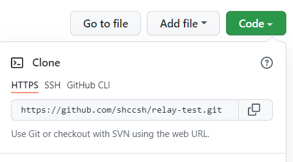
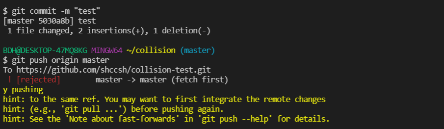
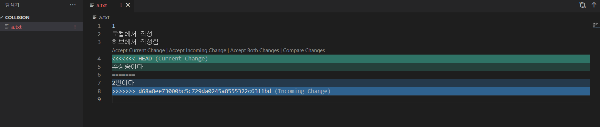
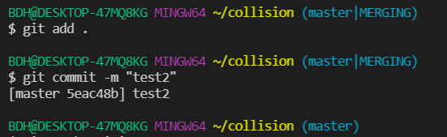
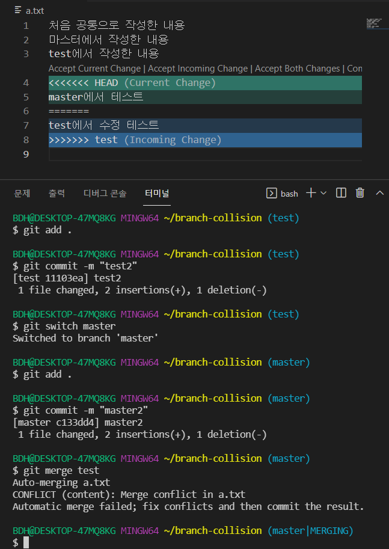
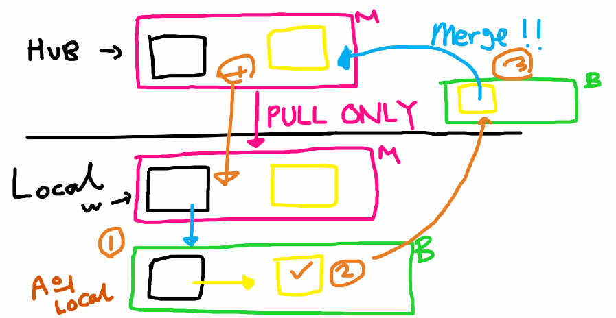

# TIL (Today I Learned)

[TOC]


## 1. CLI

### (1) 경로

1. 루트 디렉토리 (`/`)

   - 최상위 폴더
   - cd .. 계속 하면 최종적으로 `/` 가 나온다.

2. 홈 디렉토리 (`~`)

   - 사용자의 홈 폴더

3. 절대 경로와 상대 경로

   - 절대 경로 : 어디든 상관 없는 위치

   - 상대 경로 : 내 위치 기준

### (2) 명령어

1. `date` : 날짜와 시간을 알려준다.

2. `~` : 루트 / 홈 디렉토리

3. `ls` (list segments) : 현재 디렉토리 내의 폴더와 파일을 보여줌

   - `ls -a` : all 숨김 폴더 & 파일까지 보여준다.

4. `ctrl + l` : 스크롤 내리기

5. `clear` : 입력한 내용들 지우기

6. `배쉬창 화살표 키` : 최근 기입 확인

7. `ctrl + a|e` : 앞 뒤 이동

8. `touch a.txt` : '파일'을 만드는 경우

9. `mkdir` : '폴더'를 만드는 경우

10. `cd` : 경로 이동

    - cd . => 현재 경로 / cd .. => 상위 경로

11. `mv` : 이동 + 이름 바꾸기

12. `rm` : remove

    - 파일 삭제 : rm a.txt

    - 폴더 삭제 : rm -r test2

    - `*` => asterisk, wildcard

      

## 2. 마크다운

### (1) 마크다운이란?

- 일반 텍스트 기반의 경량 마크업(Markup) 언어
- 마크업과 반대 개념이 아니라, 마크업을 더 쉽고 간단하게 사용하고자 만들어졌습니다.
- ``.md`` 확장자를 가지며, 개발과 관련된 많은 문서는 마크다운 형식으로 작성되어 있습니다.
- 개발 분야에 있어서 ``문서화`` 는 굉장히 중요한 능력입니다. 마크다운은 그 토대가 될 것입니다.


### (2) 마크다운 문법

1. 제목 (Headings)

   - `#` 문서의 논리적 흐름 대제목, 소제목 

   # 제목 1

   ## 제목 2

   ### 제목 3

   #### 제목 4

   ##### 제목 5

   ###### 제목 6

2. 목록
   - 순서가 없는 목록은 `- * +` 를 사용
   - 순서가 있는 목록은 `1. 2. 3.` 과 같은 숫자를 사용
   - `tab 키` 들여쓰기 `shift + tab` 내어쓰기

3. 강조

   - 글자의 스타일링
     1) 기울임 : `*글자*` `_글자_` _기울어진 글자_
     2) 굵게 : `**글자**` `__글자__` __굵은 글씨__
     3) 취소 : `~~글자~~` ~~취소~~

4. 코드

   - 인라인 코드와 블록 코드

     1. 인라인 코드 : `inline code` 백틱을 통해 코드를 감싸준다.

     2. 블록 코드 : ````python` 백틱을 3번 입력

        ``````python
        for i in range(10):
        	print(i)
        ``````

        파이썬의 print는 `print("Hello world!")` 과 같이 사용합니다.

        ```python
        for i in range(10):
            print(i)
        ```

        ```bash
        $ touch test.txt
        ```

        ``````
        Just plain text
        ``````

5. 링크

   - 클릭하면 해당 주소로 이동할 수 있는 링크

   - `[표시할 글자](이동할 주소)` 형태로 작성

     [GOOGLE](http://google.com)을 눌러서 구글로 이동하세요.

6. 이미지

   - `` 형태로 작성

     

7. 인용

   - 주석이나 인용 문구는 `>`를 사용

   - 꺽새 갯수에 따라 중첩이 가능

     > 인용문을 작성합니다.
     >
     > > 중첩된 인용문 1
     > >
     > > > 중첩된 인용문2

8. 표(Table)

   - `파이프(|)`와 `하이픈(-)`을 이용해서 행과 열을 구분

   - 테이블 양쪽 끝의 `파이프(|)`는 생략 가능

   - 헤더 셀을 구분할 때는 `3개 이상의 하이픈(-)`이 필요

   - Typora에서는 `ctrl + T`를 통해 쉽게 표 생성 가능

   - 행을 늘릴 때는 `ctrl + enter`를 누른다.

   - | 동물   | 종류   | 다리 개수 |
     | ------ | ------ | --------- |
     | 사자   | 포유류 | 4개       |
     | 닭     | 조류   | 2개       |
     | 도마뱀 | 파충류 | 4개       |

     | 동물   | 종류   | 다리 개수 |
     | ------ | ------ | --------- |
     | 사자   | 포유류 | 4개       |
     | 닭     | 조류   | 2개       |
     | 도마뱀 | 파충류 | 4개       |

9. 수평선

   - 구분선 생성

   - `-*_`을 3번 이상 연속으로 작성

     ``````
     ---
     ***
     ___
     ``````

     ---

     ***

     ___


### (3) 실습
#### Python


##### 1. 개요


파이썬(Python)은 1990년 암스테르담의 귀도 반 로섬(Guido Van Rossum)이 개발한 인터프리터 언어이다. 귀도는 파이썬이라는 이름을 자신이 좋아하는 코미디 쇼인 "몬티 파이썬의 날아다니는 서커스(Monty Python’s Flying Circus)"에서 따왔다고 한다.

> 인터프리터 언어란 한 줄씩 소스 코드를 해석해서 그때그때 실행해 결과를 바로 확인할 수 있는 언어이다.


##### 2. 특징

1. 파이썬은 인간다운 언어이다. 아래 코드는 쉽게 해석된다.

   `if 4 in [1,2,3,4]: print("4가 있습니다")`

   _만약 4가 1, 2, 3, 4 중에 있으면 "4가 있습니다"를 출력한다._라고 말이다.

2. 파이썬은 간결하다.

   ```python
   simpe.py
   languages = ['python', 'perl', 'c', 'java']
   
   for lang in languages:
       if lang in ['python', 'perl']:
           print("%6s need interpreter" % lang)
       elif lang in ['c', 'java']:
           print("%6s need compiler" % lang)
       else:
           print("should not reach here")
   ```

3. 공식문서가 자세히 제공된다.

   [파이썬 공식문서 링크](https://docs.python.org/3/)

   

## 3. Github

### (1) 로컬 저장소

- `Working Directory (=Working Tree)` : 사용자의 일반적인 작업이 일어나는 곳
- `Staging Area (=Index)` : 커밋을 위한 파일 및 폴더가 추가되는 곳
- `Repository` : staging area에 있던 파일 및 폴더의 변경사항(커밋)을 저장하는 곳
- Git은 Working Directory - Staging Area - Repository의 과정으로 버전 관리를 수행

### (2) git 명령어

1. `git init` : 현재 폴더를 깃이 관리하는 폴더로 만들어줘!
   - 홈폴더에서 기입하면 안된다.(너무 많은 데이터가 있기 때문)
   - 최초 1번만 기입한다.
   - VS code의 베쉬 부분 입력하면 맨 우측에 (master)가 뜬다.
2. `git status` : 현 상황을 보고 싶어!
   - Working Directory와 Staging Area에 있는 파일의 현재 상태를 알려주는 명령어
   - 어떤 작업 시행하기 전에 수시로 status 확인하는 것이 좋다고 한다.
3. `git add a.txt` : a.txt 올리기
   - `git add .` : 전부 다 올리기
   - Working Directory에 있는 파일을 Staging Area로 올리는 명령어
4. `git commit -m "메시지"` : 찰칵! 후 저장소
   - Staging Area에 올라온 파일의 변경 사항을 하나의 버전(커밋)으로 저장하는 명령어
   - ``커밋 메세지``는 현재 변경 사항들을 잘 나타낼 수 있도록 의미있게 작성하는 것을 권장
   - 커밋 메시지 잘못 넣었을 때는 `git commit --amend` 입력하면 빔에디터가 뜨고, i(insert) 누르고 수정할 메시지명 입력 -> ESC 누르고, `:wq` 입력
5. `git log` : 버전들 확인할래!
   - 커밋의 내역(`ID, 작성자, 시간, 메세지 등`)을 조회할 수 있는 명령어
   - `git log --oneline` 을 기입하면 해쉬값을 알려준다. 그걸 아래 체크아웃에 쓰기로 하자.
6. `git checkout 해쉬값` : 돌아가기
   - `git checkout master` : 다시 마스터로 돌아올 때
   - `git checkout head~3` : 현재에서 몇개 뒤로 돌아가라
7. `git remote add origin 주소` : 브릿지 잇기
   - `git remote - v` : 이어진거 확인
8. `git push origin master` : 올리기
9. `.gitignore` : 특정 파일 혹은 폴더에 대해 Git이 버전 관리를 하지 못하도록 지정하는 것
   - `touch .gitignore` 로 생성
   - [gitignore](https://gitignore.io/) 사이트에서 원하는 부분을 검색하여 쉽게 작성할 수 있다.
10. `git clone` : 원격 저장소의 커밋 내역을 모두 가져와서, 로컬 저장소를생성하는 명령어
    - 결과적으로 `git init` 과 같은 결과를 가져오나, 방식은 반대 (hub에 있는 것을 내 PC 내 복제하는 것)
    - `git clone <원격 저장소 주소>` 형태로 입력
    - 생성된 로컬 저장소는 `git init` 과 `git remote add` 가 이미 수행되어 있다.
11. `git pull` : 원격 저장소의 변경 사항을 가져와서, 로컬 저장소를 업데이트하는 명령어
    - `git pull <저장소 이름> <브랜치 이름>` 형태로 입력

#### 1) Relay-test(clone, pull, push)

1. 규칙

   - 두개의 컴퓨터가 있다고 가정(다른 공간)

     ex) acomputer(집 컴퓨터), bcomputer(회사 컴퓨터)

   - 집에서 작업을 하다, 회사에서 작업을 하는 상황

2. 집에서 작업하고 깃허브에 올리기 

   - Github에서 Relay-test 이름의 `Repositories(원격저장소)`생성

   - `acomputer 폴더` 에서  vscode를 열고, 아래와 같은 절차 진행

     ``````bash
     $ git init                      # 관리 시작
     $ touch a.txt                   # a.txt 문서 생성
     $ git add .                     # 로컬에서 working directory에서 staging Area로 올림
     $ git commit -m "집에서 작성"     # 커밋(버전)으로 저장
     $ git remote add origin https://github.com/shccsh/relay-test.git   # 아래 이미지 영역에서 URL을 받아 브릿지 잇기
     $ git push origin master        # Github에 올리기
     ``````

     

   - 위의 절차를 거치면, hub에 a. txt가 올라가지게 된다.

3. 회사에서 집에서 작업한 내용을 복제하기

   - 홈폴더 또는 작업하고자 하는 폴더에서 Bash를 키고 아래 내용을 입력하여 복제한다.

     ``````bash
     $ git clone https://github.com/shccsh/relay-test.git
     ``````

   - 복제하면 `Relay-test` 폴더가 만들어지고 이를 bcomputer로 이름을 수정한다.(위의 규칙)

   - 복제된 폴더는 init과 remote 브릿지 연결까지 되어있다.

   - 복제할 때 마지막에 폴더명을 넣으면 해당 폴더명으로 생성되기도 한다.

     ``````bash
     $ git clone https://github.com/shccsh/relay-test.git bcomputer
     ``````

4. 회사에서 추가 작업하기

   - 3번에서 만들어진 폴더에서 vscode를 열고, 작업을 진행한다.

   - a.txt를 수정하는 작업 진행 후, 2번의 작업을 다시 진행

     ``````bash
     # a.txt 수정 후,
     $ git add .
     $ git commit -m "회사에서 작성"
     $ git push origin master
     ``````

5. 집에서 회사에서 작업한 내용 불러오기

   - 집에서 작업한 로컬과 회사에서 작업해서 hub에 올라간 내용은 다르기 때문에, hub에 올라간 내용을 불러와야한다.

   - 불러올 때는 `pull`을 사용한다.

     ``````bash
     $ git pull origin master
     ``````

   - 이어서 추가 작업을 진행 후, 다시 4번의 올리는 작업을 진행한다.

#### 2) 충돌

1. 발생 원인

   - 로컬이 아닌 원격저장소에서 직접 수정을 하고, 로컬에서 수정을 한 내용을 올릴 경우 충돌이 발생한다.

   - 로컬의 내용과 원격저장소의 내용이 다른 상황에서 작업이 이뤄지기 때문에 발생

     

2. 해결 방법

   - `$ git pull origin master` 를 입력

   - 저장소에서 작업한 내용, 로컬에서 작업한 내용이 같이 보여진다.

     

   - 원하는 것을 선택해서 하나만 보여지게 해도 되고, 둘다 보여지게 해도 되고, 새롭게 수정을 해도 된다.

   - 그리고, 현재 시점에는 아래와 같이 터미널 부분이 master|MERGING 으로 된 것을 알 수 있다.

     

   - 수정을 하고 나서 다시 `git add .` , `git commit -m "메시지"` 를 하면 정상적으로 돌아오게 된다.

     


#### 3) Branch

> Branch는 나뭇가지라는 뜻의 영어 단어로 나뭇가지처럼 여러 갈래로 작업 공간을 나누어 독립적으로 작업 할 수 있도록 도와주는 Git의 도구 (쉽게 이해하면 테스트 서버와 같은 개념인듯)

##### 1. 명령어

1. `git branch` : branch 위치 확인
2. `git branch {{이름}}` : branch 생성
3. `git switch {{브랜치명}}` : branch명으로 이동
4. `git switch -c {{이름}}` : branch 생성 후, 해당 branch로 이동
5. `git merge {{합치고 싶은 브랜치명}}` : branch를 마스터로 합치기(마스터에서 입력)
6. `git branch -d {{지우고 싶은 브랜치명}}` : 쓸모없어진 branch 삭제

##### 2. 충돌

- branch 생성 후, branch와 master에서 각각 수정 후 merge할 때 충돌이 발생한다.

- 충돌 시, 해결

  

- 원하는 내용으로 __수정 후 저장__, 동일하게 `git add .`, `git commit -m "메시지"` 를 입력

### (3) 풀리퀘스트

협업을 하는 형태로 아래 이미지와 같이 진행이 된다.




- 처음 Hub의 master 파일이 생성이 되고, 이를 각자의 Local로 내려 받는다.
- 이후, 작업을 할 때는 Local에서 별도의 branch를 만들어서 작업을 한다.
- branch 작업 후, hub의 master에서 branch를 생성하고, 해당 branch에 내용을 넣고 master에 merge한다.
- 최종적으로 완료된 hub에서 작업이 된 파일을 local의 master로 받는다.
